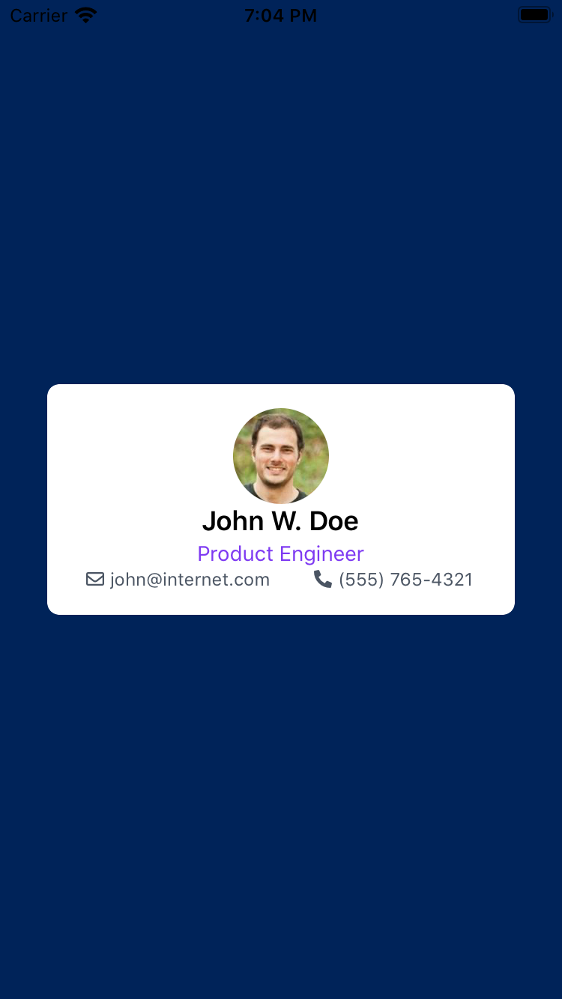

# IMPORTANT NOTICE!!!
### purgeTSS will OVERWRITE your existing app.tss file
> When you run `purgeTSS` for the first time, it will backup your existing `app.tss` file to `_app.tss`.
>
> It will use it along with `tailwind.tss`, `fontawesome.tss`, `materialicons.tss` and `lineicons.tss` files to create a new purged `app.tss` file.
>
> From now on Add, Update, or Delete your custom classes in `_app.tss.`


# purgeTSS
`purgeTSS` is a small **CLI** that creates a clean `app.tss` file by copying only the classes used in your `views`.

For now it only works with [tailwind.tss](https://github.com/macCesar/purgeTSS/blob/master/tss/tailwind.tss), [fontawesome.tss](https://github.com/macCesar/purgeTSS/blob/master/tss/fontawesome.tss), [materialicons.tss](https://github.com/macCesar/purgeTSS/blob/master/tss/materialicons.tss) and [lineicons.tss](https://github.com/macCesar/purgeTSS/blob/master/tss/lineicons.tss).

**ALL your custom classes from your `app.tss` file will be copied over without purging.**

## Installation
Install it globally on your machine via [NPM](http://npmjs.org/).
```bash
[sudo] npm i -g purgetss
```

## Purging classes
To parse all your XML files, run `purgetss` inside your project's root directory.
```bash
purgetss
```
`purgetss` will extract all found classes and copy them along with all styles originally declared in app.tss.
## Commands

### auto-update
```bash
purgetss auto-update
```
Use this command to update `purgeTSS` to the latest version.

We constantly update `purgeTSS` for bug fixes, to add new features and to include the latest versions of Tailwind CSS and all other resources like Tailwind UI and Fonts.

### dev-mode
```bash
purgetss dev-mode
```
Use this command if you want to copy **all available classes** in `tailwind.tss`, `fontawesome.tss`, `materialicons.tss` and `lineicons.tss` while prototyping your App.

### A caveat when working with very large .tss files
When compaling a ver large tss file you will get the following note:

> ___[BABEL] Note: The code generator has deoptimised the styling of [ name-of-the-generated-style.js-file ] as it exceeds the max of 500KB.___

To avoid this, you can copy the styles from the desired providers. *See below*.

### Copying specific styles
```bash
purgetss dev-mode --files="tw, fa, md, li"
```
Use any of the following arguments to copy styles from specific providers:
- tw = Tailwind styles
- fa = Font Awesome styles
- md = Material Design Icons styles
- li = LineIcons styles

### copy-fonts
```bash
purgetss copy-fonts
```
Use this command to copy the free versions of [Font Awesome](https://github.com/FortAwesome/Font-Awesome/tree/master/js-packages/%40fortawesome/fontawesome-free/webfonts), [Material Design Icons](https://github.com/google/material-design-icons) and [LineIcons](https://lineicons.com/free/) fonts into your `app/assets/fonts` folder. With their names fixed to work with your app whether it is for iOS or for Android.

> FontAwesome5Brands-Regular.ttf
>
> FontAwesome5Free-Regular.ttf
>
> FontAwesome5Free-Solid.ttf
>
> MaterialIcons-Regular.ttf
>
> MaterialIconsOutlined-Regular.otf
>
> MaterialIconsRound-Regular.otf
>
> MaterialIconsSharp-Regular.otf
>
> MaterialIconsTwoTone-Regular.otf
>
> LineIcons.ttf

### Copying specific fonts
```bash
> purgetss copy-fonts --files="fa, md, li"
```
Use any of the following arguments to copy fonts from specific providers:
- fa = Font Awesome Icons
- md = Material Design Icons
- li = LineIcons

## Sample file
Use this markup to test `purgeTSS`.

`index.xml`
```xml
<Alloy>
    <Window class="bg-primary">
        <View class="w-auto h-auto bg-white rounded-lg">
            <View class="w-10/12 mx-auto my-4 vertical">
                <ImageView class="w-16 h-16 mx-auto rounded-16" image="https://randomuser.me/api/portraits/men/43.jpg" />

                <View class="vertical">
                    <Label class="text-lg font-semibold">John W. Doe</Label>
                    <Label class="mt-0.5 text-purple-600 text-sm">Product Engineer</Label>

                    <View class="w-screen">
                        <View class="ml-0 horizontal">
                            <Label class="mr-1 text-xs text-gray-600 far fa-envelope"></Label>
                            <Label class="text-xs text-gray-600">john@internet.com</Label>
                        </View>

                        <View class="mr-0 horizontal">
                            <Label class="mr-1 text-xs text-gray-600 fas fa-phone-alt"></Label>
                            <Label class="text-xs text-gray-600">(555) 765-4321</Label>
                        </View>
                    </View>
                </View>
            </View>
        </View>
    </Window>
</Alloy>
```

`app.tss`
```css
'.bg-primary': {
    backgroundColor: '#002359'
}
```

## Purged `app.tss` file
After runing the script you will have this in `app.tss`

```css
// purgeTSS
// Created by César Estrada
// https://github.com/macCesar/purgeTSS

// Reset Styles
'Window': { backgroundColor: '#ffffff' }
'ImageView[platform=ios]': { hires: true }
'View': { width: Ti.UI.SIZE, height: Ti.UI.SIZE }
'.vertical': { layout: 'vertical' }
'.horizontal': { layout: 'horizontal' }
'.vertical[platform=ios]': { clipMode: Ti.UI.iOS.CLIP_MODE_DISABLED }
'.horizontal[platform=ios]': { clipMode: Ti.UI.iOS.CLIP_MODE_DISABLED }
'.clip-enabled[platform=ios]': { clipMode: Ti.UI.iOS.CLIP_MODE_ENABLED }

// Custom styles from _app.tss
'.bg-primary': {
    backgroundColor: '#002359'
}

// Tailwind CSS v1.8.2: A utility-first CSS framework for rapidly building custom designs. ( https://tailwindcss.com )
// Tailwind UI Plugin v0.4.0 ( https://www.npmjs.com/package/@tailwindcss/ui ).
// Created by Adam Wathan ( https://twitter.com/adamwathan ).
'.text-gray-600': { color: '#4b5563' }
'.text-purple-600': { color: '#7e3af2' }
'.bg-white': { backgroundColor: '#ffffff' }
'.text-xs': { font: { fontSize: 12 } }
'.text-sm': { font: { fontSize: 14 } }
'.text-lg': { font: { fontSize: 18 } }
'.font-semibold': { font: { fontWeight: 'semibold' } }
'.rounded-lg': { borderRadius: 8 }
'.rounded-16': { borderRadius: 32 }
'.my-4': { top: 16, bottom: 16 }
'.mx-auto': { right: null, left: null }
'.mt-0.5': { top: 2 }
'.mr-0': { right: 0 }
'.mr-1': { right: 4 }
'.ml-0': { left: 0 }
'.w-16': { width: 64 }
'.w-auto': { width: Ti.UI.SIZE }
'.w-10/12': { width: '83.333333%' }
'.w-screen': { width: Ti.UI.FILL }
'.h-16': { height: 64 }
'.h-auto': { height: Ti.UI.SIZE }

// Font Awesome Free 5.14.0 by @fontawesome - https://fontawesome.com
// License - https://fontawesome.com/license/free (Icons: CC BY 4.0, Fonts: SIL OFL 1.1, Code: MIT License)

// Font Awesome uses the Unicode Private Use Area (PUA) to ensure screen readers do not read off random characters that represent icons
'.far': { font: { fontFamily: 'FontAwesome5Free-Regular' } }
'.fas': { font: { fontFamily: 'FontAwesome5Free-Solid' } }
'.fa-envelope': { text: '\uf0e0', title: '\uf0e0' }
'.fa-phone-alt': { text: '\uf879', title: '\uf879' }
```


## Result


## More examples in the accompanying app
[Tailwind TSS Sample App](https://github.com/macCesar/tailwind.tss-sample-app)

## Contributing
If you have any suggestions or enhancements, please make a PR.


## License
purgeTSS is open-sourced software licensed under the MIT license.
