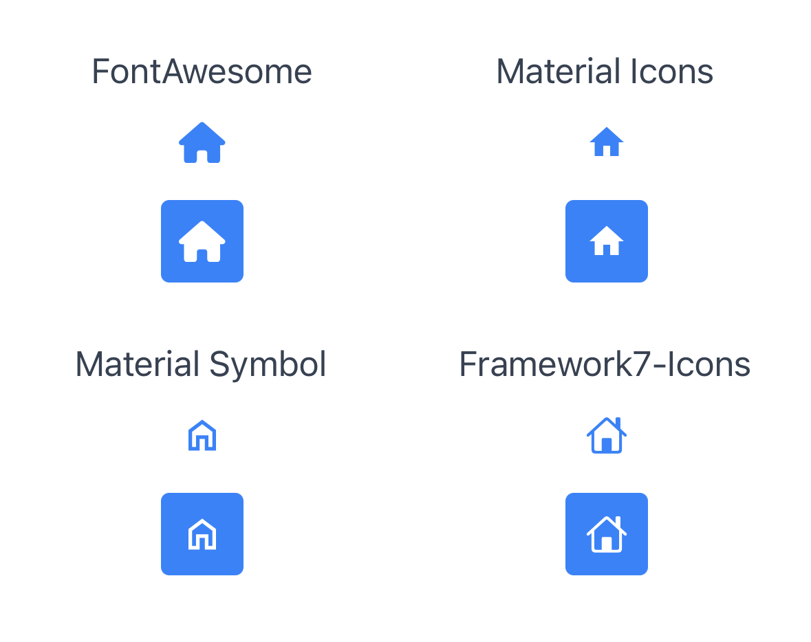
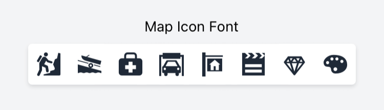

The following is a description of the various commands that can be used with **Purge TSS**:

- `init`: Initializes Purge TSS on an existing Alloy project.
- `create`: Creates a new Alloy project with Purge TSS already set up.
- `icon-library`: Copies the official icon fonts for Purge TSS into the `./app/assets/fonts` folder.
- `build-fonts`: Generates a `./purgetss/styles/fonts.tss` file with class definitions and fontFamily selectors for custom fonts.
- `shades`: Generates shades and tints for a given color and outputs the corresponding color palette in `config.js`.
- `color-module`: Creates a `./app/lib/purgetss.colors.js` file, which contains all the colors defined in `config.js`.
- `build`: Generates the `tailwind.tss` file based on the configuration in `config.js`.
- `watch`: Runs `purgetss` automatically every time the project is compiled (defaults to `--on`).
- `module`: Installs the `purgetss.ui.js` module in the `lib` folder.
- `update`: Updates Purge TSS to the latest version.
- `sudo-update`: Updates Purge TSS to the latest version, using sudo to install **NPM** modules if necessary.


## `init` Command

The `init` command sets up **Purge TSS** by creating a `./purgetss/config.js` file at the root of an existing Alloy project.

No arguments or options are needed. The command will create the file inside the `./purgetss/` folder.

```bash
> purgetss init

# alias:
> purgetss i
```

```javascript title="./purgetss/config.js"
module.exports = {
  purge: {
    mode: 'all',
    method: 'sync', // How to execute the auto-purging task: sync or async

    // These options are passed directly to Purge TSS
    options: {
      legacy: false, // Generates & purges tailwind.tss v5.x classes
      missing: true, // Reports missing classes
      widgets: false, // Purges widgets too
      safelist: [], // Array of classes to keep
      plugins: [] // Array of properties to ignore
    }
  },
  theme: {
    extend: {}
  }
};
```

:::tip To learn more

**Purge TSS** looks for the file `./purgetss/config.js`, where each section is optional and can be customized. Missing sections will use the default configuration.

To learn more and view some examples, refer to the **[Configuration Section](customization/the-config-file)**.

:::


## `create` Command

The `create` command generates a new Alloy project with **Purge TSS** already set up.

### Arguments

- Enclose `Project's Name` in single or double quotes. *This argument is required.*

### Options
- Use `-f, --force` to overwrite an existing project.
- Use `-d, --dependencies` to install **ESLint** and **Tailwind CSS** in your project.
- Use `-v, --vendor [fa,mi,ms,f7]` to copy the selected fonts into your project, including the CommonJS module into the `./app/lib/` folder. Refer to the **[`icon-library` command](#icon-library-command)** for available fonts!

If a project with the same name already exists, the command will prompt you to confirm whether you want to overwrite it.

```bash
> purgetss create 'Name of the Project' [--vendor="fontawesome, materialicons, materialsymbols, framework7"]

# alias:
> purgetss c 'Name of the Project' [-v=fa,mi,ms,f7]
```

### Requirements

Ensure that the `app.idprefix` and `app.workspace` properties are configured in Titanium’s `config.json` file.

```bash
# A name in reverse domain name format.
app.idprefix = "com.yourdomain"

# Path to use as the workspace directory for new projects.
app.workspace = "/<full-path-to>/<workspace>/<folder>"
# ...
```

Use the `ti config` command to set up both the `app.idprefix` and `app.workspace` settings:

```bash
ti config app.idprefix 'com.yourdomain'
ti config app.workspace 'the-full-path/to-the-workspace-folder'
```

### Installing Dev Dependencies

Installing these dependencies offers a profound enhancement to the setup process for projects using **Purge TSS**.

```bash
> purgetss create 'Name of the Project' [--dependencies]

# alias:
> purgetss c 'Name of the Project' [-d]
```

This option not only installs essential tools like **ESLint** for code quality and **Tailwind CSS** for efficient UI development but also ensures seamless integration with the **Visual Studio Code** (VSCode) environment.

Here's a closer look at the recommended VSCode extensions and their roles:

- **[XML Tools](https://marketplace.visualstudio.com/items?itemName=DotJoshJohnson.xml)**: For XML formatting.
- **[ESLint](https://marketplace.visualstudio.com/items?itemName=dbaeumer.vscode-eslint)**: To ensure consistent code quality, enforcing coding standards and identifying issues in real-time.
- **[Tailwind CSS IntelliSense](https://marketplace.visualstudio.com/items?itemName=bradlc.vscode-tailwindcss)**: Intelligent **Purge TSS** class support.
- **[Tailwind RAW Reorder](https://marketplace.visualstudio.com/items?itemName=Trapfether.tailwind-raw-reorder)**: An opinionated class sorter that optimizes the arrangement of **Purge TSS** classes for better readability and maintenance. It works on XML and JS files.
- **[Intellisense for CSS class names in HTML](https://marketplace.visualstudio.com/items?itemName=Zignd.html-css-class-completion)**: **Purge TSS** class name completion based on definitions within your workspace (`purgetss/config.js`), for example, all available classes in the `fonts.tss` and `tailwind.tss` files.

### List of Commands Used

When you run `purgetss create "Name of the Project" [--dependencies --vendor=fa,mi,ms,f7]`, the following commands will be executed:

- `ti config app.idprefix && ti config app.workspace` - retrieves the related values.
- `ti create -t app -p all -n "Name of the Project" --no-prompt --id "the-prefix-id-and-the-name-of-the-project"` - creates an App project with the specified name and its id set automatically.
- `cd app.workspace/"Name of the Project"` - changes to the newly created folder.
- `alloy new` - converts it to an Alloy Project.
- `purgetss w` - autoruns purgetss every time you compile your project.
- `purgetss b` - builds a new `./purgetss/styles/tailwind.tss` file.
- `[--vendor=fa,mi,ms,f7]` - sets the `--vendor` argument to copy the selected fonts into your project, including the CommonJS module into `./app/lib/` folder.
- `[--dependencies]` - installs the following dependencies and configuration files:
  - `npm i -D tailwindcss && npx tailwindcss init` - installs Tailwind CSS.
  - `npm i -D eslint eslint-config-axway eslint-plugin-alloy` - installs ESLint and Titanium specific plugins.
  - `.editorconfig`, `.eslintrc.js`, `tailwind.config.js`, `.vscode/extensions.json` and `.vscode/settings.json` - copies the configuration files.
- `code .`, `subl .`, or `open .` - uses either `code`, `subl`, or `open` to open VS Code, Sublime Text, or the project’s folder.


## `install-dependencies` Command

This command simplifies the enhancement of your development workflow in existing projects already using **Purge TSS**. It automates the installation of dev dependencies and configuration files into your project, ensuring seamless integration with the **Visual Studio Code** (VSCode) environment.

```bash
> purgetss install-dependencies

# alias:
> purgetss id
```

:::caution IMPORTANT NOTICE!!!

**Please note that this command will overwrite any existing `extensions.json` and `settings.json` files, so it's advisable to create a backup if you wish to preserve them.**

:::


## `icon-library` Command

The `icon-library` command simplifies the process of copying free font versions of [**Font Awesome**](https://github.com/FortAwesome/Font-Awesome/tree/master/js-packages/%40fortawesome/fontawesome-free/webfonts), [**Material Icons**](https://fonts.google.com/icons?icon.set=Material+Icons), [**Material Symbols**](https://fonts.google.com/icons?icon.set=Material+Symbols), and/or [**Framework7 Icons**](https://framework7.io/icons/), to the `./app/assets/fonts` folder. This eliminates the need for manual downloading or copying to the correct folder within your project.

```bash
> purgetss icon-library [--vendor=fa,mi,ms,f7] [--module] [--styles]

# alias:
> purgetss il [-v=fa,mi,ms,f7] [-m] [-s]
```

### Options and Flags

  - `-v, --vendor [fa,mi,ms,f7]` to copy specific font vendors
  - `-m, --module` to copy the corresponding **CommonJS** module into the `./app/lib/` folder
  - `-s, --styles` to copy the corresponding `tss` files into the `./purgetss/styles/` folder for your review

```bash title="./app/assets/fonts/"
FontAwesome6Brands-Regular.ttf
FontAwesome6Free-Regular.ttf
FontAwesome6Free-Solid.ttf
Framework7-Icons.ttf
MaterialIcons-Regular.ttf
MaterialIconsOutlined-Regular.otf
MaterialIconsRound-Regular.otf
MaterialIconsSharp-Regular.otf
MaterialIconsTwoTone-Regular.otf
MaterialSymbolsOutlined-Regular.ttf
MaterialSymbolsRounded-Regular.ttf
MaterialSymbolsSharp-Regular.ttf
```

After copying the desired fonts, you can use them in `Buttons` and `Labels`. For example, to use **FontAwesome**, set the font family to `fa` (for Solid icons) and input the desired icon, such as `fa-home`.

### Available Font Classes

- [**fontawesome.tss**](https://github.com/macCesar/purgeTSS/blob/master/dist/fontawesome.tss)
- [**materialicons.tss**](https://github.com/macCesar/purgeTSS/blob/master/dist/materialicons.tss)
- [**materialsymbols.tss**](https://github.com/macCesar/purgeTSS/blob/master/dist/materialsymbols.tss)
- [**framework7icons.tss**](https://github.com/macCesar/purgeTSS/blob/master/dist/framework7icons.tss)

### Copying Specific Font Vendors

To copy specific font vendors, use any of the following arguments:

```bash
> purgetss icon-library --vendor="fontawesome, materialicons, materialsymbols, framework7"

# alias:
> purgetss il -v=fa,mi,ms,f7
```

Available names and aliases:
- fa, fontawesome = Font Awesome Icons
- mi, materialicons = Material Icons
- ms, materialsymbol = Material Symbols
- f7, framework7 = Framework7 Icons

### CommonJS Module

You can use the `--module` option to copy the corresponding CommonJS module into the `./app/lib/` folder.

```bash
> purgetss icon-library --module [--vendor="fontawesome, materialicons, materialsymbols, framework7"]

# alias:
> purgetss il -m [-v=fa,mi,ms,f7]
```

Each library includes a CommonJS module that exposes Unicode strings for Font Awesome, Material Icons, Material Symbols, and Framework7-Icons fonts.

All prefixes are stripped from their class names and camel-cased. For example:

- **Font Awesome**: `fa-flag` becomes `flag`
- **Material Icons**: `mi-flag` becomes `flag`
- **Material Symbols**: `ms-flag` becomes `flag`
- **Framework7 Icons**: `f7-alarm_fill` becomes `alarmFill` or `f7-clock_fill` becomes `clockFill`.

### Font Awesome Pro

If you have a **[Font Awesome Pro Account](https://fontawesome.com/pro)**, you can generate a customized `./purgetss/styles/fontawesome.tss` file containing all the extra classes that the Pro version provides ***(except duotone icons; see note below)***.

After setting the **[@fortawesome scope](https://fontawesome.com/how-to-use/on-the-web/setup/using-package-managers#installing-pro)** with your token, install it in your project's root folder using `npm init` and `npm install --save-dev @fortawesome/fontawesome-pro` (current version 6.4.2).

To generate a new `purgetss/styles/fontawesome.tss` file, execute `purgetss build`. It will also automatically copy the Pro font files into `./app/assets/fonts` if necessary.

**Note: Titanium cannot use FontAwesome's duotone icons because they have two separate glyphs for each individual icon.**

### Font Awesome 6 Beta

Generate a customized `fontawesome.tss` file from **[Font Awesome 6 Beta](https://fontawesome.com/download)** as follows:

Move the `css` and `webfonts` folders from `fontawesome-pro-6.0.0-beta3-web/`:

```bash
fontawesome-pro-6.0.0-beta3-web
└─ css
└─ webfonts
```

Into `./purgetss/fontawesome-beta`:

```bash
purgetss
└─ fontawesome-beta
   ├─ css
   └─ webfonts
```

Then, just like with the Pro version, run `purgetss build` to generate your customized `fontawesome.tss` file and beta-test your new icons!

### Font Example File

To use this file, follow these steps:

- Copy the content of `index.xml` into a new Alloy project
- Install the official icon font files using `purgetss icon-library`
  - Without specifying a `--vendor`, **purgetss will copy all official icon fonts**: Font Awesome, Material Icons, Material Symbols, Framework7 Icons
- **Run `purgetss` once to generate the necessary files**
- Compile your app as usual.
- **We recommend using `liveview` to speed up testing and development time**

```xml title="index.xml"
<Alloy>
  <Window>
    <View class="grid">
      <View class="grid-cols-2 mx-auto gap-y-2 vertical">
        <!-- FontAwesome -->
        <Label class="mt-2 text-gray-700" text="FontAwesome" />
        <Button class="w-10 h-10 my-1 text-xl text-blue-500 fa fa-home" />
        <Button class="w-10 h-10 my-1 text-xl text-white bg-blue-500 rounded fa fa-home" />
      </View>

      <View class="grid-cols-2 mx-auto gap-y-2 vertical">
        <!-- Material Icons -->
        <Label class="mt-2 text-gray-700" text="Material Icons" />
        <Button class="w-10 h-10 my-1 text-xl text-blue-500 mi mi-home" />
        <Button class="w-10 h-10 my-1 text-xl text-white bg-blue-500 rounded mi mi-home" />
      </View>

      <View class="grid-cols-2 mx-auto gap-y-2 vertical">
        <!-- Material Symbol -->
        <Label class="mt-2 text-gray-700" text="Material Symbol" />
        <Button class="w-10 h-10 my-1 text-xl text-blue-500 ms ms-home" />
        <Button class="w-10 h-10 my-1 text-xl text-white bg-blue-500 rounded ms ms-home" />
      </View>

      <View class="grid-cols-2 mx-auto gap-y-2 vertical">
        <!-- Framework7-Icons -->
        <Label class="mt-2 text-gray-700" text="Framework7-Icons" />
        <Button class="w-10 h-10 my-1 text-xl text-blue-500 f7 f7-house" />
        <Button class="w-10 h-10 my-1 text-xl text-white bg-blue-500 rounded f7 f7-house" />
      </View>
    </View>
  </Window>
</Alloy>
```

```css title="app.tss"
/* Purge TSS v6.2.27
 * Created by César Estrada
 * https://github.com/macCesar/purgeTSS
*/

/* Ti Elements */
'View': { width: Ti.UI.SIZE, height: Ti.UI.SIZE }
'Window': { backgroundColor: '#FFFFFF' }

/* Main Styles */
'.bg-blue-500': { backgroundColor: '#3b82f6' }
'.gap-y-2': { top: 8, bottom: 8 }
'.grid': { layout: 'horizontal', width: '100%' }
'.grid-cols-2': { width: '50%' }
'.h-10': { height: 40 }
'.mt-2': { top: 8 }
'.mx-auto': { right: null, left: null }
'.my-1': { top: 4, bottom: 4 }
'.rounded': { borderRadius: 4 }
'.text-blue-500': { color: '#3b82f6', textColor: '#3b82f6' }
'.text-gray-700': { color: '#374151', textColor: '#374151' }
'.text-white': { color: '#ffffff', textColor: '#ffffff' }
'.text-xl': { font: { fontSize: 20 } }
'.vertical': { layout: 'vertical' }
'.w-10': { width: 40 }

/* Default Font Awesome */
'.fa': { font: { fontFamily: 'FontAwesome6Free-Solid' } }
'.fa-home': { text: '\uf015', title: '\uf015' }

/* Material Icons */
'.mi': { font: { fontFamily: 'MaterialIcons-Regular' } }
'.mi-home': { text: '\ue88a', title: '\ue88a' }

/* Material Symbols */
'.ms': { font: { fontFamily: 'MaterialSymbolsOutlined-Regular' } }
'.ms-home': { text: '\ue88a', title: '\ue88a' }

/* Framework7 */
'.f7': { font: { fontFamily: 'Framework7-Icons' } }
'.f7-house': { text: 'house', title: 'house' }
```




## `build-fonts` Command

The `build-fonts` command generates a `fonts.tss` file with class definitions and **fontFamily** selectors for any serif, sans-serif, cursive, fantasy, or monospace font families.

To use it, first place all of the `.ttf` or `.otf` files that you want to use in `./purgetss/fonts/`, and then run the command. You can also use the `--module` option to generate a CommonJS module in `./app/lib/`.

```bash
> purgetss build-fonts

# alias:
> purgetss bf
```

1. This will create the `./purgetss/styles/fonts.tss` file with all class definitions and `fontFamily` selectors.
2. It will also copy the font files into the `./app/assets/fonts` folder.
3. **Purge TSS will rename the font files to match their corresponding PostScript names to ensure proper functionality on both iOS and Android platforms**.

In this example, we are using the [**Bevan and Dancing Script**](https://fonts.google.com/share?selection.family=Bevan:ital@0;1%7CDancing%20Script:wght@400;500;600;700) fonts from Google Fonts.

First, place the `ttf` font files into `./purgetss/fonts/` folder:

```bash title="./purgetss/fonts/"
purgetss
└─ fonts
   ├─ Bevan-Italic.ttf
   ├─ Bevan-Regular.ttf
   ├─ DancingScript-Bold.ttf
   ├─ DancingScript-Medium.ttf
   ├─ DancingScript-Regular.ttf
   └─ DancingScript-SemiBold.ttf
```

After running `> purgetss build-fonts` you will have the following classes:

```css title="./purgetss/styles/fonts.tss"
/* Fonts TSS file generated with Purge TSS
 * https://github.com/macCesar/purgeTSS
*/

'.bevan-italic': { font: { fontFamily: 'Bevan-Italic' } }
'.bevan-regular': { font: { fontFamily: 'Bevan-Regular' } }

'.dancingscript-bold': { font: { fontFamily: 'DancingScript-Bold' } }
'.dancingscript-medium': { font: { fontFamily: 'DancingScript-Medium' } }
'.dancingscript-regular': { font: { fontFamily: 'DancingScript-Regular' } }
'.dancingscript-semibold': { font: { fontFamily: 'DancingScript-SemiBold' } }
```

**Now you can use any of those fonts in your project.**

### Organizing the Fonts Folder

For better organization, you can group each font family in subfolders. For example:

```bash title="./purgetss/fonts/"
purgetss
└─ fonts
   └─ bevan
      ├─ Bevan-Italic.ttf
      ├─ Bevan-Regular.ttf
   └─ dancing-script
      ├─ DancingScript-Bold.ttf
      ├─ DancingScript-Medium.ttf
      ├─ DancingScript-Regular.ttf
      └─ DancingScript-SemiBold.ttf
```

By organizing the fonts folder in this way, you will get the same `fonts.tss` file as in the previous example, but with a much more organized `fonts` folder.

:::tip PRO TIP

### Renaming `fontFamily` Classes

If you want to use a shorter or different name for any of the font classes, simply rename the font file to your desired name.

For example:

```bash title="./purgetss/fonts/"
purgetss
└─ fonts
   └─ dancing-script
      ├─ Script-Bold.ttf
      ├─ Script-Medium.ttf
      ├─ Script-Regular.ttf
      └─ Script-SemiBold.ttf
```

Running `build-fonts` will adjust the class name accordingly:

```css title="./purgetss/styles/fonts.tss"
'.script-bold': { font: { fontFamily: 'DancingScript-Bold' } }
'.script-medium': { font: { fontFamily: 'DancingScript-Medium' } }
'.script-regular': { font: { fontFamily: 'DancingScript-Regular' } }
'.script-semibold': { font: { fontFamily: 'DancingScript-SemiBold' } }
```

:::

### Icon Font Libraries

You can add **any icon font library** that has either a `.ttf` or `.otf` font file and a `.css` file with Unicode characters.

In this example, we are using the [**map-icons**](http://map-icons.com) and [**microns**](https://www.s-ings.com/projects/microns-icon-font/) icon font libraries.

```bash title="./purgetss/fonts/"
purgetss
└─ fonts
   └─ bevan
   └─ dancing-script
   └─ map-icons
      ├─ map-icons.css
      └─ map-icons.ttf
   └─ microns
      ├─ microns.css
      └─ microns.ttf
```

:::info

After running `purgetss build-fonts`, you will have all the `fontFamily` class definitions and Unicode characters in `fonts.tss`.

:::

```css title="./purgetss/styles/fonts.tss"
/* Fonts TSS file generated with Purge TSS */
/* https://github.com/macCesar/purgeTSS */

'.map-icons': { font: { fontFamily: 'map-icons' } }
'.microns': { font: { fontFamily: 'microns' } }

/* Unicode Characters */
/* To use your Icon Fonts in Buttons AND Labels each class sets 'text' and 'title' properties */

/* map-icons/map-icons.css */
'.map-icon-abseiling': { text: '\ue800', title: '\ue800' }
'.map-icon-accounting': { text: '\ue801', title: '\ue801' }
'.map-icon-airport': { text: '\ue802', title: '\ue802' }
'.map-icon-amusement-park': { text: '\ue803', title: '\ue803' }
'.map-icon-aquarium': { text: '\ue804', title: '\ue804' }
/* ... */

/* microns/microns.css */
'.mu-arrow-left': { text: '\ue700', title: '\ue700' }
'.mu-arrow-right': { text: '\ue701', title: '\ue701' }
'.mu-arrow-up': { text: '\ue702', title: '\ue702' }
'.mu-arrow-down': { text: '\ue703', title: '\ue703' }
'.mu-left': { text: '\ue704', title: '\ue704' }
/* ... */
```




### CommonJS Module

You can use the `--module` option to generate a CommonJS module called `purgetss-fonts.js` in `./app/lib/`.

To avoid conflicts with other icon libraries that you may be using, **Purge TSS will keep each icon's prefix**.

```bash
> purgetss build-fonts --module

# alias:
> purgetss bf -m
```

```javascript title="./app/lib/purgetss.fonts.js"
const icons = {
  // map-icons/map-icons.css
  'mapIcon': {
    'abseiling': '\ue800',
    'accounting': '\ue801',
    'airport': '\ue802',
    'amusementPark': '\ue803',
    // ...
  },
  // microns/microns.css
  'mu': {
    'arrowLeft': '\ue700',
    'arrowRight': '\ue701',
    'arrowUp': '\ue702',
    'arrowDown': '\ue703',
    // ...
  }
};
exports.icons = icons;

const families = {
  // map-icons/map-icons.css
  'mapIcon': 'map-icons',
  // microns/microns.css
  'mu': 'microns'
};
exports.families = families;
```

:::tip PRO TIP

### Renaming the Prefix in Icon Fonts

Use the `--prefix` option to apply the style's filename as the prefix for class names in `fonts.tss` and property names in `purgetss.fonts.js`.

```bash title="./purgetss/fonts/"
purgetss
└─ fonts
   └─ map-icons
      └─ map.ttf
      └─ mp.css
   └─ microns
      └─ mic.ttf
      └─ mc.css
```

```css title="./purgetss/styles/fonts.tss"
/* `fontFamily` classes use the font's filename */
'.map': { font: { fontFamily: 'map-icons' } }
'.mic': { font: { fontFamily: 'microns' } }

/* map-icons/mp.css */
'.mp-abseiling': { text: '\ue800', title: '\ue800' }
'.mp-accounting': { text: '\ue801', title: '\ue801' }
'.mp-airport': { text: '\ue802', title: '\ue802' }
'.mp-amusement-park': { text: '\ue803', title: '\ue803' }
'.mp-aquarium': { text: '\ue804', title: '\ue804' }
/* ... */

/* microns/mc.css */
'.mc-arrow-left': { text: '\ue700', title: '\ue700' }
'.mc-arrow-right': { text: '\ue701', title: '\ue701' }
'.mc-arrow-up': { text: '\ue702', title: '\ue702' }
'.mc-arrow-down': { text: '\ue703', title: '\ue703' }
'.mc-left': { text: '\ue704', title: '\ue704' }
/* ... */
```

```javascript title="./app/lib/purgetss.fonts.js"
const icons = {
  // map-icons/mp.css
  'mp': {
    'abseiling': '\ue800',
    'accounting': '\ue801',
    'airport': '\ue802',
    'amusementPark': '\ue803',
    // ...
  },
  // microns/mc.css
  'mc': {
    'arrowLeft': '\ue700',
    'arrowRight': '\ue701',
    'arrowUp': '\ue702',
    'arrowDown': '\ue703',
    // ...
  }
};
exports.icons = icons;

const families = {
  // map-icons/mp.css
  'mp': 'map-icons',
  // microns/mc.css
  'mc': 'microns'
};
exports.families = families;
```

**Make sure that the new prefix remains unique and avoid conflicts with other class prefixes.**

:::


## `shades` Command

The `shades` command generates shades and tints for a given color and outputs the corresponding color palette in the `config.js` file. This functionality simplifies the process of creating a consistent color scheme for your app.

```bash
> purgetss shades [hexcode] [name]

# alias:
> purgetss s [hexcode] [name]
```

### Arguments

- `[hexcode]`: The base hexcode value. *Omit this to create a random color.*
- `[name]`: The name of the color. *Omit this, and a name based on the color's hue will be automatically selected.*

### Options

- `-n, --name`: Specifies the name of the color.
- `-q, --quotes`: Retains double quotes in the `config.js` file.
- `-r, --random`: Generates shades from a random color.
- `-s, --single`: Generates a single color definition.
- `-t, --tailwind`: Logs the generated shades with a `tailwind.config.js` compatible structure.
- `-l, --log`: Logs the generated shades instead of saving them.
- `-j, --json`: Logs a JSON compatible structure, which can be used in `./app/config.json`, for example.

:::info

More than 66% of all `tailwind.tss` classes are related to color properties, making a tool like `shades` a valuable addition to **Purge TSS** for extending color choices!

:::

Basic usage:

```bash
> purgetss shades 53606b Primary

# alias:
> purgetss s 53606b Primary

::Purge TSS:: "Primary" (#53606b) saved in config.js
```

The generated color shades will be added to your `config.js` file, which will subsequently generate the `tailwind.tss` file with the newly added colors.

```js title="./purgetss/config.js"
module.exports = {
  // ...
  theme: {
    extend: {
      colors: {
        primary: {
          '50': '#f4f6f7',
          '100': '#e3e7ea',
          '200': '#cad2d7',
          '300': '#a6b3ba',
          '400': '#7a8b96',
          '500': '#5f707b',
          '600': '#53606b',
          '700': '#464f58',
          '800': '#3e444c',
          '900': '#373c42',
          default: '#53606b'
        }
      }
    }
  },
  // ...
}
```

Use the `--log` option to output to the console instead of saving to the `config.js` file.

```bash
> purgetss shades 53606b Primary --log

# alias:
> purgetss s 53606b Primary -l

::Purge TSS:: "Primary" (#53606b)
{
  colors: {
    primary: {
      '50': '#f4f6f7',
      '100': '#e3e7ea',
      '200': '#cad2d7',
      '300': '#a6b3ba',
      '400': '#7a8b96',
      '500': '#5f707b',
      '600': '#53606b',
      '700': '#464f58',
      '800': '#3e444c',
      '900': '#373c42',
      default: '#53606b'
    }
  }
}
```

Use the `--tailwind` option to output the generated shades to the console with a `tailwind.config.js` compatible structure.

```bash
> purgetss shades 000f3d --tailwind

# alias:
> purgetss s 000f3d -t

::Purge TSS:: "Stratos" (#000f3d)
{
  colors: {
    stratos: {
      '50': '#e5f4ff',
      '100': '#cfecff',
      '200': '#a9d8ff',
      '300': '#75bbff',
      '400': '#3f8cff',
      '500': '#145dff',
      '600': '#0047ff',
      '700': '#0048ff',
      '800': '#0040e3',
      '900': '#000f3d'
    }
  }
}
```

To generate a random color value, use the `--random` option. Here, the `--log` option logs it to the console:

```bash
> purgetss shades -rl

::Purge TSS:: "Harlequin" (#44ed20)
{
  colors: {
    harlequin: {
      '50': '#ecffe6',
      '100': '#d5fec9',
      '200': '#adfd99',
      '300': '#7bf85e',
      '400': '#44ed20',
      '500': '#2ed40e',
      '600': '#1daa06',
      '700': '#19810a',
      '800': '#18660e',
      '900': '#175611',
      default: '#44ed20'
    }
  }
}
```

To log a Titanium's `config.json` compatible structure to the console, use the `--json` option:

```bash
> purgetss shades '#65e92c' -j

::Purge TSS:: "Lima" (#65e92c)
{
  "global": {
    "colors": {
      "lima": "#65e92c",
      "lima-50": "#f0fee7",
      "lima-100": "#dcfdca",
      "lima-200": "#bbfb9b",
      "lima-300": "#90f561",
      "lima-400": "#65e92c",
      "lima-500": "#48d012",
      "lima-600": "#34a60a",
      "lima-700": "#297e0d",
      "lima-800": "#246410",
      "lima-900": "#215413"
    }
  }
}
```

:::info
The `shades` command is the first one that writes to the `config.js` file. If you experience any issues, please report them so we can promptly address them!
:::


## `color-module` Command

This command creates a file named `purgetss.colors.js` in the `lib` folder, which includes all the colors defined in the `config.js` file.

```bash
> purgetss color-module

# alias:
> purgetss cm
```

```js title="./lib/purgetss.colors.js"
module.exports = {
  harlequin: {
    '50': '#ecffe6',
    '100': '#d5fec9',
    '200': '#adfd99',
    '300': '#7bf85e',
    '400': '#44ed20',
    '500': '#2ed40e',
    '600': '#1daa06',
    '700': '#19810a',
    '800': '#18660e',
    '900': '#175611',
    default: '#44ed20'
  },
  primary: {
    '50': '#f4f6f7',
    '100': '#e3e7ea',
    '200': '#cad2d7',
    '300': '#a6b3ba',
    '400': '#7a8b96',
    '500': '#5f707b',
    '600': '#53606b',
    '700': '#464f58',
    '800': '#3e444c',
    '900': '#373c42',
    default: '#53606b'
  },
  lima: {
    '50': '#f0fee7',
    '100': '#dcfdca',
    '200': '#bbfb9b',
    '300': '#90f561',
    '400': '#65e92c',
    '500': '#48d012',
    '600': '#34a60a',
    '700': '#297e0d',
    '800': '#246410',
    '900': '#215413',
    default: '#65e92c'
  }
}
```

This feature proves useful if you wish to use these colors within your app's code. By importing the `purgetss.colors.js` file, you can avoid hardcoding colors across multiple locations.


## `build` Command

The `build` command generates the `tailwind.tss` file based on the configuration in `config.js`. This command is useful if you've made changes to the `config.js` file and want to update the `tailwind.tss` file to reflect those changes.

```bash
> purgetss build

# alias:
> purgetss b
```

When `purgetss` runs, either manually or automatically (as explained in the `purgetss watch` section below), it checks for any changes made to the `config.js` file and regenerates the `tailwind.tss` when necessary.


## `watch` Command

The `watch` command automatically runs Purge TSS every time the project is compiled. You won't need to manually execute the `build` command each time you make changes; Purge TSS will handle this for you.

```bash
> purgetss watch

# alias:
> purgetss w
```

This functionality is particularly valuable when used with `LiveView`, as it automatically purges your project whenever you make changes, such as adding or deleting styles in views.

**This provides immediate feedback on any modifications you make, significantly speeding up your prototyping process.**

The command will install a task in the `alloy.jmk` file to enable this behavior:

```javascript
task('pre:compile', function(event, logger) {
  require('child_process').execSync('purgetss', logger.warn('::Purge TSS:: Auto-Purging ' + event.dir.project));
});
```

:::info About the `watch` command

Please note that this feature is exclusively compatible with regular Alloy projects that are compiled using the `ti build` command. It hasn't been tested with other project types like those built using Webpack or Vue.

:::

**To deactivate it, use the `--off` option.**
```bash
> purgetss watch --off

# alias:
> purgetss w -o
```


## `module` Command

The `module` command installs the `purgetss.ui.js` module in the `lib` folder.

```bash
> purgetss module

# alias:
> purgetss m
```

**The Purge TSS module contains:**

- **Animation**: Offers methods for `playing` or `applying` basic animations and transformations to Alloy objects.

:::tip To learn more

**Refer to the [Animation Module](animation-module/introduction) documentation for more details.**

:::


## `update` Command

The `update` command allows you to upgrade **Purge TSS** to the most recent version. Use it to get the latest features and bug fixes that have been released.

```bash
> purgetss update

# alias:
> purgetss u
```

We constantly update **Purge TSS** to add new features, include the latest versions of Tailwind, FontAwesome, etc., and fix bugs.


## `sudo-update` Command

The `sudo-update` command is similar to the update command, but it's intended to be used when `sudo` is required to install **NPM** modules.

```bash
> purgetss sudo-update

# alias:
> purgetss su
```
