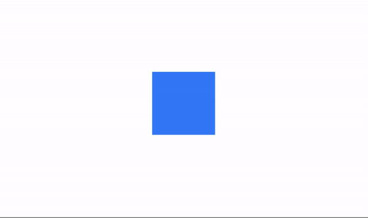
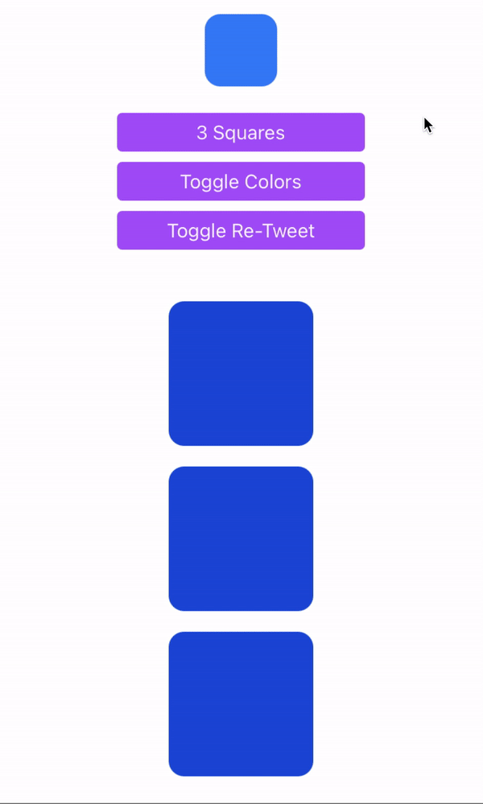
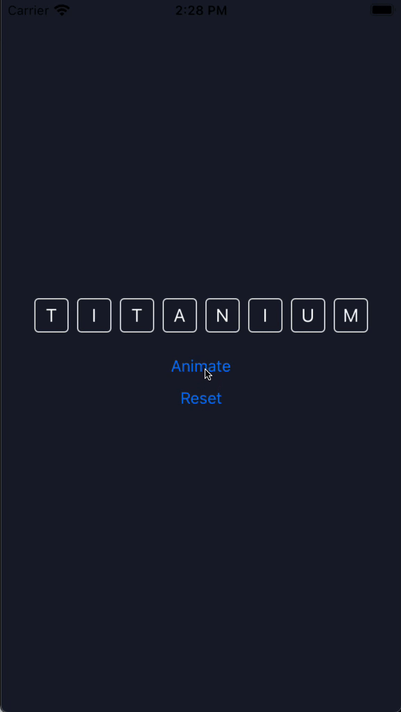

# The `play` Method

- The `play` method is used to reproduce the animation for a single view or an array of views.
- You can chain multiple Animation objects with callback functions to create a sequence of animations.

```javascript
$.myAnimation.play($.myView)
```

### Play Example 1
Create an Animation element and the view you want to animate, and set the desired properties.

`index.xml`
```xml
<Alloy>
  <Animation module="purgetss.ui" id="myAnimation" class="wh-32 bg-green-500 duration-1000" />

  <Window>
    <View id="square" class="wh-16 bg-blue-500" />
  </Window>
</Alloy>
```

In the controller, pass the element that you want to animate - in this case, the `square` view.

`index.js`
```javascript
$.index.open()

$.myAnimation.play($.square)
```

When the `play` method is called, the blue square will go from size 64x64 to 128x128 and change its color to green.



***\* low framerate gif***

## `open` and `close` Modifiers

You can create more complex animations by combining properties for different `states`, such as when `opening` or `closing` an animation. The `open` and `close` modifiers allow you to specify these different states.

### Play Example 2

`index.xml`
```xml
<Alloy>
  <Animation id="changeWidth" class="close:w-28 debug open:w-11/12" module="purgetss.ui" />
  <Animation id="changeColor" class="close:bg-blue-700 debug open:bg-purple-500" module="purgetss.ui" />
  <Animation id="changeTransparency" class="close:duration-300 open:mt-(null) close:mt-8 open:h-11/12 close:w-14 close:h-14 close:opacity-100 open:w-10/12 open:opacity-50 open:duration-150" module="purgetss.ui" />
  <Animation id="changeRetweet" class="close:duration-150 close:-mb-52 open:-mb-16 open:duration-200" module="purgetss.ui" />

  <Window class="keep-screen-on">
    <View class="vertical">
      <Button class="ios:mt-16 mt-1 w-48 rounded bg-purple-500 text-purple-50" onClick="squaresFn" title="3 Squares" />
      <Button class="mt-2 w-48 rounded bg-purple-500 text-purple-50" onClick="toggleFn" title="Toggle Colors" />
      <Button class="mt-2 w-48 rounded bg-purple-500 text-purple-50" onClick="retweetFn" title="Toggle Re-Tweet" />

      <View id="squaresView" class="vertical mt-10 w-screen">
        <View class="wh-28 rounded-xl bg-blue-700" />
        <View class="wh-28 mt-4 rounded-xl bg-blue-700" />
        <View class="wh-28 mt-4 rounded-xl bg-blue-700" />
      </View>
    </View>

    <View id="blueSquareView" class="mt-8 h-14 w-14 rounded-xl bg-blue-500" onClick="transparencyFn" />

    <View id="retweetView" class="vertical -mb-52 h-48 w-screen rounded-2xl bg-gray-800" onClick="retweetFn">
      <View class="bg-slate-700 mt-4 h-1 w-8" />

      <View class="horizontal mx-4 mt-4">
        <Label class="text-slate-500 fas fa-retweet w-7 text-xl" />
        <Label class="ml-2 text-left text-xl text-white" text="Re-Tweet" />
      </View>

      <View class="horizontal mx-4 mt-4">
        <Label class="text-slate-500 fas fa-pencil-alt w-7 text-xl" />
        <Label class="ml-2 text-left text-xl text-white" text="Quote Tweet" />
      </View>
    </View>
  </Window>
</Alloy>
```

`index.js`
```javascript
function transparencyFn() {
  $.changeTransparency.play($.blueSquareView)
}

function toggleFn() {
  $.changeColor.toggle($.squaresView.children)
}

function squaresFn() {
  $.changeWidth.play($.squaresView.children)
}

function retweetFn() {
  $.changeRetweet.play($.retweetView)
}

$.index.open()
```



***\* low framerate gif***

## `complete` Modifier

To apply additional properties after an `open` animation is finished, use the `complete` modifier.

### Complete Example 1

For example, in the following code, the `open` animation reduces the children of the `letters` view to a size of 1%. After completion, the `complete` modifier will set the background color to green and the scaling back to 100%.

`index.xml`
```xml
<Alloy>
  <Animation module="purgetss.ui" id="myAnimationReset" class="bg-transparent" />
  <Animation module="purgetss.ui" id="myAnimationOpen" class="open:scale-1 complete:bg-(#008800) complete:scale-100" />

  <Window title="App Wordle" class="bg-(#181e2d)">
    <View class="vertical">
      <View id="letters" class="horizontal">
        <Label class="wh-10 mx-1 rounded border-white bg-transparent text-center text-white" text="T" />
        <Label class="wh-10 mx-1 rounded border-white bg-transparent text-center text-white" text="I" />
        <Label class="wh-10 mx-1 rounded border-white bg-transparent text-center text-white" text="T" />
        <Label class="wh-10 mx-1 rounded border-white bg-transparent text-center text-white" text="A" />
        <Label class="wh-10 mx-1 rounded border-white bg-transparent text-center text-white" text="N" />
        <Label class="wh-10 mx-1 rounded border-white bg-transparent text-center text-white" text="I" />
        <Label class="wh-10 mx-1 rounded border-white bg-transparent text-center text-white" text="U" />
        <Label class="wh-10 mx-1 rounded border-white bg-transparent text-center text-white" text="M" />
      </View>

      <Button title="Animate" class="mt-8" android:onClick="doAnimate" ios:onSingletap="doAnimate" />
      <Button title="Reset" class="mt-4" android:onClick="doReset" ios:onSingletap="doReset" />
    </View>
  </Window>
</Alloy>
```

`index.js`
```javascript
$.index.open()

function doAnimate() {
  $.myAnimationOpen.play($.letters.children)
}

function doReset() {
  $.myAnimationReset.apply($.letters.children)
}
```


