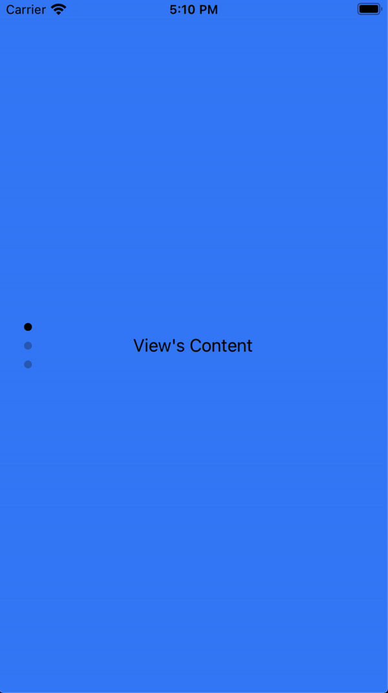

# The `apply` Method

- Use the `apply` method when you need to immediately apply the properties and transformations to a view without any animation.

`index.js`
```javascript
$.myAnimation.apply($.myView)
```

### Apply Example
The `apply` method sets the properties instantly. In this example, the `ScrollableView` is rotated 90 degrees, and its content is counter-rotated -90 degrees to simulate a **TikTok-like** interface.

`index.xml`
```xml
<Alloy>
  <Animation module="purgetss.ui" id="rotate" class="platform-wh-inverted rotate-90" />
  <Animation module="purgetss.ui" id="counterRotate" class="platform-wh -rotate-90" />

  <Window class="exit-on-close-false keep-screen-on">
    <ScrollableView id="scrollableView" class="overlay-enabled disable-bounce paging-control-alpha-100 scrolling-enabled show-paging-control paging-control-h-14 paging-control-on-top-false paging-control-transparent page-indicator-(rgba(0,0,0,0.24)) current-page-indicator-(rgba(0,0,0,1))">
      <View class="bg-blue-500">
        <Label class="text-center" text="View's Content" />
      </View>

      <View class="bg-red-500">
        <Label class="text-center" text="View's Content" />
      </View>

      <View class="bg-green-500">
        <Label class="text-center" text="View's Content" />
      </View>
    </ScrollableView>
  </Window>
</Alloy>
```

`index.js`
```javascript
$.rotate.apply($.scrollableView)

$.counterRotate.apply($.scrollableView.views)

$.index.open()
```



***\* low framerate gif***
