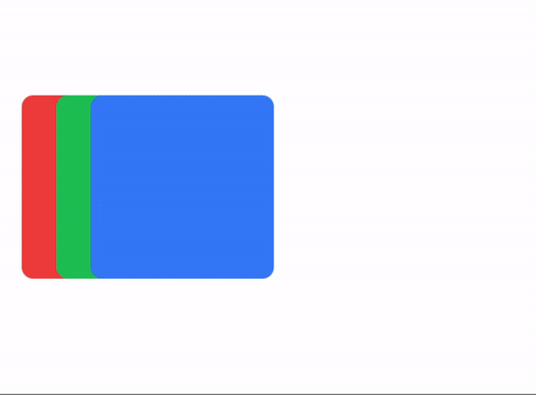
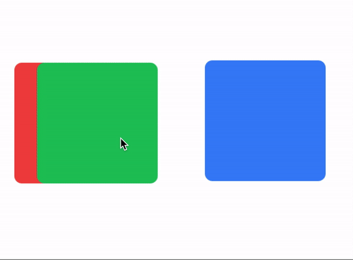
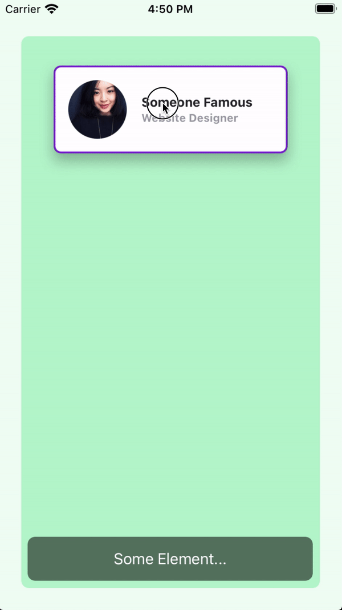

# The `draggable` Method

- The `draggable` method allows you to convert any view or an array of views into draggable elements.
- You can set **basic animations** when dragging or dropping elements using the `drag:` and `drop:` modifiers.
- You can `apply` or `animate` the properties either globally or locally using the `drag-apply` or `drag-animate` classes.
- You can also constrain any view using the `horizontal-constraint` or `vertical-constraint` classes.

```javascript
// Calling a draggable method
$.draggableAnimation.draggable('A View or an array of Views')
```

> ℹ️ **INFO**
>
> **You can create a blank `Animation` object or use an existing one to call the `draggable` method to convert a view or array of views into 'draggable' objects.**
> 
> **When using an Animation object on an array of views, it will handle the zIndex of each draggable element.**


### Draggable Example
`index.xml`
```xml
<Alloy>
  <Window class="keep-screen-on exit-on-close-false">
    <Animation module="purgetss.ui" id="draggableAnimation" />

    <Label text="Draggable Example" class="mt-16 text-center" />

    <View id="red" class="ml-4 h-32 w-32 rounded-lg bg-red-500" />

    <View id="green" class="ml-10 h-32 w-32 rounded-lg bg-green-500" />

    <View id="blue" class="ml-16 h-32 w-32 rounded-lg bg-blue-500" />
  </Window>
</Alloy>
```

`index.js`
```javascript
$.index.open()

$.draggableAnimation.draggable([$.red, $.green, $.blue])
```



***\* low framerate gif***

## `drag` and `drop` Modifiers
- The `drag:` and `drop:` modifiers allow you to set basic animations while dragging and dropping elements.
- You can set 'global' modifiers in the `Animation` object, or you can set individual modifiers for each view.
- Local modifiers will overwrite any global modifier.

> ℹ️ **INFO**
>
> To simplify things, we are restricting the types of animations that can be applied while dragging (or dropping).
> 
> **Mainly, we are not applying any `size`, `scale`, or `anchorPoint` transformation.**


### Drag & Drop Example
`index.xml`
```xml
<Alloy>
  <Window class="keep-screen-on exit-on-close-false">
    <!-- Global set of modifiers -->
    <Animation id="draggableAnimation" module="purgetss.ui" class="drag:duration-100 drag:opacity-50 drop:opacity-100" />

    <Label text="Global Modifiers:\ndrag:duration-100 drag:opacity-50 drop:opacity-100" class="mt-16 text-center" />

    <!-- No local modifiers -->
    <Label id="red" class="mx-2 ml-4 h-32 w-32 rounded-lg bg-red-500 text-center text-xs text-white" text="No local modifiers" />

    <!-- drag:bg-green-800 drop:bg-green-500 -->
    <Label id="green" class="drag:bg-green-800 drop:bg-green-500 ml-10 h-32 w-32 rounded-lg bg-green-500 text-center text-xs text-white" text="drag:bg-green-800 drop:bg-green-500" />

    <!-- drag:opacity-25 -->
    <Label id="blue" class="drag:opacity-25 ml-16 h-32 w-32 rounded-lg bg-blue-500 text-center text-xs text-white" text="drag:opacity-25" />
  </Window>
</Alloy>
```


***\* low framerate gif***

## `draggingType` Property
To control how `drag:` and `drop:` modifiers are applied, you can use either the `drag-animate` (default) or `drag-apply` class. The `drag-animate` class will animate the properties, while the `drag-apply` class will apply them immediately.

`tailwind.tss`
```css
/* Component(s): For the Animation Component */
/* Property(ies): draggingType */
.drag-apply { draggingType: 'apply' }
.drag-animate { draggingType: 'animate' }
```

### Dragging Type Example
In the following example, the `Animation` element sets the global dragging type to `drag-apply`, but the green square overwrites it to `drag-animate`.

`index.xml`
```xml
<Alloy>
  <Window class="keep-screen-on exit-on-close-false">
    <!-- Global set of modifiers -->
    <Animation id="draggableAnimation" module="purgetss.ui" class="drag-apply drag:duration-500 drag:opacity-50 drop:opacity-100" />

    <Label text="draggingType Example:\ndrag-apply drag:duration-500 drag:opacity-50 drop:opacity-100" class="mt-16 text-center" />

    <!-- No local modifiers, will be using the global modifiers -->
    <Label id="red" class="ml-4 h-32 w-32 rounded-lg bg-red-500 text-center text-xs text-white" text="No local modifiers" />

    <!-- drag-animate drag:bg-green-800 drop:bg-green-500 -->
    <Label id="green" class="drag-animate drag:bg-green-800 drop:bg-green-500 ml-10 h-32 w-32 rounded-lg bg-green-500 text-center text-xs text-white" text="drag-animate drag:bg-green-800 drop:bg-green-500" />

    <!-- drag:opacity-25 -->
    <Label id="blue" class="drag:opacity-25 ml-16 h-32 w-32 rounded-lg bg-blue-500 text-center text-xs text-white" text="drag:opacity-25" />
  </Window>
</Alloy>
```



***\* low framerate gif***

## `bounds` Modifier
- You can set boundaries in which a view can move within its parent view using the horizontal-constraint or vertical-constraint classes.
- You can set global boundaries in the Animation object and/or local boundaries for each individual child view.
- Local values will overwrite any global values.

### Bounds Example 1
The `card` view has a boundary of `m-4` and a bottom boundary of `mb-16`.

`index.xml`
```xml
<Alloy>
  <Window class="keep-screen-on exit-on-close-false bg-green-50">
    <Animation id="draggableAnimation" module="purgetss.ui" />

    <View class="mx-6 mb-6 mt-10 h-screen w-screen rounded-lg bg-green-200">
      <View id="card" class="bounds:m-2 bounds:mb-16 mt-8 h-24 w-64 shadow-lg">
        <View id="cardInside" class="w-screen rounded-lg border-2 border-purple-700 bg-white">
          <ImageView id="theImage" class="rounded-16 prevent-default-image m-4 ml-4 h-16 w-16 bg-gray-50" image="https://randomuser.me/api/portraits/women/17.jpg" />

          <View class="vertical ml-24 w-screen">
            <Label class="ml-0 text-sm font-bold text-gray-800" text="Ms. Jane Doe" />
            <Label class="ml-0 text-xs font-bold text-gray-400" text="Website Designer" />
          </View>
        </View>
      </View>

      <Label class="bg-(#80000000) mx-2 mb-2 h-12 w-screen rounded-lg text-center text-white" text="Some Element..." />
    </View>
  </Window>
</Alloy>
```

`index.js`
```javascript
$.index.open()

$.draggableAnimation.draggable($.card)
```



***\* low framerate gif***

### Bounds Example 2
In this example, the boundaries are set globally in the `draggableAnimation` view.

Every card view will use these global values.

`index.xml`
```xml
<Alloy>
  <Window class="keep-screen-on exit-on-close-false bg-green-50">
    <Animation id="draggableAnimation" module="purgetss.ui" class="bounds:m-2 bounds:mb-16" />

    <View class="wh-screen mx-6 mb-6 mt-10 rounded-lg bg-green-200">
      <View id="card" class="mt-8 h-24 w-64 shadow-lg">
        <View id="cardInside" class="w-screen rounded-lg border-2 border-purple-700 bg-white">
          <ImageView id="theImage" class="rounded-16 prevent-default-image wh-16 m-4 bg-gray-50" image="https://randomuser.me/api/portraits/women/17.jpg" />

          <View class="vertical ml-24 w-screen">
            <Label class="ml-0 text-sm font-bold text-gray-800" text="Ms. Jane Doe" />
            <Label class="ml-0 text-xs font-bold text-gray-400" text="Website Designer" />
          </View>
        </View>
      </View>

      <View id="card2" class="mt-40 h-24 w-64 shadow-lg">
        <View id="cardInside" class="w-screen rounded-lg border-2 border-purple-700 bg-white">
          <ImageView id="theImage" class="rounded-16 prevent-default-image wh-16 m-4 bg-gray-50" image="https://randomuser.me/api/portraits/women/21.jpg" />

          <View class="vertical ml-24 w-screen">
            <Label class="ml-0 text-sm font-bold text-gray-800" text="Ms. Jane Doe" />
            <Label class="ml-0 text-xs font-bold text-gray-400" text="Website Designer" />
          </View>
        </View>
      </View>

      <View id="card3" class="mt-72 h-24 w-64 shadow-lg">
        <View id="cardInside" class="w-screen rounded-lg border-2 border-purple-700 bg-white">
          <ImageView id="theImage" class="rounded-16 prevent-default-image wh-16 m-4 bg-gray-50" image="https://randomuser.me/api/portraits/women/25.jpg" />

          <View class="vertical ml-24 w-screen">
            <Label class="ml-0 text-sm font-bold text-gray-800" text="Ms. Jane Doe" />
            <Label class="ml-0 text-xs font-bold text-gray-400" text="Website Designer" />
          </View>
        </View>
      </View>

      <Label class="bg-(#80000000) mx-2 mb-2 h-12 w-screen rounded-lg text-center text-white" text="Some Element..." />
    </View>
  </Window>
</Alloy>
```

`index.js`
```javascript
$.index.open()

$.draggableAnimation.draggable([$.card, $.card2, $.card3])
```


***\* low framerate gif***

## `vertical` and `horizontal` Constraints
To add a vertical and horizontal constraint to any `dragging` element, set the `vertical-constraint` or `horizontal-constraint` classes on the view.

```css
/* Component(s): Ti.UI.Animation */
/* Property(ies): A custom property to use it with the Animation module */
'.horizontal-constraint': { constraint: 'horizontal' }
'.vertical-constraint': { constraint: 'vertical' }
```

### Constraint Example
In this example, the `card` view will move only from side to side.

`index.xml`
```xml
<Alloy>
  <Window class="keep-screen-on exit-on-close-false">
    <Animation id="draggableAnimation" module="purgetss.ui" />

    <View id="card" class="horizontal-constraint h-24 w-64 shadow-lg">
      <View id="cardInside" class="w-screen rounded-lg border-2 border-purple-700 bg-white">
        <ImageView id="theImage" class="rounded-16 wh-16 m-4 ml-4" image="https://randomuser.me/api/portraits/women/17.jpg" />

        <View class="vertical ml-24 w-screen">
          <Label class="ml-0 text-sm font-bold text-gray-800" text="Ms. Jane Doe" />
          <Label class="ml-0 text-xs font-bold text-gray-400" text="Website Designer" />
        </View>
      </View>
    </View>
  </Window>
</Alloy>
```

`index.js`
```javascript
$.index.open()

$.draggableAnimation.draggable($.card)
```


***\* low framerate gif***
