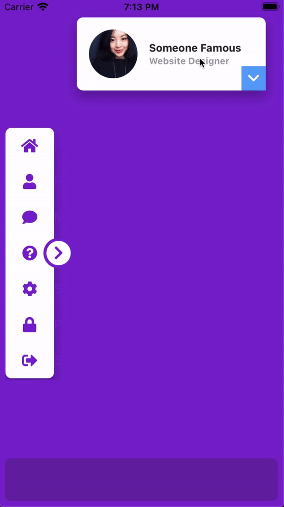

Here is an example of the Animation module with a more complex UI.

To use this example, you'll need to install the FontAwesome fonts in your project by running:

```bash
> purgetss icon-library -v=fa
```

And copy the following code:

```xml title="index.xml"
<Alloy>
  <Window class="exit-on-close-false portrait bg-purple-700">
    <!-- Sidebar -->
    <View id="sideBar" class="ml-2 h-1/2 w-24">
      <View class="vertical ios:shadow-lg mr-8 rounded-lg bg-white" ios:onSingletap="doAction" android:onClick="doAction">
        <View class="grid-flow-row">
          <View class="grid-rows-7 ml-0 w-64">
            <View class="horizontal bg-selected-purple-100 items-center" action="home">
              <Label class="touch-enabled-false fas fa-home ml-0 h-full w-16 border-transparent bg-transparent text-center text-xl text-purple-700" />
              <Label class="touch-enabled-false text-purple-700" text="Home" />
            </View>
          </View>

          <View class="grid-rows-7 ml-0 w-64">
            <View class="horizontal bg-selected-purple-100 items-center" action="profile">
              <Label class="touch-enabled-false fas fa-user ml-0 h-full w-16 border-transparent bg-transparent text-center text-xl text-purple-700" />
              <Label class="touch-enabled-false text-purple-700" text="Profile" />
            </View>
          </View>

          <View class="grid-rows-7 ml-0 w-64">
            <View class="horizontal bg-selected-purple-100 items-center" action="messages">
              <Label class="touch-enabled-false fas fa-comment ml-0 h-full w-16 border-transparent bg-transparent text-center text-xl text-purple-700" />
              <Label class="touch-enabled-false text-purple-700" text="Messages" />
            </View>
          </View>

          <View class="grid-rows-7 ml-0 w-64">
            <View class="horizontal bg-selected-purple-100 items-center" action="help">
              <Label class="touch-enabled-false fas fa-question-circle ml-0 h-full w-16 border-transparent bg-transparent text-center text-xl text-purple-700" />
              <Label class="touch-enabled-false text-purple-700" text="Help" />
            </View>
          </View>

          <View class="grid-rows-7 ml-0 w-64">
            <View class="horizontal bg-selected-purple-100 items-center" action="settings">
              <Label class="touch-enabled-false fas fa-cog ml-0 h-full w-16 border-transparent bg-transparent text-center text-xl text-purple-700" />
              <Label class="touch-enabled-false text-purple-700" text="Settings" />
            </View>
          </View>

          <View class="grid-rows-7 ml-0 w-64">
            <View class="horizontal bg-selected-purple-100 items-center" action="password">
              <Label class="touch-enabled-false fas fa-lock ml-0 h-full w-16 border-transparent bg-transparent text-center text-xl text-purple-700" />
              <Label class="touch-enabled-false text-purple-700" text="Password" />
            </View>
          </View>

          <View class="grid-rows-7 ml-0 w-64">
            <View class="horizontal bg-selected-purple-100 items-center" action="sign-out">
              <Label class="touch-enabled-false fas fa-sign-out-alt ml-0 h-full w-16 border-transparent bg-transparent text-center text-xl text-purple-700" />
              <Label class="touch-enabled-false text-purple-700" text="Sign Out" />
            </View>
          </View>
        </View>
      </View>

      <Button id="sideBarChevron" class="fas rounded-10 fa-chevron-right wh-10 mr-1.5 border-4 border-purple-700 bg-white text-xl text-purple-700" ios:onSingletap="sideBarClicked" android:onClick="sideBarClicked" />

      <Animation id="sideBarAnimation" module="purgetss.ui" class="close:w-24 duration-150 open:w-72" />
      <Animation id="sideBarAnimationChevron" module="purgetss.ui" class="close:rotate-0 duration-150 open:rotate-180" />
    </View>

    <!-- My Card -->
    <View id="myCard" class="mr-6 mt-6 h-24 w-8/12 rounded-lg shadow-lg">
      <View class="vertical rounded-lg bg-white">
        <View class="h-auto w-screen">
          <ImageView class="rounded-16 m-4 ml-4 h-16 w-16" image="https://randomuser.me/api/portraits/women/17.jpg" />

          <View class="vertical ml-24 h-auto">
            <Label class="ml-0 text-sm font-bold text-gray-800" text="Someone Famous" />
            <Label class="ml-0 text-xs font-bold text-gray-400" text="Website Designer" />
          </View>
        </View>

        <View class="rounded-1 mx-2 h-0.5 w-screen bg-gray-300" />

        <View class="mt-2 h-48 w-screen grid-flow-row" ios:onSingletap="doAction" android:onClick="doAction">
          <View class="ml-0 w-screen grid-rows-5">
            <View class="horizontal bg-selected-purple-100 items-center" action="profile">
              <Label class="touch-enabled-false fas fa-user ml-0 h-full w-14 border-transparent bg-transparent text-center text-xl text-purple-700" />
              <Label class="touch-enabled-false text-sm text-purple-700" text="Edit Profile" />
            </View>
          </View>

          <View class="ml-0 w-screen grid-rows-5">
            <View class="horizontal bg-selected-purple-100 items-center" action="inbox">
              <Label class="touch-enabled-false fas fa-inbox ml-0 h-full w-14 border-transparent bg-transparent text-center text-xl text-purple-700" />
              <Label class="touch-enabled-false text-sm text-purple-700" text="Inbox" />
            </View>
          </View>

          <View class="ml-0 w-screen grid-rows-5">
            <View class="horizontal bg-selected-purple-100 items-center" action="settings">
              <Label class="touch-enabled-false fas fa-cog ml-0 h-full w-14 border-transparent bg-transparent text-center text-xl text-purple-700" />
              <Label class="touch-enabled-false text-sm text-purple-700" text="Settings" />
            </View>
          </View>

          <View class="ml-0 w-screen grid-rows-5">
            <View class="horizontal bg-selected-purple-100 items-center" action="support">
              <Label class="touch-enabled-false fas fa-question-circle ml-0 h-full w-14 border-transparent bg-transparent text-center text-xl text-purple-700" />
              <Label class="touch-enabled-false text-sm text-purple-700" text="Support" />
            </View>
          </View>

          <View class="ml-0 w-screen grid-rows-5">
            <View class="horizontal bg-selected-purple-100 items-center" action="sign-out">
              <Label class="touch-enabled-false fas fa-sign-out-alt ml-0 h-full w-14 border-transparent bg-transparent text-center text-xl text-purple-700" />
              <Label class="touch-enabled-false text-sm text-purple-700" text="Sign Out" />
            </View>
          </View>
        </View>
      </View>

      <View class="rounded-tl-br-md wh-8 mb-0 mr-0 bg-blue-400">
        <Button id="myCardChevron" class="fas fa-chevron-down border-transparent bg-transparent text-white" ios:onSingletap="myCardClicked" android:onClick="myCardClicked" />
      </View>

      <Animation id="myCardAnimation" module="purgetss.ui" class="open:h-(298) close:h-24 duration-150" />
      <Animation id="myCardAnimationChevron" module="purgetss.ui" class="close:rotate-0 duration-150 open:rotate-180" />
    </View>

    <Label id="action" class="mx-4 mb-6 h-10 w-screen rounded-lg bg-purple-800 text-sm font-bold text-purple-50" />

    <Animation id="draggableAnimation" module="purgetss.ui" class="bounds:m-4 bounds:mb-20" />
  </Window>
</Alloy>
```

```javascript title="index.js"
$.index.open()

$.draggableAnimation.draggable($.myCard)

function sideBarClicked() {
  $.sideBarAnimation.play($.sideBar)
  $.sideBarAnimationChevron.play($.sideBarChevron)
}

function myCardClicked() {
  $.myCardAnimation.play($.myCard)
  $.myCardAnimationChevron.play($.myCardChevron)
}

function doAction(event) {
  if (event.source.action) {
    $.action.text = `   Action: ${event.source.action}`
 }
}
```



***\* low framerate gif***
