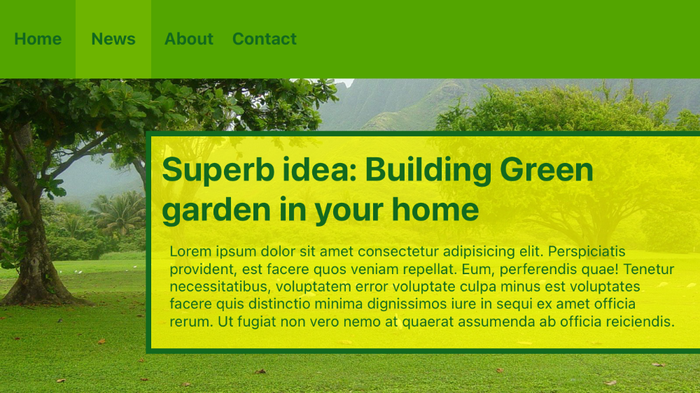

# **Customization and Configuration Guide**

- [**Customization and Configuration Guide**](#customization-and-configuration-guide)
  - [Customization](#customization)
  - [Creating your configuration file](#creating-your-configuration-file)
  - [Generating your custom `tailwind.tss` file](#generating-your-custom-tailwindtss-file)
  - [Configuration file example](#configuration-file-example)
- [**`config.js` file structure**](#configjs-file-structure)
  - [Theme Section](#theme-section)
  - [Colors Section](#colors-section)
    - [Nested object syntax](#nested-object-syntax)
    - [Shared colors](#shared-colors)
    - [Overriding a default color](#overriding-a-default-color)
    - [Extending the default palette](#extending-the-default-palette)
  - [Spacing Section](#spacing-section)
    - [Shared spacing](#shared-spacing)
    - [Overriding the default spacing scale](#overriding-the-default-spacing-scale)
    - [Extending the default spacing scale](#extending-the-default-spacing-scale)
  - [Individual properties](#individual-properties)
  - [The `apply` directive](#the-apply-directive)
    - [Set it to any id, class or Ti Element](#set-it-to-any-id-class-or-ti-element)
    - [Use any of the default classes](#use-any-of-the-default-classes)
    - [Use any newly defined classes in `config.js`](#use-any-newly-defined-classes-in-configjs)
    - [You can set an array or a string of classes](#you-can-set-an-array-or-a-string-of-classes)
    - [Combine it with any platform, device or conditional-block properties](#combine-it-with-any-platform-device-or-conditional-block-properties)
  - [Purge Section](#purge-section)
    - [Large safelist?](#large-safelist)
- [**Overriding, extending or disabling properties**](#overriding-extending-or-disabling-properties)
  - [Overriding properties](#overriding-properties)
  - [Extending properties](#extending-properties)
  - [Disabling properties](#disabling-properties)
- [**Core Properties**](#core-properties)
    - [Text Colors](#text-colors)
    - [Background Colors](#background-colors)
    - [Placeholder Colors](#placeholder-colors)
    - [Gradient Color Stops](#gradient-color-stops)
    - [Tint Color](#tint-color)
    - [Border Colors](#border-colors)
    - [Border Width](#border-width)
    - [Border Radius](#border-radius)
    - [Width scale](#width-scale)
    - [Height scale](#height-scale)
    - [Margin](#margin)
    - [Padding](#padding)
    - [Display](#display)
    - [Font Family](#font-family)
    - [Font Size](#font-size)
    - [Font Style](#font-style)
    - [Content Width & Height](#content-width--height)
    - [Opacity](#opacity)
- [**Adding your own properties**](#adding-your-own-properties)
  - [Global properties](#global-properties)
  - [Arbitrary values](#arbitrary-values)
- [**Platform and Device Variants**](#platform-and-device-variants)
- [License](#license)

## Customization
By default, `purgetss` will look for an optional `./purgetss/config.js` file where you can define any customizations.

Every section of the config file is optional, so you only specify what you'd like to change. Any missing sections will fall back to the default configuration.

## Creating your configuration file
To create a purgeTSS configuration file for your project, run this command:

```bash
> purgetss init

# alias:
> purgetss i
```

It will create a minimal `./purgetss/config.js` file in your project's root directory:
```javascript
// ./purgetss/config.js
module.exports = {
  'purge': {
    'mode': 'all',

    // These options are passed through directly to purgeTSS
    'options': {
      'safelist': [],
    }
  },
  'theme': {
    'extend': {}
  },
  corePlugins: {}
};
```

## Generating your custom `tailwind.tss` file
To generate your custom `./purgetss/tailwind.tss` file use the following command:

```bash
> purgetss build

# alias:
> purgetss b
```

It will generate a new `tailwind.tss` file with every attribute defined in `./purgetss/config.js`.

**After generating your custom `tailwind.tss` file. You can use any of the generated classes, `purgeTSS` will use this file instead of Tailwind's default file.**

## Configuration file example
- **For the modifier keys, you can use any name or convention you want. For example: '.my-custom-class', or '.anotherCustomClassName'**.
- For `Titanium` constants, `Alloy Configuration Values` or `Global Variables` always enclose them in quotes.
- For `color` values, you can use `hex`, `8-digit hex`, `rgb(R,G,B)`, `rgba(R,G,B,A)`, `transparent` or any of the standard color names.
- For `spacing` values, you can use different type of units: `rem`, `%`, `px` or `dp`.
  - `percentages` - These values are passed without any conversion.
  - `rem` - Values in rem will be converted with this little formula: `remValue * 16`.
  - `dp` and `px` - For these values, the unit type will be removed and the value will remain intact. Except the pixel units in your custom classes will remain the same.

```javascript
// ./purgetss/config.js
module.exports = {
  'theme': {
    'colors': {
      'highlight': 'rgba(255, 255, 0, .70)',
      'primary': {
        'solid': '#002359',
        'dark': '#000030',
        'transparent': '#D9002359'
      }
    },
    'fontFamily': {
      'display': 'AlfaSlabOne-Regular',
      'body': 'BarlowSemiCondensed-Regular',
    },
    'height': {
      'xl': '3rem',
      '1/3': '33.333333%'
    },
    'borderWidth': {
      '3': '3',
      '6': '6',
      '10': '10'
    },
    '.gallery': {
      'DEFAULT': {
        'width': 'Ti.UI.FILL',
        'height': 'Ti.UI.SIZE'
      },
      'ios': {
        'clipMode': 'Ti.UI.iOS.CLIP_MODE_ENABLED'
      },
      'android': {
        'hiddenBehavior': 'Ti.UI.HIDDEN_BEHAVIOR_GONE'
      }
    }
  }
};
```

# **`config.js` file structure**

## Theme Section
The `theme` section in `config.js`, is where you define your project's color palette, type scale, font stacks, border radius values, and more.

```javascript
// ./purgetss/config.js
module.exports = {
  'theme': {
    'fontFamily': {
      'display': 'AlfaSlabOne-Regular',
      'body': 'BarlowSemiCondensed-Regular'
    },
    'borderWidth': {
      'DEFAULT': 1,
      '0': '0',
      '2': '2',
      '4': '4',
    },
    'extend': {
      'colors': {
        'cyan': '#9cdbff',
      },
      'spacing': {
        '96': '24rem',
        '128': '32rem',
      }
    }
  }
}
```

## Colors Section
The `colors` section allows you to customize the global color palette values.

```javascript
// ./purgetss/config.js
module.exports = {
  'theme': {
    'colors': {
      'transparent': 'transparent',
      'black': '#000',
      'white': '#fff',
      'gray': {
        '100': '#f7fafc',
        // ...
        '900': '#1a202c',
      },

      // ...
    }
  }
}
```

By default, these colors are inherited by the `textColor`, `backgroundColor`, `borderColor`, `placeholderColor`, `gradientColorStops` and `hintTextColor` properties.


### Nested object syntax
Colors are defined as a simple list of key-value pairs, or as nested object notation. The nested keys are added to the base color name as modifiers.

```javascript
// ./purgetss/config.js
module.exports = {
  'theme': {
    'colors': {
      'highlight': '#ffff00',
      'primary': {
        'solid': '#002359',
        'dark': '#000030',
        'transparent': '#D9002359'
      },
      'secondary': {
        'solid': '#13294B',
        'dark': '#000023',
        'transparent': '#D913294B'
      },
      'gray': {
        'light': '#f1f2f3',
        'medium': '#ebeff2',
        'dark': '#2B2B2B'
      }
    }
  }
};
```

### Shared colors
All colors defined in the `colors` section are automatically shared with `textColor`, `backgroundColor`, `borderColor`, `placeholderColor`, `gradientColorStops` and `hintTextColor`  properties.

> **When you include the `colors` section, `purgeTSS` will automatically generate all color-related preperties and merge them with any other color-related preperties present in the configuration file.**

```javascript
// ./purgetss/config.js
module.exports = {
  'theme': {
    'colors': {
      'highlight': '#ffff00',
      'primary': {
        'solid': '#002359',
        'dark': '#000030',
        'transparent': '#D9002359'
      },
      'secondary': {
        'solid': '#13294B',
        'dark': '#000023',
        'transparent': '#D913294B'
      },
      'gray': {
        'light': '#f1f2f3',
        'medium': '#ebeff2',
        'dark': '#2B2B2B'
      }
    },
    'textColor': {
      'orange-peel': '#FF9F1C',
      'ultramarine': '#446DF6'
    }
  }
};
```

```css
// ./purgetss/tailwind.tss
// color Property
'.text-highlight': { color: '#ffff00' }
'.text-primary-solid': { color: '#002359' }
'.text-primary-dark': { color: '#000030' }
'.text-primary-transparent': { color: '#D9002359' }
'.text-secondary-solid': { color: '#13294B' }
'.text-secondary-dark': { color: '#000023' }
'.text-secondary-transparent': { color: '#D913294B' }
'.text-gray-light': { color: '#f1f2f3' }
'.text-gray-medium': { color: '#ebeff2' }
'.text-gray-dark': { color: '#2B2B2B' }
'.text-orange-peel': { color: '#FF9F1C' }
'.text-ultramarine': { color: '#446DF6' }

// Rest of inherited properties:

// backgroundColor
    ...
// borderColor
    ...
// placeholderColor
    ...
// gradientColorStops
    ...
```

### Overriding a default color
If you want to override one of the default colors but preserve the rest, simply provide the new values in the `theme.extend.colors` section of your `config.js` file.

For example, here we've replaced the default cool grays with a neutral gray palette:
```javascript
// ./purgetss/config.js
module.exports = {
  'theme': {
    'extend': {
      'colors': {
        'gray': {
          '100': '#f5f5f5',
          '200': '#eeeeee',
          '300': '#e0e0e0',
          '400': '#bdbdbd',
          '500': '#9e9e9e',
          '600': '#757575',
          '700': '#616161',
          '800': '#424242',
          '900': '#212121',
        }
      }
    }
  }
}
```

### Extending the default palette
If you want to to extend the default color palette, you can do so using the `theme.extend.colors` section of your `config.js` file:
```javascript
// ./purgetss/config.js
module.exports = {
  'theme': {
    'extend': {
      'colors': {
        'regal-blue': '#243c5a',
      }
    }
  }
}
```

This will generate classes like bg-regal-blue in addition to all of Tailwind's default colors.

## Spacing Section
The `spacing` section allows you to customize the global spacing and sizing scale values.

```javascript
// ./purgetss/config.js
module.exports = {
  'theme': {
    'spacing': {
      '0': '0',
      'px': '1px',
      'tight': '0.25rem',
      'loose': '1.0rem',
      'extra-loose': '3.0rem',
    }
  }
}
```

### Shared spacing
The `spacing` section is shared by the `padding`, `margin`, `width`, and `height` properties.

> **When you include the `spacing` section, `purgeTSS` will automatically generate all spacing-related properties and merge them with any other spacing-related properties present in the configuration file.**

```javascript
// ./purgetss/config.js
module.exports = {
  'theme': {
    'spacing': {
      'tight': '0.25rem',
      'loose': '1.0rem'
    },
    'width': {
      'banner': '5rem'
    },
    'height': {
      'xl': '3rem',
      '1/3': '33.333333%'
    }
  }
};
```

```css
// ./purgetss/tailwind.tss
// width Property
'.w-banner': { width: 80 }
'.w-tight': { width: 4 }
'.w-loose': { width: 16 }

// height Property
'.h-xl': { height: 48 }
'.h-1/3': { height: '33.333333%' }
'.h-tight': { height: 4 }
'.h-loose': { height: 16 }

// Margin
'.m-tight': { top: 4, right: 4, bottom: 4, left: 4 }
'.m-loose': { top: 16, right: 16, bottom: 16, left: 16 }
    ...

// padding Property
'.p-tight': { padding: { top: 4, right: 4, bottom: 4, left: 4 } }
'.p-loose': { padding: { top: 16, right: 16, bottom: 16, left: 16 } }
    ...

// Rest of inherited properties
```

### Overriding the default spacing scale
If you want to override the default spacing scale, you can do so using the `theme.spacing` section of your `config.js` file:
```javascript
// ./purgetss/config.js
module.exports = {
  'theme': {
    'spacing': {
      'sm': '8',
      'md': '12',
      'lg': '16',
      'xl': '24',
    }
  }
}
```

This will disable the default spacing scale and generate classes like p-sm, m-md, w-lg, and h-xl instead.

### Extending the default spacing scale
If you want to extend the default spacing scale, you can do so using the `theme.extend.spacing` section of your `config.js` file:
```javascript
// ./purgetss/config.js
module.exports = {
  'theme': {
    'extend': {
      'spacing': {
        '72': '18rem',
        '84': '21rem',
        '96': '24rem',
      }
    }
  }
}
```

This will generate classes like p-72, m-84, and h-96 in addition to all of the default spacing/sizing utilities.

## Individual properties
The rest of the theme section is used to configure what values are available for each individual properties.

For example, the `borderRadius` property allows you customize what border radius classes will be generated:
```javascript
module.exports = {
  'theme': {
    'borderRadius': {
      'none': '0',
      'sm': '.125rem',
      'DEFAULT': '.25rem',
      'lg': '.5rem'
    },
  }
}
```
The keys determine the suffix for the generated classes, and the values determine the value of the actual TSS declaration.

The example `borderRadius` configuration above would generate the following TSS classes:

```css
// borderRadius Property
'.rounded-none': { borderRadius: 0 }
'.rounded-sm': { borderRadius: 2 }
'.rounded': { borderRadius: 4 }
'.rounded-lg': { borderRadius: 8 }
```

You'll notice that using a key of `default` in the theme configuration created the class `.rounded` with no suffix.

This is a common convention in `purgeTSS` supported by many (although not all) of the properties.

## The `apply` directive
Starting with **`v2.3.5`**, you can `apply` a set of classes to create more complex classes, or when you find a repetitive pattern in your code and you’d like to extract it to a new class component.

- Set it to any id, class or Ti Element
- Use any of the default classes
- Use any newly defined classes in `config.js`
- You can set an array or a string of classes
- Combine it with any platform, device or conditional-block properties

### Set it to any id, class or Ti Element
```javascript
...
theme: {
  '#carrousel': {
    apply: 'w-screen h-auto bg-teal-200 mx-2 my-4 horizontal'
  },
  '.my-custom-class': {
    apply: 'w-auto h-auto font-bold border-2 rounded my-0.5 font-saira-condensed'
  },
  'Label': {
    apply: [
      'text-base',
      'font-bold',
      'text-gray-700',
    ]
  },
}
...
```

```css
'#carrousel': { backgroundColor: '#99f6e4', height: Ti.UI.SIZE, layout: 'horizontal', right: 8, left: 8, top: 16, bottom: 16, width: Ti.UI.FILL }
'.my-custom-class': { borderRadius: 4, borderWidth: 2, height: Ti.UI.SIZE, top: 2, bottom: 2, width: Ti.UI.SIZE, font: { fontFamily: 'SairaCondensed-Regular', fontWeight: 'bold' } }
'Label': { color: '#3f3f46', font: { fontSize: 16, fontWeight: 'bold' } }
```

### Use any of the default classes
```javascript
...
theme: {
  '.btn': {
    apply: 'w-auto h-auto font-bold border-2 rounded my-0.5 font-saira-condensed'
  },
  '.btn-primary': {
    apply: [
      'bg-green-500',
      'text-green-100',
      'border-green-200'
    ]
  },
}
...
```

```css
'.btn': { borderRadius: 4, borderWidth: 2, height: Ti.UI.SIZE, top: 2, bottom: 2, width: Ti.UI.SIZE, font: { fontWeight: 'bold' } }
'.btn-primary': { backgroundColor: '#22c55e', borderColor: '#bbf7d0', color: '#dcfce7' }
```

### Use any newly defined classes in `config.js`
```javascript
...
theme: {
  '.btn': {
    apply: 'w-auto h-auto font-bold border-2 rounded my-0.5'
  },
  '.btn-corporate': {
    // Newly created classes ( see below in extend.colors.corporate )
    apply: [
      'bg-corporate-500',
      'text-corporate-100',
      'border-corporate-200'
    ]
  },
  extend: {
    colors: {
      // New color values that will be used in bg, text and border
      corporate: {
        100: '#dddfe1', 200: '#babfc4', 500: '#53606b'
      }
    }
  },
}
...
```

```css
'.btn': { borderRadius: 4, borderWidth: 2, height: Ti.UI.SIZE, top: 2, bottom: 2, width: Ti.UI.SIZE, font: { fontWeight: 'bold' } }
'.btn-corporate': { backgroundColor: '#53606b', borderColor: '#babfc4', color: '#dddfe1' }
// ...
// color Property
'.text-corporate-100': { color: '#dddfe1' }
// backgroundColor Property
'.bg-corporate-500': { backgroundColor: '#53606b' }
// borderColor Property
'.border-corporate-200': { borderColor: '#babfc4' }
```

### You can set an array or a string of classes
```javascript
...
theme: {
  '.btn': {
    // Use a string of classes
    apply: 'w-auto h-auto font-bold border-2 rounded my-0.5'
  },
  '.btn-corporate': {
    // or an array of classes
    apply: [
      'bg-corporate-500',
      'text-corporate-100',
      'border-corporate-200'
    ]
  }
}
...
```

```css
'.btn': { borderRadius: 4, borderWidth: 2, height: Ti.UI.SIZE, top: 2, bottom: 2, width: Ti.UI.SIZE, font: { fontWeight: 'bold' } }
'.btn-corporate': { backgroundColor: '#53606b', borderColor: '#babfc4', color: '#dddfe1' }
// ...
```

### Combine it with any platform, device or conditional-block properties
```javascript
...
theme: {
  '.btn': {
    apply: 'w-auto h-auto font-bold border-2 rounded my-0.5',
    ios: {
      apply: 'w-screen mx-4'
    },
    handheld: {
      apply: 'h-20'
    },
    '[if=Alloy.Globals.iPhoneX]': {
      apply: 'mb-12'
    }
  },
}
...
```

```css
'.btn': { borderRadius: 4, borderWidth: 2, height: Ti.UI.SIZE, top: 2, bottom: 2, width: Ti.UI.SIZE, font: { fontWeight: 'bold' } }
'.btn[platform=ios]': { right: 16, left: 16, width: Ti.UI.FILL }
'.btn[formFactor=handheld]': { height: 80 }
'.btn[if=Alloy.Globals.iPhoneX]': { bottom: 48 }
// ...
```


## Purge Section
You can control how `purgetss` remove unused classes. Or to keep the ones you want.

```javascript
// ./purgetss/config.js
module.exports = {
  'purge': {
    'mode': 'all',

    // These options are passed through directly to purgeTSS
    'options': {
      'safelist': [],
    }
  },
}
```

- `purge.mode.all` By default, `purgeTSS` will look everywhere inside your XML files, like in comments, attributes, classes, ids, Ti Element, and even the actual written content in your markup. **This mode is necessary if you want `purgetss` to parse any Ti Element that you've styled in `config.js`**.
- `purge.mode.class` Use `class` to search only in `class` and `id` attributes in your XML files.
- `purge.mode.options.safelist` List of classes and Ti Elements that you want to keep regardless of the purge mode or whether or not they are included in your XML files.

### Large safelist?
If you need to keep a very large list of classes and elements, you can create a CommonJS module with an array of all the styles and require it in `config.js` like this:

```javascript
// ./purgetss/config.js
module.exports = {
  'purge': {
    'mode': 'all',

    // These options are passed through directly to purgeTSS
    'options': require('./safelist'),
  },
}
```

You should put it inside `purgetss` to keep everything organized:
```javascript
// ./purgetss/safelist.js
exports.safelist = [
  // A large list of classes to keep
  'Label',
  'Botton',
  'Window',
  'ListView',
  'TableView',
  'Scrollview',
  'ScrollableView',
  // ...
  // ...
  // ...
  'bg-indigo-50',
  'bg-indigo-100',
  // ...
  // ...
  'bg-indigo-800',
  'bg-indigo-900',
];
```

# **Overriding, extending or disabling properties**
Out of the box, your project will automatically inherit the values from the default theme configuration. If you want to customize it, you have a few different options depending on your goals.

## Overriding properties
To override a default property, add it directly in `theme`.

```javascript
// ./purgetss/config.js
module.exports = {
  'theme': {
    // Replaces all of the default `opacity` values
    'opacity': {
      '15': '0.15',
      '35': '0.35',
      '65': '0.65',
      '85': '0.85'
    }
  }
}
```
This will completely replace the original default `opacity` values with the new ones.

**Any keys you do not provide will be inherited from the default theme, so in the above example, the default theme configuration for things like colors, spacing, border radius, background position, etc. will be preserved.**

## Extending properties
If you want to preserve the default values for a theme option but also add new values, add your extensions under the `theme.extend` key.

For example, if you want to add an extra color but preserve the existing ones, you could extend the `colors` section:

```javascript
// ./purgetss/config.js
module.exports = {
  'theme': {
    'extend': {
      // Adds a new color in addition to the default colors
      'colors': {
        'primary': '#002359',
      }
    }
  }
}
```

You can of course override some parts of the default theme and extend others within the same configuration:

```javascript
// ./purgetss/config.js
module.exports = {
  'theme': {
    'opacity': {
      '15': '0.15',
      '35': '0.35',
      '65': '0.65',
      '85': '0.85'
    },
    'extend': {
      'colors': {
        'primary': '#002359',
      }
    }
  }
}
```

## Disabling properties
If you don't want to generate any classes for a certain property, set that plugin to false in `corePlugins` configuration.

```javascript
// ./purgetss/config.js
module.exports = {
  'corePlugins': {
    'opacity': false,
  }
}
```

# **Core Properties**

### Text Colors
Utilities for controlling the text/title color of an element.
```javascript
// ./purgetss/config.js
module.exports = {
  'theme': {
    'textColor': {
      'orange-peel': '#FF9F1C',
      'ultramarine': '#446DF6'
    }
  }
};
```

```css
// ./purgetss/tailwind.tss
// color Property
'.text-orange-peel': { color: '#FF9F1C' }
'.text-ultramarine': { color: '#446DF6' }
```

### Background Colors
Utilities for controlling an element's background color.
```javascript
// ./purgetss/config.js
module.exports = {
  'theme': {
    'backgroundColor': {
      'minion': '#EDD83D',
      'pacific': '#08A4BD'
    }
  }
};
```

```css
// ./purgetss/tailwind.tss
// backgroundColor Property
'.bg-minion': { backgroundColor: '#EDD83D' }
'.bg-pacific': { backgroundColor: '#08A4BD' }
```

### Placeholder Colors
Utilities for controlling the color of placeholder text.
```javascript
// ./purgetss/config.js
module.exports = {
  'theme': {
    'placeholderColor': {
      'flame': '#EC4E20',
      'spanish-blue': '#016FB9'
    }
  }
};
```

```css
// ./purgetss/tailwind.tss
// hintTextColor Property
'.placeholder-flame': { hintTextColor: '#EC4E20' }
'.placeholder-spanish-blue': { hintTextColor: '#016FB9' }
```

### Gradient Color Stops
Utilities for controlling the color stops in background gradients.
```javascript
// ./purgetss/config.js
module.exports = {
  'theme': {
    'gradientColorStops': {
      'corporate': '#3490dc',
      'danger': '#e3342f'
    }
  }
};
```

```css
// ./purgetss/tailwind.tss
// Gradient Color Stops
// From Color
'.from-corporate': { backgroundGradient: { colors: [ '#003490dc', '#3490dc' ] } }
'.from-danger': { backgroundGradient: { colors: [ '#00e3342f', '#e3342f' ] } }

// To Color
'.to-corporate': { backgroundGradient: { colors: [ '#3490dc' ] } }
'.to-danger': { backgroundGradient: { colors: [ '#e3342f' ] } }
```

### Tint Color
Utilities for controlling an element's tint color.
```javascript
// ./purgetss/config.js
module.exports = {
  'theme': {
    'tintColor': {
      'corporate': '#3490dc',
      'highlight': '#ffff00'
    }
  }
};
```

```css
// ./purgetss/tailwind.tss

// tintColor Property
'.tint-corporate': { tintColor: '#3490dc' }
'.tint-highlight': { tintColor: '#ffff00' }
```

### Border Colors
Utilities to control the color of the borders of an element.
```javascript
// ./purgetss/config.js
module.exports = {
  'theme': {
    'borderColor': {
      'old-burgundy': '#4B3B40',
      'tea-green': '#D1F5BE'
    }
  }
};
```

```css
// ./purgetss/tailwind.tss
// borderColor Property
'.border-old-burgundy': { borderColor: '#4B3B40' }
'.border-tea-green': { borderColor: '#D1F5BE' }
```

### Border Width
Utilities for controlling the width of an element's borders.
```javascript
// ./purgetss/config.js
module.exports = {
  'theme': {
    'borderWidth': {
      '3': '3',
      '6': '6',
      '10': '10',
    }
  }
};
```

```css
// ./purgetss/tailwind.tss
// borderWidth Property
'.border-3': { borderWidth: 3 }
'.border-6': { borderWidth: 6 }
'.border-10': { borderWidth: 10 }
```

### Border Radius
Utilities for controlling the border radius of an element.
```javascript
// ./purgetss/config.js
module.exports = {
  'theme': {
    'borderRadius:' {
      'DEFAULT': '0.25rem',
      'large': '1.0rem',
      'extra-large': '2.0rem'
    }
  }
};
```

```css
// ./purgetss/tailwind.tss
// borderRadius Property
'.rounded': { borderRadius: 4 }
'.rounded-large': { borderRadius: 16 }
'.rounded-extra-large': { borderRadius: 32 }
```

### Width scale
Utilities for setting the width of an element
```javascript
// ./purgetss/config.js
module.exports = {
  'theme': {
    'width': {
      'banner': '5rem'
    }
  }
};
```

```css
// ./purgetss/tailwind.tss
// width Property
'.w-banner': { width: 80 }
```

### Height scale
Utilities for setting the height of an element
```javascript
// ./purgetss/config.js
module.exports = {
  'theme': {
    'height': {
      'xl': '3rem',
      '1/3': '33.333333%'
    }
  }
};
```

```css
// ./purgetss/tailwind.tss
// height Property
'.h-xl': { height: 48 }
'.h-1/3': { height: '33.333333%' }
```

### Margin
Utilities for controlling an element's margin.
```javascript
// ./purgetss/config.js
module.exports = {
  'theme': {
    'margin': {
      'tiny': '.125rem',
    }
  }
};
```

```css
// ./purgetss/tailwind.tss
// Margin
'.m-tiny': { top: 2, right: 2, bottom: 2, left: 2 }
'.-m-tiny': { top: -2, right: -2, bottom: -2, left: -2 }
'.my-tiny': { top: 2, bottom: 2 }
'.-my-tiny': { top: -2, bottom: -2 }
'.mx-tiny': { right: 2, left: 2 }
'.-mx-tiny': { right: -2, left: -2 }
'.mt-tiny': { top: 2 }
'.-mt-tiny': { top: -2 }
'.mr-tiny': { right: 2 }
'.-mr-tiny': { right: -2 }
'.mb-tiny': { bottom: 2 }
'.-mb-tiny': { bottom: -2 }
'.ml-tiny': { left: 2 }
'.-ml-tiny': { left: -2 }
```

### Padding
Utilities for controlling an element's padding.
```javascript
// ./purgetss/config.js
module.exports = {
  'theme': {
    'padding': {
      'sm': '1rem',
      'md': '1.5rem',
    }
  }
};
```

```css
// ./purgetss/tailwind.tss
// padding Property
'.p-sm': { padding: { top: 16, right: 16, bottom: 16, left: 16 } }
'.p-md': { padding: { top: 24, right: 24, bottom: 24, left: 24 } }
'.py-sm': { padding: { top: 16, bottom: 16 } }
'.py-md': { padding: { top: 24, bottom: 24 } }
'.px-sm': { padding: { right: 16, left: 16 } }
'.px-md': { padding: { right: 24, left: 24 } }
'.pt-sm': { padding: { top: 16 } }
'.pt-md': { padding: { top: 24 } }
'.pr-sm': { padding: { right: 16 } }
'.pr-md': { padding: { right: 24 } }
'.pb-sm': { padding: { bottom: 16 } }
'.pb-md': { padding: { bottom: 24 } }
'.pl-sm': { padding: { left: 16 } }
'.pl-md': { padding: { left: 24 } }
```

### Display
Utilities for controlling an element's visibility.

```css
// ./purgetss/tailwind.tss

// Display
'.block': { visible: true }
'.hidden': { visible: false }
```

### Font Family
Utilities for controlling the font family of an element.
```javascript
// ./purgetss/config.js
module.exports = {
  'theme': {
    'fontFamily': {
      'display': 'AlfaSlabOne-Regular',
      'body': 'BarlowSemiCondensed-Regular',
    }
  }
};
```

```css
// ./purgetss/tailwind.tss
// fontFamily Property
'.font-display': { font: { fontFamily: 'AlfaSlabOne-Regular' } }
'.font-body': { font: { fontFamily: 'BarlowSemiCondensed-Regular' } }
```

### Font Size
Utilities for controlling the font size of an element.
```javascript
// ./purgetss/config.js
module.exports = {
  'theme': {
    'fontSize:' {
      '10xl': '8rem',
      'small-print': '.5rem',
    }
  }
};
```

### Font Style
Font style. Valid values are "italic" or "normal".

```css
// fontStyle Property
'.italic': { font: { fontStyle: 'italic' } }
'.not-italic': { font: { fontStyle: 'normal' } }
```

### Content Width & Height
Width and Height of the scrollable region of a `ScrollView`.
```css
'.content-auto': { contentWidth: Ti.UI.SIZE, contentHeight: Ti.UI.SIZE }
'.content-screen': { contentWidth: Ti.UI.FILL, contentHeight: Ti.UI.FILL }
'.content-w-auto': { contentWidth: Ti.UI.SIZE }
'.content-w-screen': { contentWidth: Ti.UI.FILL }
'.content-h-auto': { contentHeight: Ti.UI.SIZE }
'.content-h-screen': { contentHeight: Ti.UI.FILL }
```

```css
// ./purgetss/tailwind.tss
// fontSize Property
'.text-10xl': { font: { fontSize: 128 } }
'.text-small-print': { font: { fontSize: 8 } }
```

### Opacity
Utilities for controlling the opacity of an element.
```javascript
// ./purgetss/config.js
module.exports = {
  'theme': {
    'opacity': {
      '15': '0.15',
      '35': '0.35',
      '65': '0.65',
      '85': '0.85'
    }
  }
};
```

```css
// ./purgetss/tailwind.tss
// opacity Property
'.opacity-15': { opacity: 0.15 }
'.opacity-35': { opacity: 0.35 }
'.opacity-65': { opacity: 0.65 }
'.opacity-85': { opacity: 0.85 }
```

# **Adding your own properties**
You can use your own classes, ids and any Ti Element with as many attributes as needed, optionally you can place a conditional block that can specify platform or device size conditionals.

Whether you want to style a Ti Element (also known as a markup element), a custom class name prefixed with a period (.) or even a custom id name prefixed with a hash tag (#), the structure is as follows:

```javascript
'Markup-.class-or-#id-name': {
  'DEFAULT': {
    // Any default properties
    // even custom properties to use in your Controllers
  },
  // Optional: platform, device or conditional-block properties
  'ios-android-tablet-handheld-[conditional-block]': {
    // platform, device or conditional-block properties
  }
};
```

```javascript
// ./purgetss/config.js
module.exports = {
  'theme': {
    '#mainBanner': {
      'DEFAULT': {
        'width': '300px',
        'height': '80px'
      },
      'ios': {
        'clipMode': 'Ti.UI.iOS.CLIP_MODE_DISABLED'
      }
    },
    '.gallery': {
      'DEFAULT': {
        'height': 'Ti.UI.SIZE'
      },
      'ios': {
        'clipMode': 'Ti.UI.iOS.CLIP_MODE_ENABLED'
      },
      'android': {
        'hiddenBehavior': 'Ti.UI.HIDDEN_BEHAVIOR_GONE'
      },
      'handheld': {
        'width': '250px'
      },
      'tablet': {
        'width': '500px'
      }
    },
    'TextField': {
      'DEFAULT': {
        'top': '10',
        'left': '20',
        'right': '20',
        'bottom': '0'
      },
      '[if=Alloy.Globals.iPhoneX]': {
        'bottom': 'Alloy.CFG.iPhoneXNotchSize'
      },
      'android': {
        'touchFeedback': true
      }
    },
  }
};
```

```css
// ./purgetss/tailwind.tss
...
'#mainBanner': { width: '300px', height: '80px' }
'#mainBanner[platform=ios]': { clipMode: Ti.UI.iOS.CLIP_MODE_DISABLED }

'.gallery': { height: Ti.UI.SIZE }
'.gallery[platform=ios]': { clipMode: Ti.UI.iOS.CLIP_MODE_ENABLED }
'.gallery[platform=android]': { hiddenBehavior: Ti.UI.HIDDEN_BEHAVIOR_GONE }
'.gallery[formFactor=handheld]': { width: '250px' }
'.gallery[formFactor=tablet]': { width: '500px' }

'TextField': { top: 10, left: 20, right: 20, bottom: 0 }
'TextField[if=Alloy.Globals.iPhoneX]': { bottom: Alloy.CFG.iPhoneXNotchSize }
'TextField[platform=android]': { touchFeedback: true }
...
```

## Global properties
All of the properties and values added in `config.js` are available globally in your app.

## Arbitrary values
There are times when you just want a custom class that your are going to use once in your project and don't want to set it in the `config.js` file.

Or you need a very specific value that is not part of the default values in `tailwind.tss` file.

**With the release of `v2.3.0` you can generate arbitrary styles and values directly in you `xml` files using any of the following attributes:**

- w - `width`
- h - `height`
- tint - `tintColor`
- opacity - `opacity`
- bg - `backgroundColor`
- rounded - `borderRadius`
- text - `color` or `fontSize`
- feedback - `touchFeedback`
- placeholder - `hintTextColor`
- from & to - `backgroundGradient`
- top, right, bottom, left - `position`
- border - `borderColor` or `borderWidth`
- p ( including pb, pl, pr, pt, px, py ) - `padding`
- m ( including mb, ml, mr, mt, mx, my ) - `position`

To generate an arbitrary style use **parenthesis notation**, *unfortunally you can't use square bracket notation like in Tailwind, because of the way Titanium handles platform and conditional statements in `.tss` files*.

You can use any of the supported units depending of the property you are generating, you can use `hex` or `rgba` values in any `color` property, or you can use `rem` or `px` in any position or sizing property.

```xml
<Alloy>
  <Window class="bg-(#53606b)">
    <View class="w-(2in) h-(3.5in) bg-(#4C61E4) rounded-(20)">
      <View class="m-(50px) w-screen h-screen">
        <View class="mt-0 ml-0 horizontal">
          <View class="w-(3rem) h-(3rem) rounded-(1.5rem) bg-white opacity-(0.35)" />
          <View class="-ml-(20) w-(3rem) h-(3rem) rounded-(1.5rem) bg-white opacity-(0.25)" />
          <Label class="font-bold text-white ml-2.5">Mastercard</Label>
        </View>
      </View>

      <View class="bottom-(0) bg-(#6D80FB) w-full h-16">
        <View class="horizontal">
          <Label class="text-2xl text-white fab fa-apple" />
          <Label class="ml-2 text-2xl font-bold text-white" text="Pay"/>
        </View>
      </View>
    </View>
  </Window>
</Alloy>
```

`app.tss` *Showing only the generated styles*
```css
// purgeTSS
// Created by César Estrada
// https://github.com/macCesar/purgeTSS

// Custom Tailwind Styles
'.-ml-(20)': { left: -20 }
// ...
'.bg-(#4C61E4)': { backgroundColor: '#4C61E4' }
'.bg-(#53606b)': { backgroundColor: '#53606b' }
'.bg-(#6D80FB)': { backgroundColor: '#6D80FB' }
// ...
'.bottom-(0)': { bottom: 0 }
// ...
'.h-(3.5in)': { height: '3.5in'}
'.h-(3rem)': { height: 48}
// ...
'.m-(50px)': { top: '50px', right: '50px', bottom: '50px', left: '50px' }
// ...
'.opacity-(0.25)': { opacity: 0.25 }
'.opacity-(0.35)': { opacity: 0.35 }
'.rounded-(1.5rem)': { borderRadius: 24 }
'.rounded-(20)': { borderRadius: 20 }
// ...
'.w-(2in)': { width: '2in' }
'.w-(3rem)': { width: 48 }
// ...
```

**Result**


**iPad Example**
```xml
<Alloy>
  <Window class="bg-white">
    <View class="bg-(#1B6F3F) mt-0 ml-0 w-(2300px) h-(1600px)">
      <View class="mt-(100px) h-(200px) left-(150px) horizontal">
        <Label class="fas fa-cloud text-(48px) text-white" />
        <Label class="ml-(30px) text-white text-(48px) font-bold h-(200px)">ZULTYS</Label>
      </View>

      <View class="vertical left-(150px) w-(1300px)">
        <Label class="text-white font-bold text-(64px) mt-(275px)">Convert your business to remote work at a time that matters most</Label>
        <Button class="mt-(75px) bg-(#fff) text-(#25A25B) h-(100px) w-(400px) rounded-(20px) left-(0) font-bold">Request Free Demo</Button>
      </View>
    </View>

    <View class="mt-(100px) mr-(150px) w-(1800px) h-(200px) bg-(#0B4825)">
      <Label class="left-(50px) text-white font-normal text-(22px)">We can have your remote teams up and running in 24 hours</Label>
      <Button class="bg-(#25A25B) text-white h-(100px) w-(350px) rounded-(20px) right-(50px)">Request Free Demo</Button>
    </View>

    <View class="mt-(450px) right-(250px) rounded-(60px)">
      <ImageView class="h-(1480px) w-(900px) " image="https://images.pexels.com/photos/1526814/pexels-photo-1526814.jpeg?auto=compress&cs=tinysrgb&dpr=3&h=1480&w=900&fit=crop" />
    </View>

    <View class="left-(150px) top-(1650px) vertical w-(1300px)">
      <Button class="left-(0) bg-(#83B758) text-white font-bold h-(60px) w-(250px) rounded-(20px)">Fast Setup</Button>
      <Label class="left-(0) text-(#042F16) font-bold text-(48px)">24 hour activation</Label>
      <Label class="left-(0) text-(#042F16) font-normal text-(22px)">We offer same day activation. We are here to transition your business communications to the Cloud and get you back in business</Label>
    </View>
  </Window>
</Alloy>
```

`app.tss`
```css
// purgeTSS
// Created by César Estrada
// https://github.com/macCesar/purgeTSS

// Custom Tailwind Styles
'ImageView[platform=ios]': { hires: true }
'View': { width: Ti.UI.SIZE, height: Ti.UI.SIZE }
'Window': { backgroundColor: '#ffffff' }
'.bg-(#0B4825)': { backgroundColor: '#0B4825' }
'.bg-(#1B6F3F)': { backgroundColor: '#1B6F3F' }
'.bg-(#25A25B)': { backgroundColor: '#25A25B' }
'.bg-(#83B758)': { backgroundColor: '#83B758' }
'.bg-(#fff)': { backgroundColor: '#ffffff' }
'.bg-white': { backgroundColor: '#ffffff' }
'.font-bold': { font: { fontWeight: 'bold' } }
'.font-normal': { font: { fontWeight: 'normal' } }
'.h-(100px)': { height: '100px'}
'.h-(1480px)': { height: '1480px'}
'.h-(1600px)': { height: '1600px'}
'.h-(200px)': { height: '200px'}
'.h-(60px)': { height: '60px'}
'.horizontal': { layout: 'horizontal' }
'.left-(0)': { left: 0 }
'.left-(150px)': { left: '150px' }
'.left-(50px)': { left: '50px' }
'.ml-(30px)': { left: '30px' }
'.ml-0': { left: 0 }
'.mr-(150px)': { right: '150px' }
'.mt-(100px)': { top: '100px' }
'.mt-(275px)': { top: '275px' }
'.mt-(450px)': { top: '450px' }
'.mt-(75px)': { top: '75px' }
'.mt-0': { top: 0 }
'.right-(250px)': { right: '250px' }
'.right-(50px)': { right: '50px' }
'.rounded-(20px)': { borderRadius: '20px' }
'.rounded-(60px)': { borderRadius: '60px' }
'.text-(#042F16)': { color: '#042F16' }
'.text-(#25A25B)': { color: '#25A25B' }
'.text-(22px)': { font: { fontSize: '22px' } }
'.text-(48px)': { font: { fontSize: '48px' } }
'.text-(64px)': { font: { fontSize: '64px' } }
'.text-white': { color: '#ffffff' }
'.top-(1650px)': { top: '1650px' }
'.vertical': { layout: 'vertical' }
'.w-(1300px)': { width: '1300px' }
'.w-(1800px)': { width: '1800px' }
'.w-(2300px)': { width: '2300px' }
'.w-(250px)': { width: '250px' }
'.w-(350px)': { width: '350px' }
'.w-(400px)': { width: '400px' }
'.w-(900px)': { width: '900px' }

// Default Font Awesome styles
'.fa-cloud': { text: '\uf0c2', title: '\uf0c2' }
'.fas': { font: { fontFamily: 'FontAwesome5Free-Solid' } }
```

**Result**


**Example 3**
```xml
<Alloy>
  <Window class="bg-(#53606b)" backgroundImage="https://i.pinimg.com/originals/ab/70/a1/ab70a19f087cc9ba2b03e3bee71acc3e.jpg">
    <View class="mt-0 w-full h-(150px) bg-(#53A500) horizontal">
      <Label class="w-(4.5rem) font-bold text-(16px) h-(150px) text-(#12681E) text-center" text="Home" />
      <Label class="w-(4.5rem) font-bold text-(16px) h-(150px) text-(#12681E) bg-(#6DB400) text-center" text="News" />
      <Label class="w-(4.5rem) font-bold text-(16px) h-(150px) text-(#12681E) text-center" text="About" />
      <Label class="w-(4.5rem) font-bold text-(16px) h-(150px) text-(#12681E) text-center" text="Contact" />
    </View>

    <View class="bg-(rgba(255,255,0,0.75)) -right-(10px) top-(250px) bottom-(75px) h-screen w-(80%) border-(5) border-(#12681E)">
      <View class="m-(1rem) h-screen w-screen vertical">
        <Label class="text-(32px) font-bold text-(#12681E)" text="Superb idea: Building Green garden in your home" />
        <TextArea class="bg-transparent mt-1 text-(14px) text-(#12681E)">Lorem ipsum dolor sit amet consectetur adipisicing elit. Perspiciatis provident, est facere quos veniam repellat. Eum, perferendis quae! Tenetur necessitatibus, voluptatem error voluptate culpa minus est voluptates facere quis distinctio minima dignissimos iure in sequi ex amet officia rerum. Ut fugiat non vero nemo at quaerat assumenda ab officia reiciendis.</TextArea>
      </View>
    </View>
  </Window>
</Alloy>
```

`app.tss`
```css
// purgeTSS
// Created by César Estrada
// https://github.com/macCesar/purgeTSS

// Custom Tailwind Styles
'.-right-(10px)': { right: '-10px' }
'View': { width: Ti.UI.SIZE, height: Ti.UI.SIZE }
'Window': { backgroundColor: '#ffffff' }
'.bg-(#53606b)': { backgroundColor: '#53606b' }
'.bg-(#53A500)': { backgroundColor: '#53A500' }
'.bg-(#6DB400)': { backgroundColor: '#6DB400' }
'.bg-(rgba(255,255,0,0.75))': { backgroundColor: 'rgba(255,255,0,0.75)' }
'.bg-transparent': { backgroundColor: 'transparent' }
'.border-(#12681E)': { borderColor: '#12681E' }
'.border-(5)': { borderWidth: 5 }
'.bottom-(75px)': { bottom: '75px' }
'.font-bold': { font: { fontWeight: 'bold' } }
'.h-(150px)': { height: '150px'}
'.h-screen': { height: Ti.UI.FILL }
'.horizontal': { layout: 'horizontal' }
'.m-(1rem)': { top: 16, right: 16, bottom: 16, left: 16 }
'.mt-0': { top: 0 }
'.mt-1': { top: 4 }
'.text-(#12681E)': { color: '#12681E' }
'.text-(14px)': { font: { fontSize: '14px' } }
'.text-(16px)': { font: { fontSize: '16px' } }
'.text-(32px)': { font: { fontSize: '32px' } }
'.text-center': { textAlign: Ti.UI.TEXT_ALIGNMENT_CENTER }
'.top-(250px)': { top: '250px' }
'.vertical': { layout: 'vertical' }
'.w-(4.5rem)': { width: 72 }
'.w-(80%)': { width: '80%' }
'.w-full': { width: '100%' }
'.w-screen': { width: Ti.UI.FILL }
```

**Result**



# **Platform and Device Variants**
You can specify different classes to any element using `Platform` and `Device` utility variants:

- `ios:`
- `android:`
- `handheld:`
- `tablet:`

Lets say that you want to have different background color and font sizes, depending on the platform and device your app is running. You can target them separately, and you can even combine them with arbitrary values, like: `ios:bg-(#53606b)`, `ios:text-(20px)`, `android:bg-(#8fb63e)` and `android:text-(24px)`.

`index.xml`
```xml
<Alloy>
  <Window class="tablet:bg-green-500 handheld:bg-blue-500">
    <View class="h-32 tablet:bg-green-100 handheld:bg-blue-100">
      <Label class="w-screen h-auto text-center ios:text-blue-800 ios:text-xl android:text-green-800 android:text-2xl">This is a Test</Label>
    </View>
  </Window>
</Alloy>
```

`app.tss`
```css
// purgeTSS
// Created by César Estrada
// https://github.com/macCesar/purgeTSS

// Custom Tailwind Styles
...
'.android:text-2xl[platform=android]': { font: { fontSize: 24 } }
'.android:text-green-800[platform=android]': { color: '#166534' }
...
'.handheld:bg-blue-100[formFactor=handheld]': { backgroundColor: '#dbeafe' }
'.handheld:bg-blue-500[formFactor=handheld]': { backgroundColor: '#3b82f6' }
'.ios:text-blue-800[platform=ios]': { color: '#1e40af' }
'.ios:text-xl[platform=ios]': { font: { fontSize: 20 } }
'.tablet:bg-green-100[formFactor=tablet]': { backgroundColor: '#dcfce7' }
'.tablet:bg-green-500[formFactor=tablet]': { backgroundColor: '#22c55e' }
...
```

# License
<pre>
Copyright 2020-2021 César Estrada

Licensed under the Apache License, Version 2.0 (the “License”); you may not use this file except in compliance with the License.

You may obtain a copy of the License at

   http://www.apache.org/licenses/LICENSE-2.0

Unless required by applicable law or agreed to in writing, software distributed under the License is distributed on an “AS IS” BASIS, WITHOUT WARRANTIES OR CONDITIONS OF ANY KIND, either express or implied.

See the License for the specific language governing permissions and limitations under the License.
</pre>
