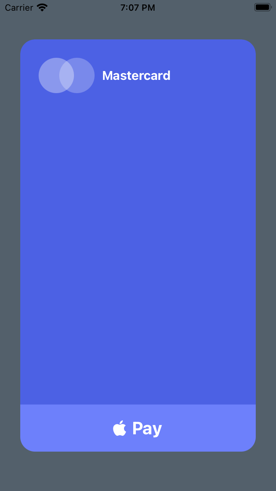
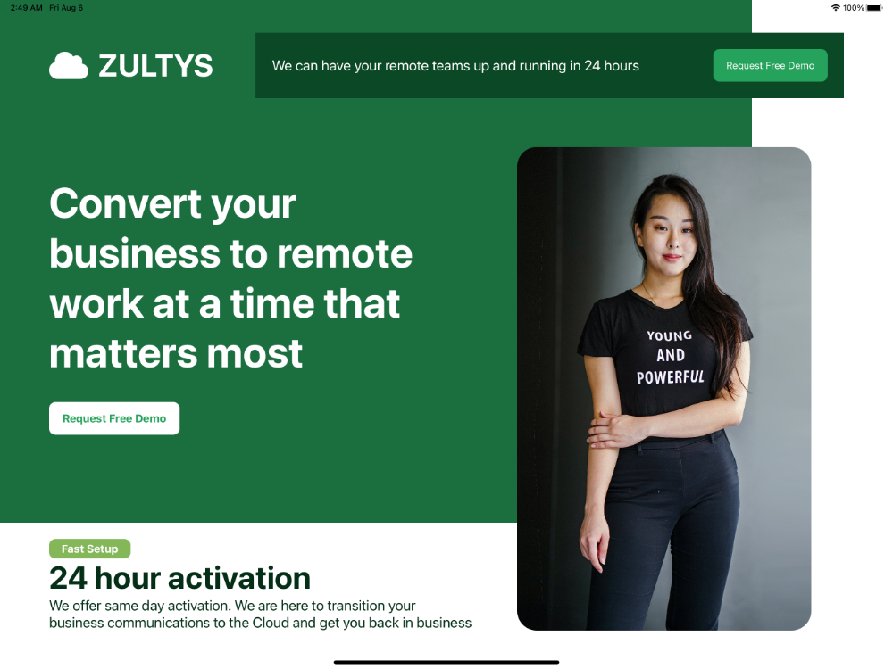
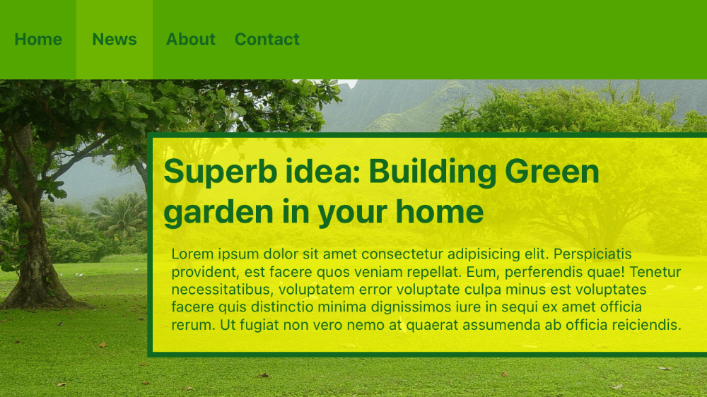

Sometimes, you may need a specific value that is not included among the default values, or that you only need to use once in your project and do not want to include in the `config.js` file. In these cases, you can use arbitrary values.

:::info
**To generate an arbitrary style, you can use *parenthesis notation* with almost any default utility classes.**

Unfortunately, you cannot use square bracket notation like in Tailwind, because Titanium handles platform and conditional statements in `.tss` files differently.
:::

## Color Properties
You can set arbitrary color values **to ALL available color properties**, using `hex`, `rgb` or `rgba` color values, directly in `xml` files or in the `config.js` file.

```xml title="Arbitrary values for color properties"
<Alloy>
  <Window class="from-(#4C61E4) to-(#804C61E4)">
    <Label class="text-center w-(250) h-8 bg-(rgba(100,200,50)) text-(#4C61E4) text-(15) rounded-4" text="Green Label" />
  </Window>
</Alloy>
```

```css title="Generated classes"
/* Purge TSS v6.2.27 */
/* Created by César Estrada */
/* https://github.com/macCesar/purgeTSS */

/* Ti Elements */
'Window': { backgroundColor: '#FFFFFF' }

/* Main Styles */
'.h-8': { height: 32 }
'.rounded-4': { borderRadius: 8 }
'.text-center': { textAlign: Ti.UI.TEXT_ALIGNMENT_CENTER }

/* Arbitrary Values */
'.bg-(rgba(100,200,50))': { backgroundColor: 'rgba(100,200,50)' }
'.from-(#4C61E4)': { backgroundGradient: { colors: [ '#004C61E4', '#4C61E4' ] } }
'.text-(#4C61E4)': { color: '#4C61E4', textColor: '#4C61E4' }
'.text-(15)': { font: { fontSize: 15 } }
'.to-(#804C61E4)': { backgroundGradient: { colors: [ '#804C61E4' ] } }
'.w-(250)': { width: 250 }
```

### List of Color Properties
You can set an arbitrary value to any of the following color properties:

- **active-tint-**(*hex-rgb-or-rgba-value*)
- **active-title-**(*hex-rgb-or-rgba-value*)
- **badge-**(*hex-rgb-or-rgba-value*)
- **bar-**(*hex-rgb-or-rgba-value*)
- **bg-**(*hex-rgb-or-rgba-value*)
- **bg-focused-**(*hex-rgb-or-rgba-value*)
- **bg-selected-**(*hex-rgb-or-rgba-value*)
- **bg-selected-from-**(*hex-rgb-or-rgba-value*)
- **bg-selected-to-**(*hex-rgb-or-rgba-value*)
- **border-**(*hex-rgb-or-rgba-value*)
- **current-page-indicator-**(*hex-rgb-or-rgba-value*)
- **date-time-**(*hex-rgb-or-rgba-value*)
- **disabled-**(*hex-rgb-or-rgba-value*)
- **drop-shadow-**(*hex-rgb-or-rgba-value*)
- **from-**(*hex-rgb-or-rgba-value*)
- **highlighted-**(*hex-rgb-or-rgba-value*)
- **image-touch-feedback-**(*hex-rgb-or-rgba-value*)
- **indicator-**(*hex-rgb-or-rgba-value*)
- **keyboard-toolbar-**(*hex-rgb-or-rgba-value*)
- **nav-tint-**(*hex-rgb-or-rgba-value*)
- **on-tint-**(*hex-rgb-or-rgba-value*)
- **page-indicator-**(*hex-rgb-or-rgba-value*)
- **paging-control-**(*hex-rgb-or-rgba-value*)
- **placeholder-**(*hex-rgb-or-rgba-value*)
- **pull-bg-**(*hex-rgb-or-rgba-value*)
- **results-bg-**(*hex-rgb-or-rgba-value*)
- **results-separator-**(*hex-rgb-or-rgba-value*)
- **selected-**(*hex-rgb-or-rgba-value*)
- **selected-button-**(*hex-rgb-or-rgba-value*)
- **selected-subtitle-**(*hex-rgb-or-rgba-value*)
- **selected-text-**(*hex-rgb-or-rgba-value*)
- **separator-**(*hex-rgb-or-rgba-value*)
- **shadow-**(*hex-rgb-or-rgba-value*)
- **subtitle-**(*hex-rgb-or-rgba-value*)
- **tabs-bg-**(*hex-rgb-or-rgba-value*)
- **tabs-bg-selected-**(*hex-rgb-or-rgba-value*)
- **text-**(*hex-rgb-or-rgba-value*)
- **thumb-tint-**(*hex-rgb-or-rgba-value*)
- **tint-**(*hex-rgb-or-rgba-value*)
- **title-**(*hex-rgb-or-rgba-value*)
- **title-attributes-**(*hex-rgb-or-rgba-value*)
- **title-attributes-shadow-**(*hex-rgb-or-rgba-value*)
- **title-text-**(*hex-rgb-or-rgba-value*)
- **to-**(*hex-rgb-or-rgba-value*)
- **touch-feedback-**(*hex-rgb-or-rgba-value*)
- **track-tint-**(*hex-rgb-or-rgba-value*)

## Spacing Properties
You can set arbitrary values **to MOST of the size and dimension properties**, using `rem`, `px` or `pt` values, directly in `xml` files or in the `config.js` file.

```xml title="Arbitrary values for spacing properties"
<Alloy>
  <Window>
    <Label class="text-center w-(10rem) h-(1.75rem) text-(15) rounded-(5) text-white bg-blue-800" text="My custom Label" />
  </Window>
</Alloy>
```

```css title="Generated classes"
/* Purge TSS v6.2.27 */
/* Created by César Estrada */
/* https://github.com/macCesar/purgeTSS */

/* Ti Elements */
'Window': { backgroundColor: '#FFFFFF' }

/* Main Styles */
'.bg-blue-800': { backgroundColor: '#1e40af' }
'.text-center': { textAlign: Ti.UI.TEXT_ALIGNMENT_CENTER }
'.text-white': { color: '#ffffff', textColor: '#ffffff' }

/* Arbitrary Values */
'.h-(1.75rem)': { height: 28 }
'.rounded-(5)': { borderRadius: 5 }
'.text-(15)': { font: { fontSize: 15 } }
'.w-(10rem)': { width: 160 }
```

### List of Spacing Properties

- **Background Padding**
  - **bg-padding-b-**(*any-size-value-and-unit*)
  - **bg-padding-l-**(*any-size-value-and-unit*)
  - **bg-padding-r-**(*any-size-value-and-unit*)
  - **bg-padding-t-**(*any-size-value-and-unit*)
- **Background Left and Top Cap**
  - **bg-l-cap-**(*any-size-value-and-unit*)
  - **bg-t-cap-**(*any-size-value-and-unit*)
- **Top, Right, Bottom, Left**
  - **bottom-**(*any-size-value-and-unit*)
  - **left-**(*any-size-value-and-unit*)
  - **l-**(*any-size-value-and-unit*)
  - **right-**(*any-size-value-and-unit*)
  - **r-**(*any-size-value-and-unit*)
  - **top-**(*any-size-value-and-unit*)
  - **x-**(*any-size-value-and-unit*)
  - **y-**(*any-size-value-and-unit*)
- **Content Width and Content Height**
  - **content-**(*any-size-value-and-unit*)
  - **content-h-**(*any-size-value-and-unit*)
  - **content-w-**(*any-size-value-and-unit*)
- **Gaps (Top, Right, Bottom, Left)**
  - **gap-**(*any-size-value-and-unit*)
  - **gap-b-**(*any-size-value-and-unit*)
  - **gap-l-**(*any-size-value-and-unit*)
  - **gap-r-**(*any-size-value-and-unit*)
  - **gap-t-**(*any-size-value-and-unit*)
  - **gap-x-**(*any-size-value-and-unit*)
  - **gap-y-**(*any-size-value-and-unit*)
- **Width and Height**
  - **h-**(*any-size-value-and-unit*)
  - **w-**(*any-size-value-and-unit*)
- **indentation-level-**(*any-size-value-and-unit*)
- **keyboard-toolbar-h-**(*any-size-value-and-unit*)
- **Left and Right Button Padding**
  - **left-button-padding-**(*any-size-value-and-unit*)
  - **right-button-padding-**(*any-size-value-and-unit*)
- **Left and Right Width**
  - **left-w-**(*any-size-value-and-unit*)
  - **lw-**(*any-size-value-and-unit*)
 - **right-w-**(*any-size-value-and-unit*)
  - **rw-**(*any-size-value-and-unit*)
- **Margin**
  - **m-**(*any-size-value-and-unit*)
  - **mb-**(*any-size-value-and-unit*)
  - **ml-**(*any-size-value-and-unit*)
  - **mr-**(*any-size-value-and-unit*)
  - **mt-**(*any-size-value-and-unit*)
  - **mx-**(*any-size-value-and-unit*)
  - **my-**(*any-size-value-and-unit*)
- **max-elevation-**(*any-size-value-and-unit*)
- **Max and Min Row Height**
  - **max-row-h-**(*any-size-value-and-unit*)
  - **min-row-h-**(*any-size-value-and-unit*)
- **Padding**
  - **p-**(*any-size-value-and-unit*)
  - **pb-**(*any-size-value-and-unit*)
  - **pl-**(*any-size-value-and-unit*)
  - **pr-**(*any-size-value-and-unit*)
  - **pt-**(*any-size-value-and-unit*)
  - **px-**(*any-size-value-and-unit*)
  - **py-**(*any-size-value-and-unit*)
- **paddingTop, paddingRight, paddingBottom, paddingLeft**
  - **padding-**(*any-size-value-and-unit*)
  - **padding-b-**(*any-size-value-and-unit*)
  - **padding-bottom-**(*any-size-value-and-unit*)
  - **padding-l-**(*any-size-value-and-unit*)
  - **padding-left-**(*any-size-value-and-unit*)
  - **padding-r-**(*any-size-value-and-unit*)
  - **padding-right-**(*any-size-value-and-unit*)
  - **padding-t-**(*any-size-value-and-unit*)
  - **padding-top-**(*any-size-value-and-unit*)
  - **padding-x-**(*any-size-value-and-unit*)
  - **padding-y-**(*any-size-value-and-unit*)
- **paging-control-h-**(*any-size-value-and-unit*)
- **Border Radius**
  - **rounded-**(*any-size-value-and-unit*)
  - **rounded-b-**(*any-size-value-and-unit*)
  - **rounded-bl-**(*any-size-value-and-unit*)
  - **rounded-br-**(*any-size-value-and-unit*)
  - **rounded-l-**(*any-size-value-and-unit*)
  - **rounded-r-**(*any-size-value-and-unit*)
  - **rounded-t-**(*any-size-value-and-unit*)
  - **rounded-tl-**(*any-size-value-and-unit*)
  - **rounded-tr-**(*any-size-value-and-unit*)
- **row-h-**(*any-size-value-and-unit*)
- **section-header-top-padding-**(*any-size-value-and-unit*)
- **separator-h-**(*any-size-value-and-unit*)
- **shadow-radius-**(*any-size-value-and-unit*)
- **xOffset & yOffset**
  - **x-offset-**(*any-size-value-and-unit*)
  - **y-offset-**(*any-size-value-and-unit*)


## Miscellaneous Properties
You can set arbitrary values to the following properties, like border radius, opacity, etc.

### List of Miscellaneous Properties

- **active-tab-**(*number-value*)
- **border-width-**(*number-value*)
- **cache-size-**(*number-value*)
- **count-down-**(*in-milliseconds*)
- **delay-**(*in-milliseconds*)
- **duration-**(*in-milliseconds*)
- **elevation-**(*number-value*)
- **font-**(*valid-font-weight-value*)
- **horizontal-margin-**(*decimal-value*)
- **lines-**(*number-value*)
- **max-length-**(*number-value*)
- **max-lines-**(*number-value*)
- **max-zoom-scale-**(*decimal-value*)
- **min-zoom-scale-**(*decimal-value*)
- **min-**(*number-value*)
- **minimum-text-**(*number-value*)
- **opacity-**(*decimal-value-from-0-to-1*)
- **origin-**(*x-and-y-coordinates*)
- **paging-control-alpha-**(*decimal-value-from-0-to-1*)
- **paging-control-timeout-**(*in-milliseconds*)
- **repeat-count-**(*number-value*)
- **repeat-**(*number-value*)
- **rotate-**(*number-value*)
- **scale-**(*decimal-value*)
- **text-size-**(*number-value*)
- **timeout-**(*in-milliseconds*)
- **vertical-margin-**(*decimal-value*)
- **z-**(*number-value*)
- **zoom-scale-**(*decimal-value*)


## Examples
You can use any supported units depending on the property you are generating. You can use `hex` or `rgba` values for any `color` property, or you can use `rem` or `px` for any position or sizing property.

### Credit Card

```xml title="index.xml"
<Alloy>
  <Window class="bg-(#53606b)">
    <View class="w-(2in) h-(3.5in) bg-(#4C61E4) rounded-(20)">
      <View class="m-(50px) w-screen h-screen">
        <View class="mt-0 ml-0 horizontal">
          <View class="w-(3rem) h-(3rem) rounded-(1.5rem) bg-white opacity-(0.35)" />
          <View class="-ml-(20) w-(3rem) h-(3rem) rounded-(1.5rem) bg-white opacity-(0.25)" />
          <Label class="font-bold text-white ml-2.5">Mastercard</Label>
        </View>
      </View>

      <View class="bottom-(0) bg-(#6D80FB) w-full h-16">
        <View class="horizontal">
          <Label class="text-2xl text-white fab fa-apple" />
          <Label class="ml-2 text-2xl font-bold text-white" text="Pay"/>
        </View>
      </View>
    </View>
  </Window>
</Alloy>
```

```css title="app.tss"
/* Purge TSS v6.2.27 */
/* Created by César Estrada */
/* https://github.com/macCesar/purgeTSS */

/* Ti Elements */
'View': { width: Ti.UI.SIZE, height: Ti.UI.SIZE }
'Window': { backgroundColor: '#FFFFFF' }

/* Main Styles */
'.bg-white': { backgroundColor: '#ffffff' }
'.font-bold': { font: { fontWeight: 'bold' } }
'.h-16': { height: 64 }
'.h-screen': { height: Ti.UI.FILL }
'.horizontal': { layout: 'horizontal' }
'.ml-0': { left: 0 }
'.ml-2': { left: 8 }
'.ml-2.5': { left: 10 }
'.mt-0': { top: 0 }
'.text-2xl': { font: { fontSize: 24 } }
'.text-white': { color: '#ffffff', textColor: '#ffffff' }
'.w-full': { width: '100%' }
'.w-screen': { width: Ti.UI.FILL }

/* Arbitrary Values */
'.-ml-(20)': { left: -20 }
'.bg-(#4C61E4)': { backgroundColor: '#4C61E4' }
'.bg-(#53606b)': { backgroundColor: '#53606b' }
'.bg-(#6D80FB)': { backgroundColor: '#6D80FB' }
'.bottom-(0)': { bottom: 0 }
'.h-(3.5in)': { height: '3.5in' }
'.h-(3rem)': { height: 48 }
'.m-(50px)': { top: '50px', right: '50px', bottom: '50px', left: '50px' }
'.opacity-(0.25)': { opacity: 0.25 }
'.opacity-(0.35)': { opacity: 0.35 }
'.rounded-(1.5rem)': { borderRadius: 24 }
'.rounded-(20)': { borderRadius: 20 }
'.w-(2in)': { width: '2in' }
'.w-(3rem)': { width: 48 }

/* Default Font Awesome */
'.fa-apple': { text: '\uf179', title: '\uf179' }
'.fab': { font: { fontFamily: 'FontAwesome6Brands-Regular' } }
```



### Front Cover
Try this example on an iPad or tablet.

```xml title="index.xml"
<Alloy>
  <Window class="bg-white">
    <View class="bg-(#1B6F3F) mt-0 ml-0 w-(2300px) h-(1600px)">
      <View class="mt-(100px) h-(200px) left-(150px) horizontal">
        <Label class="fas fa-cloud text-(48px) text-white" />
        <Label class="ml-(30px) text-white text-(48px) font-bold h-(200px)">ZULTYS</Label>
      </View>

      <View class="vertical left-(150px) w-(1300px)">
        <Label class="text-white font-bold text-(64px) mt-(275px)">Convert your business to remote work at a time that matters most</Label>
        <Button class="mt-(75px) bg-(#fff) text-(#25A25B) h-(100px) w-(400px) rounded-(20px) left-(0) font-bold">Request Free Demo</Button>
      </View>
    </View>

    <View class="mt-(100px) mr-(150px) w-(1800px) h-(200px) bg-(#0B4825)">
      <Label class="left-(50px) text-white font-normal text-(22px)">We can have your remote teams up and running in 24 hours</Label>
      <Button class="bg-(#25A25B) text-white h-(100px) w-(350px) rounded-(20px) right-(50px)">Request Free Demo</Button>
    </View>

    <View class="mt-(450px) right-(250px) rounded-(60px)">
      <ImageView class="h-(1480px) w-(900px)" image="https://images.pexels.com/photos/1526814/pexels-photo-1526814.jpeg?auto=compress&cs=tinysrgb&dpr=3&h=1480&w=900&fit=crop" />
    </View>

    <View class="left-(150px) top-(1650px) vertical w-(1300px)">
      <Button class="left-(0) bg-(#83B758) text-white font-bold h-(60px) w-(250px) rounded-(20px)">Fast Setup</Button>
      <Label class="left-(0) text-(#042F16) font-bold text-(48px)">24 hour activation</Label>
      <Label class="left-(0) text-(#042F16) font-normal text-(22px)">We offer same day activation. We are here to transition your business communications to the Cloud and get you back in business</Label>
    </View>
  </Window>
</Alloy>
```

```css title="app.tss"
// Purge TSS v6.2.27
// Created by César Estrada
// https://github.com/macCesar/purgeTSS

// Ti Elements
'ImageView[platform=ios]': { hires: true }
'View': { width: Ti.UI.SIZE, height: Ti.UI.SIZE }
'Window': { backgroundColor: '#FFFFFF' }

// Main Styles
'.bg-white': { backgroundColor: '#ffffff' }
'.font-bold': { font: { fontWeight: 'bold' } }
'.font-normal': { font: { fontWeight: 'normal' } }
'.horizontal': { layout: 'horizontal' }
'.ml-0': { left: 0 }
'.mt-0': { top: 0 }
'.running': { running: true }
'.text-white': { color: '#ffffff', textColor: '#ffffff' }
'.vertical': { layout: 'vertical' }

// Arbitrary Values
'.bg-(#0B4825)': { backgroundColor: '#0B4825' }
'.bg-(#1B6F3F)': { backgroundColor: '#1B6F3F' }
'.bg-(#25A25B)': { backgroundColor: '#25A25B' }
'.bg-(#83B758)': { backgroundColor: '#83B758' }
'.bg-(#fff)': { backgroundColor: '#ffffff' }
'.h-(100px)': { height: '100px' }
'.h-(1480px)': { height: '1480px' }
'.h-(1600px)': { height: '1600px' }
'.h-(200px)': { height: '200px' }
'.h-(60px)': { height: '60px' }
'.left-(0)': { left: 0 }
'.left-(150px)': { left: '150px' }
'.left-(50px)': { left: '50px' }
'.ml-(30px)': { left: '30px' }
'.mr-(150px)': { right: '150px' }
'.mt-(100px)': { top: '100px' }
'.mt-(275px)': { top: '275px' }
'.mt-(450px)': { top: '450px' }
'.mt-(75px)': { top: '75px' }
'.right-(250px)': { right: '250px' }
'.right-(50px)': { right: '50px' }
'.rounded-(20px)': { borderRadius: '20px' }
'.rounded-(60px)': { borderRadius: '60px' }
'.text-(#042F16)': { color: '#042F16', textColor: '#042F16' }
'.text-(#25A25B)': { color: '#25A25B', textColor: '#25A25B' }
'.text-(22px)': { font: { fontSize: '22px' } }
'.text-(48px)': { font: { fontSize: '48px' } }
'.text-(64px)': { font: { fontSize: '64px' } }
'.top-(1650px)': { top: '1650px' }
'.w-(1300px)': { width: '1300px' }
'.w-(1800px)': { width: '1800px' }
'.w-(2300px)': { width: '2300px' }
'.w-(250px)': { width: '250px' }
'.w-(350px)': { width: '350px' }
'.w-(400px)': { width: '400px' }
'.w-(900px)': { width: '900px' }

// Default Font Awesome
'.fa-cloud': { text: '\uf0c2', title: '\uf0c2' }
'.fas': { font: { fontFamily: 'FontAwesome6Free-Solid' } }
```



### Menu Bar
```xml title="index.xml"
<Alloy>
  <Window class="bg-(#53606b)" backgroundImage="https://i.pinimg.com/originals/ab/70/a1/ab70a19f087cc9ba2b03e3bee71acc3e.jpg">
    <View class="mt-0 w-full h-(150px) bg-(#53A500) horizontal">
      <Label class="w-(4.5rem) font-bold text-(16px) h-(150px) text-(#12681E) text-center" text="Home" />
      <Label class="w-(4.5rem) font-bold text-(16px) h-(150px) text-(#12681E) bg-(#6DB400) text-center" text="News" />
      <Label class="w-(4.5rem) font-bold text-(16px) h-(150px) text-(#12681E) text-center" text="About" />
      <Label class="w-(4.5rem) font-bold text-(16px) h-(150px) text-(#12681E) text-center" text="Contact" />
    </View>

    <View class="bg-(rgba(255,255,0,0.75)) -right-(10px) top-(250px) bottom-(75px) h-screen w-(80%) border-(5) border-(#12681E)">
      <View class="m-(1rem) h-screen w-screen vertical">
        <Label class="text-(32px) font-bold text-(#12681E)" text="Superb idea: Building Green garden in your home" />
        <TextArea class="bg-transparent mt-1 text-(14px) text-(#12681E)">Lorem ipsum dolor sit amet consectetur adipisicing elit. Perspiciatis provident, est facere quos veniam repellat. Eum, perferendis quae! Tenetur necessitatibus, voluptatem error voluptate culpa minus est voluptates facere quis distinctio minima dignissimos iure in sequi ex amet officia rerum. Ut fugiat non vero nemo at quaerat assumenda ab officia reiciendis.</TextArea>
      </View>
    </View>
  </Window>
</Alloy>
```

```css title="app.tss"
/* Purge TSS v6.2.27 */
/* Created by César Estrada */
/* https://github.com/macCesar/purgeTSS */

/* Ti Elements */
'View': { width: Ti.UI.SIZE, height: Ti.UI.SIZE }
'Window': { backgroundColor: '#FFFFFF' }

/* Main Styles */
'.bg-transparent': { backgroundColor: 'transparent' }
'.font-bold': { font: { fontWeight: 'bold' } }
'.h-screen': { height: Ti.UI.FILL }
'.horizontal': { layout: 'horizontal' }
'.mt-0': { top: 0 }
'.mt-1': { top: 4 }
'.text-center': { textAlign: Ti.UI.TEXT_ALIGNMENT_CENTER }
'.vertical': { layout: 'vertical' }
'.w-full': { width: '100%' }
'.w-screen': { width: Ti.UI.FILL }

/* Arbitrary Values */
'.-right-(10px)': { right: '-10px' }
'.bg-(#53606b)': { backgroundColor: '#53606b' }
'.bg-(#53A500)': { backgroundColor: '#53A500' }
'.bg-(#6DB400)': { backgroundColor: '#6DB400' }
'.bg-(rgba(255,255,0,0.75))': { backgroundColor: 'rgba(255,255,0,0.75)' }
'.border-(#12681E)': { borderColor: '#12681E' }
'.border-(5)': { borderWidth: 5 }
'.bottom-(75px)': { bottom: '75px' }
'.h-(150px)': { height: '150px' }
'.m-(1rem)': { top: 16, right: 16, bottom: 16, left: 16 }
'.text-(#12681E)': { color: '#12681E', textColor: '#12681E' }
'.text-(14px)': { font: { fontSize: '14px' } }
'.text-(16px)': { font: { fontSize: '16px' } }
'.text-(32px)': { font: { fontSize: '32px' } }
'.top-(250px)': { top: '250px' }
'.w-(4.5rem)': { width: 72 }
'.w-(80%)': { width: '80%' }
```

**Result**


