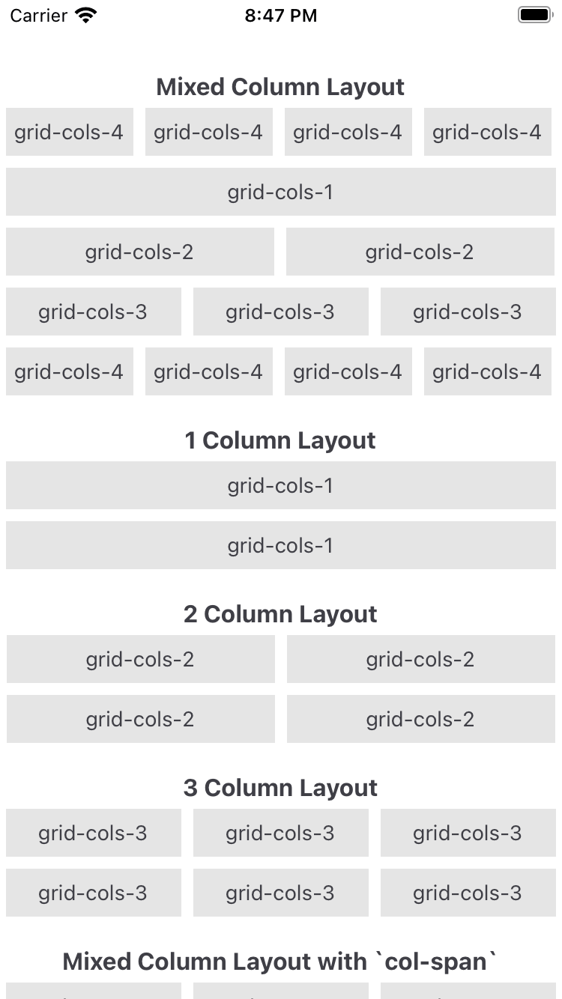

# Grid System

The grid system is a simple but useful layout tool with utilities to lay out columns and rows.

This is the most basic layout for using the grid system. Of course, you can create a more complex layout by mixing different columns and rows.

`index.xml`
```xml
<Alloy>
  <View class='grid'>
    <View class="grid-cols-4">
      <!-- Remove it if you don't need a gutter between columns (or rows) -->
      <View class="gap-1">
        <!-- ANY CONTENT GOES HERE -->
      </View>
    </View>

    <View class="grid-cols-4">
      <!-- Remove it if you don't need a gutter between columns (or rows) -->
      <View class="gap-1">
        <!-- ANY CONTENT GOES HERE -->
      </View>
    </View>
    ...
    ...
    ...
  </View>
</Alloy>
```

## Column Grid
**`.grid-cols-{n}`**
With `grid-cols`, you are telling the grid system how many columns you want to fit in each row. For example, if you set each view with a `.grid-cols-2` class, it will fit two views per row; `.grid-cols-3` will fit three views, and so on.

**`.col-span-{n}`**
With `col-span`, you are setting the number of columns that each element will occupy in a **12-column grid**.

If you set a view with `.col-span-3`, you can add three more views of equal width to fill the row, or any other combination like 3-6-3, 2-4-6, etc., as long as the sum fills a **12-column grid**.

## Row Grid
**`.grid-rows-{n}`**
With `grid-rows`, you are telling the grid system how many rows you want to fit in each column. For example, if you set each view with a `.grid-rows-2` class, it will fit two views per column; `.grid-rows-3` will fit three views, and so on.

**`.row-span-{n}`**
With `row-span`, you are setting the number of rows that each element will occupy in a **12-row grid**.

If you set a view with `.row-span-3`, you can add three more views of equal height to fill the column, or any other combination like 3-6-3, 2-4-6, etc., as long as the sum fills a **12-row grid**.



## Available Utilities
These are the available utilities to control [**”The Grid”**](https://youtu.be/4-J4duzP8Ng?t=13) 😉

### Gutter Utilities
  - `gap-{size}`: Use this to change the gap between rows and columns.
  - `gap-x-{size}` and `gap-y-{size}`: Use these to change the gap between rows and columns independently.
  - `gap-{side}-{size}`: Use this to change the gap between rows and columns on a specific side (t=top, r=right, b=bottom, l=left).

### Column Span Utilities
  - Use the **`col-span-{n}`** utilities to make an element span n columns.

### Row Span Utilities
  - Use the **`row-span-{n}`** utilities to make an element span n rows.

### Direction Utilities
  - `grid` or `grid-flow-col`: Use these utilities to set the layout property to horizontal.
  - `grid-flow-row`: Use this utility to set the `layout` property to `vertical`.

### Column Utilities
  - `grid-cols-{n}`: Use this utility to create grids with **n** equally sized columns.

### Row Utilities
  - Use the **`grid-rows-{n}`** utilities to create grids with n equally sized rows.

### Row Placement Utilities
  - `start`: Aligns an element to the start of a row.
  - `end`: Aligns an element to the end of a row.
  - `center`: Aligns an element to the center of a row.
