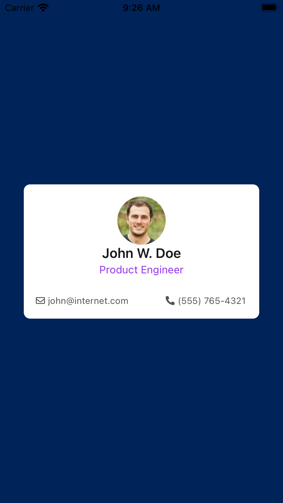
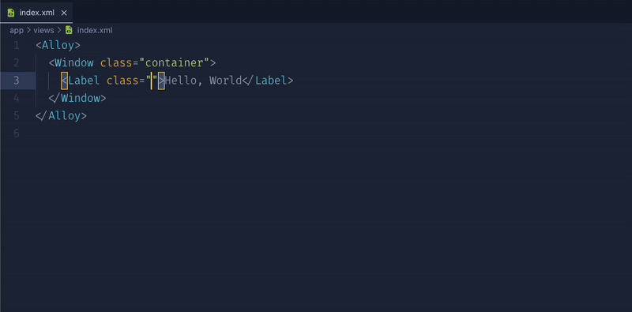

# Installation

**Install Purge TSS globally on your machine using [NPM](https://www.npmjs.com/).**

```bash
> [sudo] npm install -g purgetss
```

> ⚠️ **CAUTION**
>
> Maximum Node.js Version
> 
> Purge TSS has been thoroughly tested and proven to be compatible with Node version 20.x.x.


## Running Purge TSS for the First Time

> ℹ️ **INFO**
>
> **You only need to execute `purgetss` once within your project to automatically generate the required files and folders.**
> 
> Subsequently, whenever you build your application, **Purge TSS** will parse all your XML files and generate a clean `app.tss` file containing only the classes used in your project.


When you run `purgetss` for the first time in your project, it will perform the following tasks:


### 1. Auto-Run Hook

**Purge TSS** adds a task in `alloy.jmk` to auto-run `purgetss` every time you compile your app. **This is especially useful when using `liveview`.**


### 2. purgetss Folder

Upon execution, **Purge TSS** creates a `purgetss` folder at the root of your project containing the following files and folders:

`./purgetss`
```bash
purgetss
└─ fonts
└─ styles
   └─ definitions.css
   └─ tailwind.tss
└─ config.js
```

- **`config.js` File**

  This is where you can customize or create new classes with your preferred spacing, colors, margin values, and more. For further details, refer to the **[Customization Section](./customization/1-configuring-guide.md)**.

- **`styles` Folder**

  The `styles` folder contains the `tailwind.tss` and `definitions.css` files:

  - **`tailwind.tss` File**

    This file includes all Tailwind-like utility classes, including any custom classes defined in `config.js`.

  - **`definitions.css` File**

    A special `css` file that incorporates ALL classes from `tailwind.tss`, `_app.tss`, any `.tss` remaining in your project, and `fonts.tss` files. This encompasses all classes from official icon font libraries, meant for use with the [**“IntelliSense for CSS class names in HTML”**](#vscode-extension) VS Code extension.

- **`fonts` Folder**

  Here, you can add various font types such as Icons, Serif, Sans-Serif, Cursive, Fantasy, or Monospace fonts, all applicable to your app. Step-by-step instructions are available in the [**build-fonts command**](commands#build-fonts-command) section.

> ⚠️ **CAUTION**
>
> IMPORTANT NOTICE!!!
> 
> **Purge TSS will OVERWRITE your existing `app.tss` file.**
> 
> Upon the initial execution of **Purge TSS**, your `app.tss` file is backed up to `_app.tss`.
> 
> From this point forward, you have the option to add, delete, or update your custom classes in `_app.tss`.
> 
> Alternatively, a better approach is to include your custom values in `config.js`. Further information is available in the [Configuration Section](./customization/1-configuring-guide.md).


## Example Files

**To use the example files:**
- Copy the content of `index.xml` and `app.tss` into a new Alloy project.
- Install Font Awesome font files with `purgetss icon-library --vendor=fontawesome`.
- **Run `purgetss` once to generate the necessary files.**
- Compile your app as usual.
- **We recommend using `liveview` to speed up testing and development time**.

```xml title=index.xml
<Alloy>
  <Window class="bg-primary">
    <View class="w-10/12 h-auto bg-white rounded-lg">
      <View class="m-4 vertical">
        <ImageView class="w-16 h-16 mx-auto rounded-16" image="https://randomuser.me/api/portraits/men/43.jpg" />

        <View class="vertical">
          <Label class="text-lg font-semibold text-center text-gray-900">John W. Doe</Label>
          <Label class="text-sm text-center text-purple-600 mt-0.5">Product Engineer</Label>

          <View class="w-screen mt-6">
            <View class="ml-0 horizontal">
              <Label class="mr-1 text-xs text-gray-600 far fa-envelope"></Label>
              <Label class="text-xs text-gray-600">john@internet.com</Label>
            </View>

            <View class="mr-0 horizontal">
              <Label class="mr-1 text-xs text-gray-600 fas fa-phone-alt"></Label>
              <Label class="text-xs text-gray-600">(555) 765-4321</Label>
            </View>
          </View>
        </View>
      </View>
    </View>
  </Window>
</Alloy>
```

`app.tss`
```css
'.bg-primary': {
  backgroundColor: '#002359'
}
```

> ℹ️ **INFO**
>
> **After running `purgetss`, you will have a new `app.tss` file with only the classes used in the XML files.**
> 
> Your original `app.tss` file is backed up in `_app.tss`. You can use this file to add, delete, or update any of your original styles.
> 
> Every time `purgetss` runs, it will copy the content of `_app.tss` to `app.tss`.


`app.tss after purging`
```css
/* Purge TSS v6.2.27 */
/* Created by César Estrada */
/* https://github.com/macCesar/purgeTSS */

/* _app.tss styles */
'.bg-primary': {
  backgroundColor: '#002359'
}

/* Ti Elements */
'ImageView[platform=ios]': { hires: true }
'View': { width: Ti.UI.SIZE, height: Ti.UI.SIZE }
'Window': { backgroundColor: '#FFFFFF' }

/* Main Styles */
'.bg-white': { backgroundColor: '#ffffff' }
'.font-semibold': { font: { fontWeight: 'semibold' } }
'.h-16': { height: 64 }
'.h-auto': { height: Ti.UI.SIZE }
'.horizontal': { layout: 'horizontal' }
'.m-4': { top: 16, right: 16, bottom: 16, left: 16 }
'.ml-0': { left: 0 }
'.mr-0': { right: 0 }
'.mr-1': { right: 4 }
'.mt-0.5': { top: 2 }
'.mt-6': { top: 24 }
'.mx-auto': { right: null, left: null }
'.rounded-16': { borderRadius: 32 }
'.rounded-lg': { borderRadius: 8 }
'.text-center': { textAlign: Ti.UI.TEXT_ALIGNMENT_CENTER }
'.text-gray-600': { color: '#4b5563', textColor: '#4b5563' }
'.text-gray-900': { color: '#111827', textColor: '#111827' }
'.text-lg': { font: { fontSize: 18 } }
'.text-purple-600': { color: '#9333ea', textColor: '#9333ea' }
'.text-sm': { font: { fontSize: 14 } }
'.text-xs': { font: { fontSize: 12 } }
'.vertical': { layout: 'vertical' }
'.w-10/12': { width: '83.333334%' }
'.w-16': { width: 64 }
'.w-screen': { width: Ti.UI.FILL }

/* Default Font Awesome */
'.fa-envelope': { text: '\uf0e0', title: '\uf0e0' }
'.fa-phone-alt': { text: '\uf879', title: '\uf879' }
'.far': { font: { fontFamily: 'FontAwesome6Free-Regular' } }
'.fas': { font: { fontFamily: 'FontAwesome6Free-Solid' } }
```



**Find more examples in the [Tailwind TSS Sample App](https://github.com/macCesar/tailwind.tss-sample-app)**


## VSCode Extension

If you're using **[Visual Studio Code](https://code.visualstudio.com)**, we recommend installing the **[IntelliSense for CSS class names in HTML](https://marketplace.visualstudio.com/items?itemName=Zignd.html-css-class-completion)** extension.

It provides class name completion for the `XML` class attribute based on the `definitions.css` file created by Purge TSS.



After installing the extension, you'll need to add the `xml` language to the `"HTMLLanguages"` setting and exclude any `css/html` files from the caching process by pointing `"excludeGlobPattern"` to the `./purgetss/fonts/` folder.

`VS Code ‘settings.json’ file`
```json
{
  "html-css-class-completion.HTMLLanguages": [
    "html",
    "vue",
    "razor",
    "blade",
    "handlebars",
    "twig",
    "django-html",
    "php",
    "markdown",
    "erb",
    "ejs",
    "svelte",
    "xml"
  ],
  "html-css-class-completion.excludeGlobPattern": "**/node_modules/**,purgetss/fonts/**/*.{css,html}"
}
```
