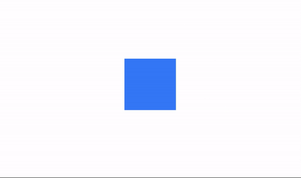

# What's new in v2.5.0
- [What's new in v2.5.0](#whats-new-in-v250)
  - [Braking changes & new utilities](#braking-changes--new-utilities)
  - [Grid System](#grid-system)
    - [Column grid](#column-grid)
    - [Row grid](#row-grid)
    - [Available utilities for `The Grid`](#available-utilities-for-the-grid)
      - [Gap](#gap)
      - [Column Span](#column-span)
      - [Row Span](#row-span)
      - [Grid and Grid Flow](#grid-and-grid-flow)
      - [Grid Template Columns](#grid-template-columns)
      - [Grid Template Rows](#grid-template-rows)
      - [Items](#items)
  - [Animation Module](#animation-module)
    - [Instalation](#instalation)
    - [Usage](#usage)
    - [Available methods](#available-methods)
      - [`play`](#play)
      - [`apply`](#apply)
    - [Example 1](#example-1)
    - [Example 2](#example-2)
    - [Example 3](#example-3)
    - [Available utilities](#available-utilities)
      - [anchorPoint](#anchorpoint)
      - [autoreverse](#autoreverse)
      - [curve](#curve)
      - [delay](#delay)
      - [duration](#duration)
      - [repeat](#repeat)
      - [rotate](#rotate)
      - [scale](#scale)
  - [Utilities for ScrollableView properties](#utilities-for-scrollableview-properties)
    - [clipMode](#clipmode)
    - [currentPageIndicatorColor](#currentpageindicatorcolor)
    - [disableBounce](#disablebounce)
    - [overlayEnabled](#overlayenabled)
    - [pageIndicatorColor](#pageindicatorcolor)
    - [pagingControlAlpha](#pagingcontrolalpha)
    - [pagingControlColor](#pagingcontrolcolor)
    - [pagingControlHeight](#pagingcontrolheight)
    - [pagingControlOnTop](#pagingcontrolontop)
    - [pagingControlTimeout](#pagingcontroltimeout)
    - [scrollingEnabled](#scrollingenabled)
    - [showPagingControl](#showpagingcontrol)
  - [Radial Gradients ( iOS only )](#radial-gradients--ios-only-)

## Braking changes & new utilities
- As of Tailwind CSS v2.2, `lightBlue` has been renamed to `sky`.
- Changed `bg-gradient-to-{direction}` to `bg-linear-to-{direction}`
- Added `Label` to the Reset utilities in order to better fit the new Grid System Layout by setting `width` to `Ti.UI.FILL`.
- Added `touch-enabled` and `touch-disabled` utilities (touchEnabled)
- Added `platform-w`, `platform-h` utilities (Ti.Platform.displayCaps width and height)
- **Reduced purging time by 56% ( on average )**
- iOS Only
  - Added `bg-radial-to-{direction}` utilities
  - Added `prevent-default-image` and `display-default-image` utilities (preventDefaultImage)
- Android Only
  - `exit-on-close` and `dont-exit-on-close` utilities (exitOnClose)
  - `keep-screen-on` and `keep-screen-off` utilities (keepScreenOn)
  - `scroll-horizontal` and `scroll-vertical` utilities (scrollType)

## Grid System
A simple but useful Grid System with utilities to lay columns and rows.

This is the most basic layout in order to use the grid system. Of course you can create a more complex layout by mixing different columns and rows.

```xml
<Alloy>
  <View class='grid'>
    <View class="grid-cols-4">
      <View class="gap-1"> <!-- Optional if you dont need a gutter between columns ( or rows ) -->
        <!-- ANY CONTENT GOES HERE -->
      </View>
    </View>

    <View class="grid-cols-4">
      <View class="gap-1"> <!-- Optional if you dont need a gutter between columns ( or rows ) -->
        <!-- ANY CONTENT GOES HERE -->
      </View>
    </View>
    ...
    ...
    ...
  </View>
</Alloy>
```

### Column grid
**`.grid-cols-{n}`**
With `grid-cols` your are telling the grid system how many columns you want to fit in each row, for example if you set each view with a `.grid-cols-2` class it will fit two views per row, `.grid-cols-3` will fit three views, and so on.

**`.col-span-{n}`**
With `col-span` you are setting the number of columns each element will occupy in a **12 column grid**.

If you set a view with `.col-span-3` you can add three more views of equal width to fill the row, or any other combination like 3-6-3, 2-4-6, etc., as long as the sum fills a **12 column grid**.


### Row grid
**`.grid-rows-{n}`**
With `grid-rows` your are telling the grid system how many columns you want to fit in each row, for example if you set each view with a `.grid-rows-2` class it will fit two views per row, `.grid-rows-3` will fit three views, and so on.

**`.row-span-{n}`**
With `row-span` you are setting the number of rows each element will occupy in a **12 row grid**.

If you set a view with `.row-span-3` you can add three more views of equal height to fill the column, or any other combination like 3-6-3, 2-4-6, etc., as long as the sum fills a **12 row grid**.


### Available utilities for `The Grid`
These are the available utilities to control **”The Grid”** ( use **"TRON: Legacy"** score here! ) 🤣

#### Gap
Utilities for controlling gutters between grid.
  - Use **`gap-{size}`** to change the gap between both rows and columns.
  - Use **`gap-x-{size}`** and **`gap-y-{size}`** to change the gap between rows and columns independently.
  - use **`gap-{side}-{size}`** to change the gap between rows and columns to an specific side. t=top, r=right, b=bottom and l=left.

#### Column Span
Utilities for controlling how elements are sized across grid columns.
  - Use the **`col-span-{n}`** utilities to make an element span n columns.

#### Row Span
Utilities for controlling how elements are sized across grid rows.
    - Use the **`row-span-{n}`** utilities to make an element span n rows.

#### Grid and Grid Flow
Utilities for controlling the direction of the grid system.
  - Use **`grid`** or **`grid-flow-col`** to set the `layout` poperty to `horizontal`.
  - Use **`grid-flow-row`** to set the `layout` poperty to `vertical`.

#### Grid Template Columns
Utilities for specifying the columns in a grid layout.
  - Use the **`grid-cols-{n}`** utilities to create grids with n equally sized columns.

#### Grid Template Rows
Utilities for specifying the rows in a grid layout.
  - Use the **`grid-rows-{n}`** utilities to create grids with n equally sized rows.

#### Items
Utilities for controlling how elements are sized and placed across grid rows.
  - `start`, `end` and `center` utilities


## Animation Module
**`Animation` is a Titanium module to apply a 2D Matrix animation or transformation to any element or to an array of elements.**

- You can create as many `Animation` elements as you want on each View file.
- You can chain them with callback functions to create a sequence of animations.
- You can `play` the animation to a single element or an array of elements, like the children of a view for example.
- You can `apply` the properties instantly without animation.
- You can set: `delay`, `duration`, `rotation`, `scaling`, `repetition`, `animation curve`.
- You can animate properties like background color, opacity, width, height and more.
- **You can set different properties to different states, using the prefix `open:`, `close:` and `complete:`.**

### Instalation
Use the new **`purgetss module`** command to install the module in your `lib` folder.

```bash
> purgetss module

# alias:
> purgetss m
```

### Usage
To use it, create an `Animation` element that will hold the transformation values. And set its 'module' property to `module='purgetss.ui'`

You can set any of the sizing, positioning and color properties available in `tailwind.tss`.

### Available methods
There are two methods available `play` and `apply`.

#### `play`
Use the `play` method in your controller to reproduce the animation by passing the element that you want to animate.

You can call the method when opening the controller, after a click event, etc.

 ```javascript
 $myAnimation.play($.myView);
 ```

 #### `apply`
Use `apply` when you need to apply the properties and transformations immediately to the view.

 ```javascript
 $myAnimation.apply($.myView);
 ```

### Example 1
```xml
<Alloy>
  <Window>
    <View id="square" class="w-16 h-16 bg-blue-500" />
    <Animation module="purgetss.ui" id="myAnimation" class="w-32 h-32 bg-green-500" />
  </Window>
</Alloy>
```

In the controller pass the element that you want to animate.
```javascript
$.index.open();
$.myAnimation.play($.square);
```



***\* low framerate gif***

### Example 2
You can create more complex animations by combining properties to different `states` like when `opening` or `closing` an animation.

```xml
<Alloy>
  <Window class="keep-screen-on">
    <View class="vertical">
      <Button class="w-48 mt-1 bg-purple-500 rounded ios:mt-16 text-purple-50" ios:onSingletap="do3Squares" android:onClick="do3Squares" title="3 Squares"/>
      <Button class="w-48 mt-1 mt-2 bg-purple-500 rounded text-purple-50" ios:onSingletap="doChangeColors" android:onClick="doChangeColors" title="Toggle Colors"/>
      <Button class="w-48 mt-1 mt-2 bg-purple-500 rounded text-purple-50" ios:onSingletap="doRetweet" android:onClick="doRetweet" title="Toggle Re-Tweet"/>

      <View id="squares" class="w-screen mt-1 mt-10 vertical">
        <View id="aquare1" class="bg-blue-700 w-28 h-28 rounded-xl" />
        <View id="aquare2" class="mt-4 bg-blue-700 w-28 h-28 rounded-xl" />
        <View id="aquare3" class="mt-4 bg-blue-700 w-28 h-28 rounded-xl" />
      </View>
    </View>

    <View id="square3" class="mt-8 bg-blue-500 w-14 h-14 rounded-xl" ios:onSingletap="doTransparency" android:onClick="doTransparency" />

    <View id="retweetView" class="w-screen h-48 bg-gray-800 vertical -mb-52 rounded-2xl" ios:onSingletap="doRetweet" android:onClick="doRetweet">
      <View class="w-8 h-1 mt-4 bg-blueGray-700" />

      <View class="mx-4 mt-4 horizontal">
        <Label class="text-xl text-blueGray-500 fas fa-retweet w-7" />
        <Label class="ml-2 text-xl text-left text-white" text="Re-Tweet" />
      </View>

      <View class="mx-4 mt-4 horizontal">
        <Label class="text-xl text-blueGray-500 fas fa-pencil-alt w-7" />
        <Label class="ml-2 text-xl text-left text-white" text="Quote Tweet" />
      </View>
    </View>

    <Animation id="squaresWidth" class="ease-out delay-50 open:w-11/12 close:w-28 debug-on" module="purgetss.ui" />
    <Animation id="transparency" class="open:duration-150 close:duration-300 open:mt-(null) close:mt-8 open:w-10/12 open:h-11/12 close:w-14 close:h-14 open:opacity-50 close:opacity-100" module="purgetss.ui" />
    <Animation id="retweet" class="open:duration-200 close:duration-150 open:-mb-16 close:-mb-52" module="purgetss.ui" />
    <Animation id="changeColor" class="delay-25 open:bg-purple-500 close:bg-blue-700 debug-on" module="purgetss.ui" />
  </Window>
</Alloy>
```

```javascript
function doTransparency(e) {
  $.transparency.play($.square3);
}

function doChangeColors(e) {
  $.changeColor.play($.squares.children);
}

function do3Squares(e) {
  $.squaresWidth.play($.squares.children);
}

function doRetweet(e) {
  $.retweet.play($.retweetView);
}

$.index.open();
```


***\* low framerate gif***

### Example 3
The following example `applies` the properties to prevent the animation from showing.

The method `apply` sets the properties instantly. The `ScrollableView` is rotated 90 degrees, and its content is counter rotated -90 degrees.

```xml
<Alloy>
  <Window class="dont-exit-on-close keep-screen-on">
    <ScrollableView id="scrollableView" class="overlay-enabled disable-bounce paging-alpha-100 scrolling-enabled show-paging paging-h-14 paging-on-bottom paging-transparent page-(rgba(0,0,0,0.24)) current-page-(rgba(0,0,0,1))">
      <View id="elView1" class="bg-blue-500">
        <Label class="text-center" text="View's Content" />
      </View>

      <View id="elView2" class="bg-red-500">
        <Label class="text-center" text="View's Content" />
      </View>

      <View id="elView3" class="bg-green-500">
        <Label class="text-center" text="View's Content" />
      </View>
    </ScrollableView>

    <Animation module="purgetss.ui" id="rotate" class="rotate-90 inverted-platform-w inverted-platform-h" />
    <Animation module="purgetss.ui" id="counterRotate" class="-rotate-90 platform-w platform-h" />
  </Window>
</Alloy>
```

```javascript
$.index.open();
$.rotate.apply($.scrollableView);
$.counterRotate.apply($.scrollableView.views);
```


***\* low framerate gif***

### Available utilities

#### anchorPoint
Coordinate of the view about which to pivot an animation.

Point to rotate around, specified as a dictionary object with x and y properties, where { x: 0.5, y: 0.5 } represents the center of whatever is being rotated.

**Default:** `(0.5, 0.5)`

```css
// anchorPoint Properties
'.origin-center': { anchorPoint: { x: 0.5, y: 0.5 } }
'.origin-top': { anchorPoint: { x: 0.5, y: 0 } }
'.origin-top-right': { anchorPoint: { x: 1, y: 0 } }
'.origin-right': { anchorPoint: { x: 0.5, y: 1 } }
'.origin-bottom-right': { anchorPoint: { x: 1, y: 1 } }
'.origin-bottom': { anchorPoint: { x: 0.5, y: 1 } }
'.origin-bottom-left': { anchorPoint: { x: 0, y: 1 } }
'.origin-left': { anchorPoint: { x: 0, y: 0.5 } }
'.origin-top-left': { anchorPoint: { x: 0, y: 0 } }
```

#### autoreverse
Specifies if the animation should be replayed in reverse upon completion.

**Default:** `false`

```css
// autoreverse Property
'.autoreverse': { autoreverse: true }
'.no-autoreverse': { autoreverse: false }
```

#### curve
Animation curve or easing function to apply to the animation.

This API can be assigned the following constants:

```css
// curve Property
'.ease-in': { curve: Ti.UI.ANIMATION_CURVE_EASE_IN }
'.ease-out': { curve: Ti.UI.ANIMATION_CURVE_EASE_OUT }
'.ease-linear': { curve: Ti.UI.ANIMATION_CURVE_LINEAR }
'.ease-in-out': { curve: Ti.UI.ANIMATION_CURVE_EASE_IN_OUT }
```

#### delay
Delay, in milliseconds before starting the animation

```css
// delay Property
'.delay-0': { delay: 0 }
'.delay-25': { delay: 25 }
'.delay-50': { delay: 50 }
'.delay-75': { delay: 75 }
'.delay-100': { delay: 100 }
'.delay-150': { delay: 150 }
'.delay-200': { delay: 200 }
'.delay-300': { delay: 300 }
'.delay-500': { delay: 500 }
'.delay-700': { delay: 700 }
'.delay-1000': { delay: 1000 }
'.delay-2000': { delay: 2000 }
'.delay-3000': { delay: 3000 }
'.delay-4000': { delay: 4000 }
'.delay-5000': { delay: 5000 }
```

#### duration
Duration of the animation, in milliseconds.

```css
// duration Property
'.duration': { duration: 150 }
'.duration-0': { duration: 0 }
'.duration-25': { duration: 25 }
'.duration-50': { duration: 50 }
'.duration-75': { duration: 75 }
'.duration-100': { duration: 100 }
'.duration-150': { duration: 150 }
'.duration-200': { duration: 200 }
'.duration-300': { duration: 300 }
'.duration-500': { duration: 500 }
'.duration-700': { duration: 700 }
'.duration-1000': { duration: 1000 }
```
#### repeat
Number of times the animation should be performed.

If `autoreverse` is true, then one repeat of the animation consists of the animation being played once forward, and once backward.

```css
// repeat Property
'.repeat-1': { repeat: 1 }
'.repeat-2': { repeat: 2 }
'.repeat-3': { repeat: 3 }
'.repeat-4': { repeat: 4 }
'.repeat-5': { repeat: 5 }
'.repeat-6': { repeat: 6 }
'.repeat-7': { repeat: 7 }
'.repeat-8': { repeat: 8 }
'.repeat-9': { repeat: 9 }
'.repeat-10': { repeat: 10 }
```

#### rotate
Utilities to specify the amount of rotation.

Rotation angle, in degrees. See the rotate method for a discussion of rotation.

**Default:** `No rotation.`

```css
// rotate Property
'.rotate-0': { rotate: 0 }
'.rotate-1': { rotate: 1 }
'.rotate-2': { rotate: 2 }
'.rotate-3': { rotate: 3 }
'.rotate-6': { rotate: 6 }
'.rotate-12': { rotate: 12 }
'.rotate-45': { rotate: 45 }
'.rotate-90': { rotate: 90 }
'.rotate-180': { rotate: 180 }
'.-rotate-180': { rotate: -180 }
'.-rotate-90': { rotate: -90 }
'.-rotate-45': { rotate: -45 }
'.-rotate-12': { rotate: -12 }
'.-rotate-6': { rotate: -6 }
'.-rotate-3': { rotate: -3 }
'.-rotate-2': { rotate: -2 }
'.-rotate-1': { rotate: -1 }
```

#### scale
Scale the matrix by the specified scaling factor. The same scaling factor is used for both horizontal and vertical scaling.

**Default:** `1`

```css
// scale Property
'.scale-0': { scale: '0' }
'.scale-50': { scale: '.5' }
'.scale-75': { scale: '.75' }
'.scale-90': { scale: '.9' }
'.scale-95': { scale: '.95' }
'.scale-100': { scale: '1' }
'.scale-105': { scale: '1.05' }
'.scale-110': { scale: '1.1' }
'.scale-125': { scale: '1.25' }
'.scale-150': { scale: '1.5' }
```

## Utilities for ScrollableView properties

### clipMode
View's clipping behavior.

Setting this to CLIP_MODE_ENABLED enforces all child views to be clipped to this views bounds. Setting this to CLIP_MODE_DISABLED allows child views to be drawn outside the bounds of this view. When set to CLIP_MODE_DEFAULT or when this property is not set, clipping behavior is inferred. See section on iOS Clipping Behavior in Titanium.UI.View.

**Defaults** `to undefined. Behaves as if set to CLIP_MODE_DEFAULT.`

The clipMode property lets the user control the clipping behavior of the View. Setting this to `Titanium.UI.iOS.CLIP_MODE_ENABLED` enforces all child views to be clipped to this views bounds. Setting this to `Titanium.UI.iOS.CLIP_MODE_DISABLED` allows child views to be drawn outside the bounds of this view. When set to `Titanium.UI.iOS.CLIP_MODE_DEFAULT` or when this property is not set, clipping behavior is defined by the following rules applied in order.

- If the viewShadowColor is defined to be a color with alpha > 0, clipping is disabled.
- If the borderWidth or borderRadius of the view is set to a value > 0, clipping is enabled.
- If the view has one or more children clipping is enabled.
- If none of the conditions are met, clipping is disabled.

```css
// clipMode Property
'.clip-enabled[platform=ios]': { clipMode: Ti.UI.iOS.CLIP_MODE_ENABLED }
'.clip-disabled[platform=ios]': { clipMode: Ti.UI.iOS.CLIP_MODE_DISABLED }
```

### currentPageIndicatorColor
Color for the current page of the paging control, as a color name or hex triplet.

**Default:** `undefined (system-default white)`

```css
// currentPageIndicatorColor Property
'.current-page-transparent': { currentPageIndicatorColor: 'transparent' }
'.current-page-black': { currentPageIndicatorColor: '#000000' }
'.current-page-white': { currentPageIndicatorColor: '#ffffff' }
// ...
// The rest of available colors
```

### disableBounce
Determines whether page bouncing effect is disabled.

**Default**: `false`

```css
// disableBounce Property
'.enable-bounce': { disableBounce: false }
'.disable-bounce': { disableBounce: true }
```

### overlayEnabled
Determines whether the paging control is added as an overlay to the view.

If this property is set to true, the view takes up the entire height available in the parent view and the paging control is placed over the view. It is advisable to set an appropriate value for pagingControlAlpha along with this property, so that the underlying view content may be seen properly.

**Default**: `false`

```css
// overlayEnabled Property
'.overlay-enabled': { overlayEnabled: true }
'.overlay-disabled': { overlayEnabled: false }
```

### pageIndicatorColor
Color for the current page of the paging control, as a color name or hex triplet.

**Default:** `undefined (system-default white)`

```css
// pageIndicatorColor Property
'.page-transparent': { pageIndicatorColor: 'transparent' }
'.page-black': { pageIndicatorColor: '#000000' }
'.page-white': { pageIndicatorColor: '#ffffff' }
// ...
// The rest of available colors
```

### pagingControlAlpha
Alpha value of the paging control.

**Default**: `1`

```css
// pagingControlAlpha Property
'.paging-alpha-0': { pagingControlAlpha: 0 }
'.paging-alpha-5': { pagingControlAlpha: 0.05 }
'.paging-alpha-10': { pagingControlAlpha: 0.1 }
'.paging-alpha-20': { pagingControlAlpha: 0.2 }
'.paging-alpha-25': { pagingControlAlpha: 0.25 }
'.paging-alpha-30': { pagingControlAlpha: 0.3 }
'.paging-alpha-40': { pagingControlAlpha: 0.4 }
'.paging-alpha-50': { pagingControlAlpha: 0.5 }
'.paging-alpha-60': { pagingControlAlpha: 0.6 }
'.paging-alpha-70': { pagingControlAlpha: 0.7 }
'.paging-alpha-75': { pagingControlAlpha: 0.75 }
'.paging-alpha-80': { pagingControlAlpha: 0.8 }
'.paging-alpha-90': { pagingControlAlpha: 0.9 }
'.paging-alpha-95': { pagingControlAlpha: 0.95 }
'.paging-alpha-100': { pagingControlAlpha: 1 }
```

### pagingControlColor
Color of the paging control, as a color name or hex triplet.

**Default:** `black`

```css
// pagingControlColor Property
'.paging-transparent': { pagingControlColor: 'transparent' }
'.paging-black': { pagingControlColor: '#000000' }
'.paging-white': { pagingControlColor: '#ffffff' }
// ...
// The rest of available colors
```

### pagingControlHeight
Height of the paging control.

**Default:** `20`

```css
// pagingControlHeight Property
'.paging-h-0': { pagingControlHeight: 0 }
'.paging-h-1': { pagingControlHeight: 4 }
'.paging-h-2': { pagingControlHeight: 8 }
'.paging-h-3': { pagingControlHeight: 12 }
'.paging-h-4': { pagingControlHeight: 16 }
'.paging-h-5': { pagingControlHeight: 20 }
'.paging-h-6': { pagingControlHeight: 24 }
'.paging-h-7': { pagingControlHeight: 28 }
'.paging-h-8': { pagingControlHeight: 32 }
'.paging-h-9': { pagingControlHeight: 36 }
'.paging-h-10': { pagingControlHeight: 40 }
'.paging-h-11': { pagingControlHeight: 44 }
'.paging-h-12': { pagingControlHeight: 48 }
'.paging-h-13': { pagingControlHeight: 52 }
'.paging-h-14': { pagingControlHeight: 56 }
'.paging-h-15': { pagingControlHeight: 60 }
'.paging-h-16': { pagingControlHeight: 64 }
'.paging-h-20': { pagingControlHeight: 80 }
'.paging-h-24': { pagingControlHeight: 96 }
'.paging-h-28': { pagingControlHeight: 112 }
'.paging-h-32': { pagingControlHeight: 128 }
'.paging-h-36': { pagingControlHeight: 144 }
'.paging-h-40': { pagingControlHeight: 160 }
'.paging-h-44': { pagingControlHeight: 176 }
'.paging-h-48': { pagingControlHeight: 192 }
'.paging-h-52': { pagingControlHeight: 208 }
'.paging-h-56': { pagingControlHeight: 224 }
'.paging-h-60': { pagingControlHeight: 240 }
'.paging-h-64': { pagingControlHeight: 256 }
'.paging-h-72': { pagingControlHeight: 288 }
'.paging-h-80': { pagingControlHeight: 320 }
'.paging-h-96': { pagingControlHeight: 384 }
'.paging-h-px': { pagingControlHeight: '1px' }
'.paging-h-0.5': { pagingControlHeight: 2 }
'.paging-h-1.5': { pagingControlHeight: 6 }
'.paging-h-2.5': { pagingControlHeight: 10 }
'.paging-h-3.5': { pagingControlHeight: 14 }
```

### pagingControlOnTop
Determines whether the paging control is displayed at the top or bottom of the view.

Set to true for the paging control at the top.

**Default:** `false`

```css
// pagingControlOnTop Property
'.paging-on-top': { pagingControlOnTop: true }
'.paging-on-bottom': { pagingControlOnTop: false }
```

### pagingControlTimeout
Number of milliseconds to wait before hiding the paging control.

Set to less than or equal to 0 to disable timeout, to keep controls displayed.

**Default:** `3000`

```css
// pagingControlTimeout Property
'.paging-timeout-0': { pagingControlTimeout: 0 }
'.paging-timeout-25': { pagingControlTimeout: 25 }
'.paging-timeout-50': { pagingControlTimeout: 50 }
'.paging-timeout-75': { pagingControlTimeout: 75 }
'.paging-timeout-100': { pagingControlTimeout: 100 }
'.paging-timeout-150': { pagingControlTimeout: 150 }
'.paging-timeout-200': { pagingControlTimeout: 200 }
'.paging-timeout-300': { pagingControlTimeout: 300 }
'.paging-timeout-500': { pagingControlTimeout: 500 }
'.paging-timeout-700': { pagingControlTimeout: 700 }
'.paging-timeout-1000': { pagingControlTimeout: 1000 }
'.paging-timeout-2000': { pagingControlTimeout: 2000 }
'.paging-timeout-3000': { pagingControlTimeout: 3000 }
'.paging-timeout-4000': { pagingControlTimeout: 4000 }
'.paging-timeout-5000': { pagingControlTimeout: 5000 }
```

### scrollingEnabled
Determines whether scrolling is enabled for the view.

If this property is unset or true, scrolling is enabled.

**Default:** `undefined (scrolling enabled)`

```css
// scrollingEnabled Property
'.scrolling-enabled': { scrollingEnabled: true }
'.scrolling-disabled': { scrollingEnabled: false }
```

### showPagingControl
Determines whether the paging control is visible.

Set to true to show paging control.

**Default:** `false`

```css
// showPagingControl Property
'.show-paging': { showPagingControl: true }
'.hide-paging': { showPagingControl: false }
```

## Radial Gradients ( iOS only )
Now you can set a gradient to be `radial` and also you can set its direction.

Use it in combination with `from-{color}` and `to-{color}` utilities.

Unfortunately this implementation do not work on Android, due to the lack of support for percentage values in `startRadius` and `endRadius` properties.

```css
// Radial backgroundGradient Property [iOS]
'.bg-radial[platform=ios]': { backgroundGradient: { type: 'radial', startRadius: '125%', endRadius: '0%', backfillStart: true, backfillEnd: true } }
'.bg-radial-to-b[platform=ios]': { backgroundGradient: { type: 'radial', startPoint: { x: '50%', y: '0%' }, endPoint: { x: '50%', y: '0%' }, startRadius: '150%', endRadius: '0%', backfillStart: true, backfillEnd: true } }
'.bg-radial-to-bl[platform=ios]': { backgroundGradient: { type: 'radial', startPoint: { x: '100%', y: '0%' }, endPoint: { x: '100%', y: '0%' }, startRadius: '150%', endRadius: '0%', backfillStart: true, backfillEnd: true } }
'.bg-radial-to-l[platform=ios]': { backgroundGradient: { type: 'radial', startPoint: { x: '100%', y: '50%' }, endPoint: { x: '100%', y: '50%' }, startRadius: '150%', endRadius: '0%', backfillStart: true, backfillEnd: true } }
'.bg-radial-to-tl[platform=ios]': { backgroundGradient: { type: 'radial', startPoint: { x: '100%', y: '100%' }, endPoint: { x: '100%', y: '100%' }, startRadius: '150%', endRadius: '0%', backfillStart: true, backfillEnd: true } }
'.bg-radial-to-t[platform=ios]': { backgroundGradient: { type: 'radial', startPoint: { x: '50%', y: '100%' }, endPoint: { x: '50%', y: '100%' }, startRadius: '150%', endRadius: '0%', backfillStart: true, backfillEnd: true } }
'.bg-radial-to-tr[platform=ios]': { backgroundGradient: { type: 'radial', startPoint: { x: '0%', y: '100%' }, endPoint: { x: '0%', y: '100%' }, startRadius: '150%', endRadius: '0%', backfillStart: true, backfillEnd: true } }
'.bg-radial-to-r[platform=ios]': { backgroundGradient: { type: 'radial', startPoint: { x: '0%', y: '50%' }, endPoint: { x: '0%', y: '50%' }, startRadius: '150%', endRadius: '0%', backfillStart: true, backfillEnd: true } }
'.bg-radial-to-br[platform=ios]': { backgroundGradient: { type: 'radial', startPoint: { x: '0%', y: '0%' }, endPoint: { x: '0%', y: '0%' }, startRadius: '150%', endRadius: '0%', backfillStart: true, backfillEnd: true } }
```
