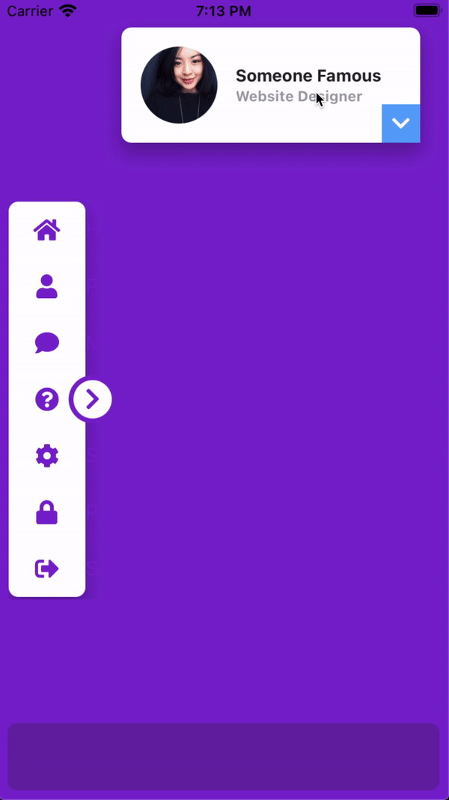

# What's new in v2.5.3
- [What's new in v2.5.3](#whats-new-in-v253)
  - [`zIndex` utilities](#zindex-utilities)
  - [Boxicons Font v2.0.9!](#boxicons-font-v209)
  - [We are still experimenting with the recently added `create` command](#we-are-still-experimenting-with-the-recently-added-create-command)
  - [Set `rotate`, `scale` and `anchorPoints` in `open:` and `close:` states](#set-rotate-scale-and-anchorpoints-in-open-and-close-states)


## `zIndex` utilities
Utilities for controlling the stack order of an element.
```css
// Component(s): Ti.UI.Animation, Ti.UI.View
// Property(ies): zIndex
'.z-0': { zIndex: 0 }
'.z-10': { zIndex: 10 }
'.z-20': { zIndex: 20 }
'.z-30': { zIndex: 30 }
'.z-40': { zIndex: 40 }
'.z-50': { zIndex: 50 }
```


## Boxicons Font v2.0.9!
Added a beatufil library of icons called [Boxicons](https://boxicons.com).

A High Quality web friendly icons

'Boxicons' is a carefully designed open source iconset with 1500+ icons. It's crafted to look enrich your website/app experience.

To copy the new font file to your project use:

```bash
> purgetss fonts --vendor="boxicons"

# alias:
> purgetss f -v=bx
```

Add the `--modules` flag to also copy the corresponding CommonJS module into `./app/lib/` folder:

```bash
> purgetss fonts --vendor="boxicons" --modules

# alias:
> purgetss f -v=bx -m
```

We are keeping the prefixes of boxicons classes in the `boxicons.js` file to prevent unexpected results, because there are three sets of icons in the same font file: **Logos, Regular and Solid**.
- Regular: `bx-flag` becomes `bxFlag`
- Solid: `bxs-flag` becomes `bxsFlag`
- Logos: Almost all the logos have no conflict with other classes, because almost all have unique names, except for one: `bxl-windows` and `bx-windows`. That's why we are also keeping the prefix for all `logos` variants, so they become: `bxlWindows` for example.


## We are still experimenting with the recently added `create` command
We temporary remove a second error check in order to continue with the creation and installation process.

We've also added the `--vendor` argument to specify which icon font you'd like to install.

```bash
> purgetss create 'Name of the Project' [--vendor="fontawesome, materialdesign, lineicons, boxicons"]

# alias:
> purgetss c 'Name of the Project' [-v=fa,md,li,bx]
```

Please check the complete instructions [here](../../README.md#create-experimental)


## Set `rotate`, `scale` and `anchorPoints` in `open:` and `close:` states
Now you can set `rotate`, `scale` and `anchorPoints` separately when opening or closing states.

```xml
<Alloy>
  <Window class="bg-purple-700 keep-screen-on">
    <Button id="chevron" class="w-16 h-16 text-3xl text-purple-700 bg-white rounded-16 fas fa-chevron-right" ios:onSingletap="doRotate" android:onClick="doRotate" />
    <Animation id="myRotation" class="open:rotate-90 close:-rotate-90" module="purgetss.ui" />
  </Window>
</Alloy>
```

```javascript
$.index.open();

$.myRotation.play($.chevron);

function doRotate() {
  $.myRotation.play($.chevron);
}
```

A more complex UI with animations

```xml
<Alloy>
  <Window class="bg-purple-700 keep-screen-on dont-exit-on-close">
    <View id="navBar" class="w-24 ml-2 h-6/12">
      <View class="grid-flow-row mr-8 bg-white rounded-lg shadow-lg" ios:onSingletap="doAction" android:onClick="doAction">
        <View class="ml-0 grid-rows-7 w-72 ">
          <View class="items-center horizontal bg-selected-purple-100" action="home">
            <Button class="w-16 h-full ml-0 text-xl text-purple-700 bg-transparent border-transparent touch-disabled fas fa-home" />
            <Label class="text-purple-700 touch-disabled" text="Home" />
          </View>
        </View>

        <View class="ml-0 grid-rows-7 w-72">
          <View class="items-center horizontal bg-selected-purple-100" action="profile">
            <Button class="w-16 h-full ml-0 text-xl text-purple-700 bg-transparent border-transparent touch-disabled fas fa-user" />
            <Label class="text-purple-700 touch-disabled" text="Profile" />
          </View>
        </View>

        <View class="ml-0 grid-rows-7 w-72">
          <View class="items-center horizontal bg-selected-purple-100" action="messages">
            <Button class="w-16 h-full ml-0 text-xl text-purple-700 bg-transparent border-transparent touch-disabled fas fa-comment" />
            <Label class="text-purple-700 touch-disabled" text="Messages" />
          </View>
        </View>

        <View class="ml-0 grid-rows-7 w-72">
          <View class="items-center horizontal bg-selected-purple-100" action="help">
            <Button class="w-16 h-full ml-0 text-xl text-purple-700 bg-transparent border-transparent touch-disabled fas fa-question-circle" />
            <Label class="text-purple-700 touch-disabled" text="Help" />
          </View>
        </View>

        <View class="ml-0 grid-rows-7 w-72">
          <View class="items-center horizontal bg-selected-purple-100" action="settings">
            <Button class="w-16 h-full ml-0 text-xl text-purple-700 bg-transparent border-transparent touch-disabled fas fa-cog" />
            <Label class="text-purple-700 touch-disabled" text="Settings" />
          </View>
        </View>

        <View class="ml-0 grid-rows-7 w-72">
          <View class="items-center horizontal bg-selected-purple-100" action="password">
            <Button class="w-16 h-full ml-0 text-xl text-purple-700 bg-transparent border-transparent touch-disabled fas fa-lock" />
            <Label class="text-purple-700 touch-disabled" text="Password" />
          </View>
        </View>

        <View class="ml-0 grid-rows-7 w-72">
          <View class="items-center horizontal bg-selected-purple-100" action="sign-out">
            <Button class="w-16 h-full ml-0 text-xl text-purple-700 bg-transparent border-transparent touch-disabled fas fa-sign-out-alt" />
            <Label class="text-purple-700 touch-disabled" text="Sign Out" />
          </View>
        </View>
      </View>

      <Button id="chevy" class="w-10 h-10 text-xl text-purple-700 bg-white border-4 border-purple-700 fas rounded-10 fa-chevron-up mr-1.5" zIndex="2000" ios:onSingletap="doAnimation" android:onClick="doAnimation" />

      <Animation id="myAnimation" module="purgetss.ui" class="duration-150 open:w-72 close:w-24" />
      <Animation id="myAnimationChevron" module="purgetss.ui" class="duration-150 rotate-90 open:rotate-90 close:-rotate-90" />
    </View>

    <View id="myCard" class="w-8/12 h-24 mt-6 mr-6 shadow-lg">
      <View class="bg-white rounded-lg vertical">
        <View ios:onSingletap="myCardClicked" android:onClick="myCardClicked">
          <ImageView class="w-16 h-16 m-4 ml-4 rounded-16" image="https://randomuser.me/api/portraits/women/17.jpg" />

          <View class="ml-24 vertical">
            <Label class="text-sm font-bold text-gray-800" text="Someone Famous" />
            <Label class="text-xs font-bold text-gray-400" text="Website Designer" />
          </View>
        </View>

        <View class="w-screen mx-2 bg-gray-300 rounded-1 h-0.5" />

        <View class="h-48 grid-flow-row mt-2" ios:onSingletap="doAction" android:onClick="doAction">
          <View class="grid-rows-5 ml-0 w-72">
            <View class="items-center horizontal bg-selected-purple-100" action="profile">
              <Button class="h-full ml-0 text-xl text-purple-700 bg-transparent border-transparent touch-disabled w-14 fas fa-user" />
              <Label class="text-sm text-purple-700 touch-disabled" text="Edit Profile" />
            </View>
          </View>

          <View class="grid-rows-5 ml-0 w-72">
            <View class="items-center horizontal bg-selected-purple-100" action="inbox">
              <Button class="h-full ml-0 text-xl text-purple-700 bg-transparent border-transparent touch-disabled w-14 fas fa-inbox" />
              <Label class="text-sm text-purple-700 touch-disabled" text="Inbox" />
            </View>
          </View>

          <View class="grid-rows-5 ml-0 w-72">
            <View class="items-center horizontal bg-selected-purple-100" action="settings">
              <Button class="h-full ml-0 text-xl text-purple-700 bg-transparent border-transparent touch-disabled w-14 fas fa-cog" />
              <Label class="text-sm text-purple-700 touch-disabled" text="Settings" />
            </View>
          </View>

          <View class="grid-rows-5 ml-0 w-72">
            <View class="items-center horizontal bg-selected-purple-100" action="support">
              <Button class="h-full ml-0 text-xl text-purple-700 bg-transparent border-transparent touch-disabled w-14 fas fa-question-circle" />
              <Label class="text-sm text-purple-700 touch-disabled" text="Support" />
            </View>
          </View>

          <View class="grid-rows-5 ml-0 w-72">
            <View class="items-center horizontal bg-selected-purple-100" action="sign-out">
              <Button class="h-full ml-0 text-xl text-purple-700 bg-transparent border-transparent touch-disabled w-14 fas fa-sign-out-alt" />
              <Label class="text-sm text-purple-700 touch-disabled" text="Sign Out" />
            </View>
          </View>
        </View>
      </View>

      <View class="w-8 h-8 mb-0 mr-0 bg-blue-400">
        <Button id="myCardChevron" class="text-white bg-transparent border-transparent fas fa-chevron-right" ios:onSingletap="myCardClicked" android:onClick="myCardClicked" />
      </View>

      <Animation id="myCardAnimation" module="purgetss.ui" class="duration-150 open:h-(298) close:h-24" />
      <Animation id="myCardAnimationChevron" module="purgetss.ui" class="duration-150 rotate-90 open:rotate-90 close:-rotate-90" />
    </View>

    <Label id="action" class="mx-2 mb-2 text-sm font-bold bg-purple-800 rounded-lg text-purple-50 h-14" />
  </Window>
</Alloy>
```

```javascript
$.index.open();

// Both animations has the `rotate-90` set,
// so we can use apply to `hide` the animation from showing at startup
$.myAnimationChevron.apply($.chevy);
$.myCardAnimationChevron.apply($.myCardChevron);

function doAnimation(e) {
	$.myAnimation.play($.navBar);
	$.myAnimationChevron.play($.chevy);
}

function myCardClicked() {
	$.myCardAnimation.play($.myCard);
	$.myCardAnimationChevron.play($.myCardChevron);
}

function doAction(e) {
	if (e.source.action) {
		$.action.text = `   do Action: ${e.source.action}`;
	}
}
```



***\* low framerate gif***
