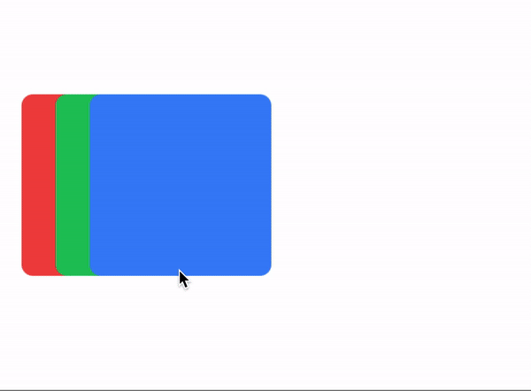
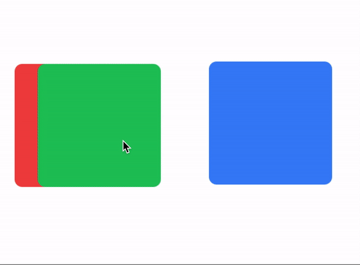

# What's new in v2.5.5
- [What's new in v2.5.5](#whats-new-in-v255)
  - [Extra scale values](#extra-scale-values)
  - [New `draggable` method, modifiers and properties in the Animation module](#new-draggable-method-modifiers-and-properties-in-the-animation-module)
    - [The `draggable` method](#the-draggable-method)
    - [`drag:` and `drop:` prefixes ( modifiers )](#drag-and-drop-prefixes--modifiers-)
    - [`draggingType` property](#draggingtype-property)
    - [`vertical` and `horizontal` constraints](#vertical-and-horizontal-constraints)


## Extra scale values
Added some extra values for the `scale` property
```css
// scale Property
// ...
'.scale-5': { scale: '0.05' }
'.scale-10': { scale: '0.1' }
'.scale-25': { scale: '0.25' }
// ...
```

## New `draggable` method, modifiers and properties in the Animation module
- Now you can convert any View or a set of Views into draggable elements by using the new `draggable` method.
- You can set **basic animations** when dragging or dropping elements with the modifiers `drag:` and `drop:`.
- You can apply or animate the animations to the views either globally or locally with the `draggingType` property.
- You can constrain any View to horizontal or vertical movement with the `constraint` propety.

### The `draggable` method
```javascript
$.draggableAnimation.draggable([$.red, $.green, $.blue]);
```

**You can use any `Animation` element created in your view to use the `draggable` method, but by using one Animation on a set of Views, it will handle the zIndex of every draggable element automatically.**

```xml
<Alloy>
  <Window class="keep-screen-on dont-exit-on-close">
    <View id="red" class="w-32 h-32 ml-4 bg-red-500 rounded-lg" />

    <View id="green" class="w-32 h-32 ml-10 bg-green-500 rounded-lg" />

    <View id="blue" class="w-32 h-32 ml-16 bg-blue-500 rounded-lg" />

    <Animation id="draggableAnimation" module="purgetss.ui" />
  </Window>
</Alloy>
```

```javascript
$.index.open();

$.draggableAnimation.draggable([$.red, $.green, $.blue]);
```


***\* low framerate gif***


### `drag:` and `drop:` prefixes ( modifiers )
You can set **basic animations** while dragging and dropping elements.

You can create an `Animation` element with a “global” set of modifiers or you can set modifiers separately to each view.

Local modifiers will overwrite any global modifier.

**To simplify things... We are restricting the type of animations that can be apply while dragging ( or dropping ). Mainly we are not applying any `size`, `scale` or `anchorPoint` transformation.**

```xml
<Alloy>
  <Window class="keep-screen-on dont-exit-on-close">
    <!-- No local modifiers, will be using the global modifiers -->
    <View id="red" class="w-32 h-32 ml-4 bg-red-500 rounded-lg" />

    <!-- Local modifiers: drag:bg-green-700 drop:bg-green-500 plus the global modifiers-->
    <View id="green" class="w-32 h-32 ml-10 bg-green-500 rounded-lg drag:bg-green-700 drop:bg-green-500" />

    <!-- Local modifiers: overwriting the global opacity to drag:opacity-80 -->
    <View id="blue" class="w-32 h-32 ml-16 bg-blue-500 rounded-lg drag:opacity-80" />

    <!-- Global set of modifiers -->
    <Animation id="draggableAnimation" module="purgetss.ui" class="drag:duration-100 drag:opacity-50 drop:opacity-100" />
  </Window>
</Alloy>
```



***\* low framerate gif***

### `draggingType` property

For controlling how `drag:` and `drop:` modifiers are applied, either by animating: `drag-animate` ( *default* ) or by applying: `drag-apply` the properties.

```css
// draggingType Property
'.drag-apply': { draggingType: 'apply' }
'.drag-animate': { draggingType: 'animate' }
```

In the following example, the `Animation` element is setting the global dragging type to `drag-apply`, but the green square is overwriting it to `drag-animate`.

```xml
<Alloy>
  <Window class="keep-screen-on dont-exit-on-close">
    <!-- No local modifiers, will be using the global modifiers -->
    <View id="red" class="w-32 h-32 ml-4 bg-red-500 rounded-lg" />

    <!-- Local modifiers: drag:bg-green-700 drop:bg-green-500 plus the global modifiers-->
    <View id="green" class="w-32 h-32 ml-10 bg-green-500 rounded-lg drag-animate drag:bg-green-700 drop:bg-green-500" />

    <!-- Local modifiers: overwriting the global opacity to drag:opacity-80 -->
    <View id="blue" class="w-32 h-32 ml-16 bg-blue-500 rounded-lg drag:opacity-80" />

    <!-- Global set of modifiers -->
    <Animation id="draggableAnimation" module="purgetss.ui" class="drag-apply drag:duration-500 drag:opacity-50 drop:opacity-100" />
  </Window>
</Alloy>
```



***\* low framerate gif***


### `vertical` and `horizontal` constraints
Add a vertical and horizontal constraint to any `dragging` element.

```css
// Constraint Property
'.vertical-constraint': { constraint: 'vertical' }
'.horizontal-constraint': { constraint: 'horizontal' }
```

In this example the `card` will move only from side to side.

```xml
<Alloy>
  <Window class="keep-screen-on dont-exit-on-close">
    <View id="card" class="w-64 h-24 shadow-lg horizontal-constraint">
      <View id="cardInside" class="bg-white border-2 border-purple-700 rounded-lg vertical">
        <View id="cardWithImage">
          <ImageView id="theImage" class="w-16 h-16 m-4 ml-4 rounded-16" image="https://randomuser.me/api/portraits/women/17.jpg" />

          <View class="ml-24 vertical">
            <Label class="text-sm font-bold text-gray-800" text="Someone Famous" />
            <Label class="text-xs font-bold text-gray-400" text="Website Designer" />
          </View>
        </View>
      </View>
    </View>

    <Animation id="draggableAnimation" module="purgetss.ui" />
  </Window>
</Alloy>
```

```javascript
$.index.open();

$.draggableAnimation.draggable($.card);
```


***\* low framerate gif***
