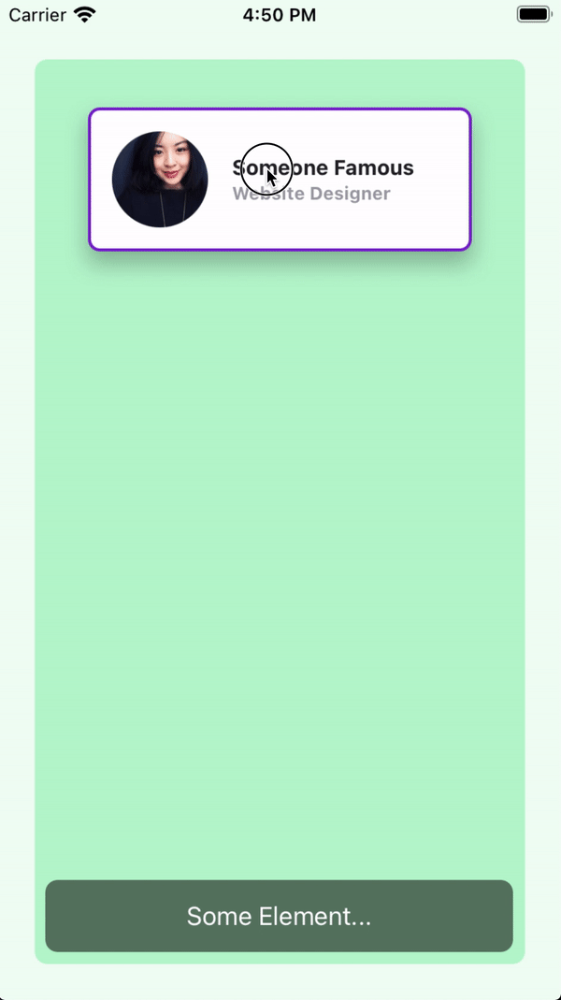

# What's new in v2.5.8
- [What's new in v2.5.8](#whats-new-in-v258)
  - [Fixed: zIndex values in complex Views.](#fixed-zindex-values-in-complex-views)
  - [`bounds:` prefix ( or modifier )](#bounds-prefix--or-modifier-)
    - [Example 1](#example-1)
    - [Example 2](#example-2)

## Fixed: zIndex values in complex Views.
When dealing with an array of complex Views ( a View with children ), the zIndex sorting was working incorrectly.

Now it takes the zIndex of the based View and not the dragged ( or selected ) child.

## `bounds:` prefix ( or modifier )
Now you can set boundaries in which the View can move within its parent View.

You can set global boundaries and/or local boundaries to each individual view. Local values will overwrite any global values.

### Example 1
The `card` view has a boundary of `m-4` and a bottom boundary of `mb-16`.

`index.xml`
```xml
<Alloy>
  <Window class="keep-screen-on dont-exit-on-close bg-green-50">
    <View class="w-screen h-screen mx-6 mt-10 mb-6 bg-green-200 rounded-lg">
      <View id="card" class="w-64 h-24 mt-8 shadow-lg bounds:m-2 bounds:mb-16">
        <View id="cardInside" class="w-screen bg-white border-2 border-purple-700 rounded-lg ">
          <ImageView id="theImage" class="w-16 h-16 m-4 ml-4 rounded-16 prevent-default-image bg-gray-50" image="https://randomuser.me/api/portraits/women/17.jpg" />

          <View class="w-screen ml-24 vertical">
            <Label class="ml-0 text-sm font-bold text-gray-800" text="Someone Famous" />
            <Label class="ml-0 text-xs font-bold text-gray-400" text="Website Designer" />
          </View>
        </View>
      </View>

      <Label class="mx-2 mb-2 h-12 rounded-lg text-white text-center w-screen bg-(#80000000)" text="Some Element..." />
    </View>

    <Animation id="draggableAnimation" module="purgetss.ui" />
  </Window>
</Alloy>
```

`index.js`
```javascript
$.index.open();

$.draggableAnimation.draggable($.card);
```



***\* low framerate gif***

### Example 2
In this example, the boundaries are set globally in the `draggableAnimation` view.

Every card view will use the global values.

`index.xml`
```xml
<Alloy>
  <Window class="keep-screen-on dont-exit-on-close bg-green-50">
    <View class="w-screen h-screen mx-6 mt-10 mb-6 bg-green-200 rounded-lg">
      <View id="card" class="w-64 h-24 mt-8 shadow-lg">
        <View id="cardInside" class="w-screen bg-white border-2 border-purple-700 rounded-lg ">
          <ImageView id="theImage" class="w-16 h-16 m-4 ml-4 rounded-16 prevent-default-image bg-gray-50" image="https://randomuser.me/api/portraits/women/17.jpg" />

          <View class="w-screen ml-24 vertical">
            <Label class="ml-0 text-sm font-bold text-gray-800" text="Someone Famous" />
            <Label class="ml-0 text-xs font-bold text-gray-400" text="Website Designer" />
          </View>
        </View>
      </View>

      <View id="card2" class="w-64 h-24 mt-40 shadow-lg">
        <View id="cardInside" class="w-screen bg-white border-2 border-purple-700 rounded-lg ">
          <ImageView id="theImage" class="w-16 h-16 m-4 ml-4 rounded-16 prevent-default-image bg-gray-50" image="https://randomuser.me/api/portraits/women/21.jpg" />

          <View class="w-screen ml-24 vertical">
            <Label class="ml-0 text-sm font-bold text-gray-800" text="Second Famous" />
            <Label class="ml-0 text-xs font-bold text-gray-400" text="Website Designer" />
          </View>
        </View>
      </View>

      <View id="card3" class="w-64 h-24 shadow-lg mt-72">
        <View id="cardInside" class="w-screen bg-white border-2 border-purple-700 rounded-lg ">
          <ImageView id="theImage" class="w-16 h-16 m-4 ml-4 rounded-16 prevent-default-image bg-gray-50" image="https://randomuser.me/api/portraits/women/25.jpg" />

          <View class="w-screen ml-24 vertical">
            <Label class="ml-0 text-sm font-bold text-gray-800" text="Third Famous" />
            <Label class="ml-0 text-xs font-bold text-gray-400" text="Website Designer" />
          </View>
        </View>
      </View>

      <Label class="mx-2 mb-2 h-12 rounded-lg text-white text-center w-screen bg-(#80000000)" text="Some Element..." />
    </View>

    <Animation id="draggableAnimation" module="purgetss.ui" class="bounds:m-2 bounds:mb-16" />
  </Window>
</Alloy>
```

`index.js`
```javascript
$.index.open();

$.draggableAnimation.draggable([$.card, $.card2, $.card3]);
```


***\* low framerate gif***
