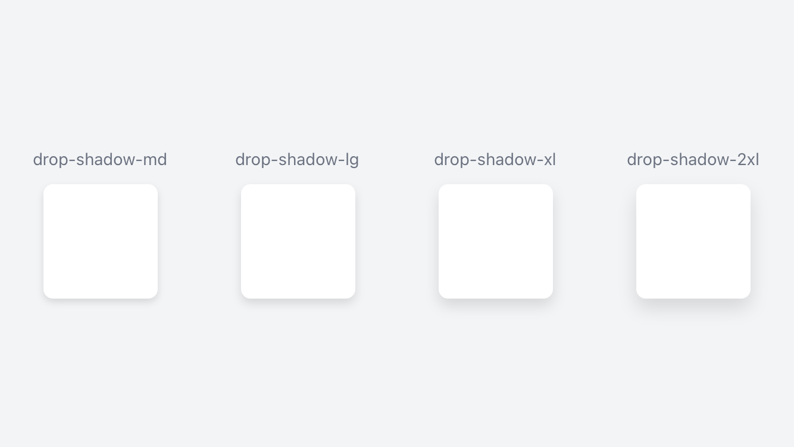

# What's new in v3.0.5
- [What's new in v3.0.5](#whats-new-in-v305)
  - [Minor Tweeks to Shadow Classes](#minor-tweeks-to-shadow-classes)
  - [Icon Mask](#icon-mask)
    - [iconIsMask Property](#iconismask-property)
    - [activeIconIsMask Property](#activeiconismask-property)
  - [Status Bar Style](#status-bar-style)
  - [Keyboard](#keyboard)
    - [keyboardAppearance Property](#keyboardappearance-property)
    - [keyboardDismissMode Property](#keyboarddismissmode-property)
    - [keyboardType Property](#keyboardtype-property)
    - [loginKeyboardType Property](#loginkeyboardtype-property)
  - [autoLink Property](#autolink-property)
  - [Border Style Property](#border-style-property)
  - [Keep Sections In Search Property](#keep-sections-in-search-property)
  - [Music Player](#music-player)
    - [Repeat Mode Property](#repeat-mode-property)
    - [Shuffle Mode Property](#shuffle-mode-property)
  - [Video Repeat Mode Property](#video-repeat-mode-property)
  - [Shift Mode](#shift-mode)
  - [Show As Action Property](#show-as-action-property)
  - [Activity Indicator](#activity-indicator)
    - [Indicator Colors Property](#indicator-colors-property)
    - [Indicator Style Property](#indicator-style-property)
  - [Masked Image View Blend Modes](#masked-image-view-blend-modes)
    - [Blend Mode Property](#blend-mode-property)
    - [Tint Color Property](#tint-color-property)
  - [TabGroups](#tabgroups)
    - [Style Property](#style-property)
    - [Padding Properties ( including for CardViews )](#padding-properties--including-for-cardviews-)

## Minor Tweeks to Shadow Classes
Did some minor adjustments to the shadow classes to better match the shadows from Tailwind.

Also added `drop-shadow-xx` classes for compatibility with Tailwind classes.

```xml
<Alloy>
  <Window class="grid bg-gray-100">
    <View class="grid-cols-4 grid-rows-1">
      <View class="vertical clip-disabled">
        <Label class="mb-3 text-sm text-gray-500" text="drop-shadow-md" />
        <View class="w-24 h-24 bg-white rounded-lg drop-shadow-md" />
      </View>
    </View>

    <View class="grid-cols-4 grid-rows-1">
      <View class="vertical clip-disabled">
        <Label class="mb-3 text-sm text-gray-500" text="drop-shadow-lg" />
        <View class="w-24 h-24 bg-white rounded-lg drop-shadow-lg"/>
      </View>
    </View>

    <View class="grid-cols-4 grid-rows-1">
      <View class="vertical clip-disabled">
        <Label class="mb-3 text-sm text-gray-500" text="drop-shadow-xl" />
        <View class="w-24 h-24 bg-white rounded-lg drop-shadow-xl"/>
      </View>
    </View>

    <View class="grid-cols-4 grid-rows-1">
      <View class="vertical clip-disabled">
        <Label class="mb-3 text-sm text-gray-500" text="drop-shadow-2xl" />
        <View class="w-24 h-24 bg-white rounded-lg drop-shadow-2xl"/>
      </View>
    </View>
  </Window>
</Alloy>
```

```css
// Tailwind styles
'.bg-gray-100': { backgroundColor: '#f3f4f6' }
'.bg-white': { backgroundColor: '#ffffff' }
'.clip-disabled[platform=ios]': { clipMode: Ti.UI.iOS.CLIP_MODE_DISABLED }
'.drop-shadow-2xl': { viewShadowOffset: { x: 0, y: 8 }, viewShadowRadius: 8, viewShadowColor: '#59000000' }
'.drop-shadow-lg': { viewShadowOffset: { x: 0, y: 4 }, viewShadowRadius: 4, viewShadowColor: '#59000000' }
'.drop-shadow-md': { viewShadowOffset: { x: 0, y: 3 }, viewShadowRadius: 3, viewShadowColor: '#59000000' }
'.drop-shadow-xl': { viewShadowOffset: { x: 0, y: 6 }, viewShadowRadius: 6, viewShadowColor: '#59000000' }
'.grid': { layout: 'horizontal' }
'.grid-cols-4': { width: '25%' }
'.grid-rows-1': { height: '100%' }
'.h-24': { height: 96 }
'.mb-3': { bottom: 12 }
'.rounded-lg': { borderRadius: 8 }
'.text-gray-500': { color: '#6b7280' }
'.text-sm': { font: { fontSize: 14 } }
'.vertical': { layout: 'vertical' }
'.w-24': { width: 96 }
'View': { width: Ti.UI.SIZE, height: Ti.UI.SIZE }
'Window': { backgroundColor: '#ffffff' }
```



```css
// Box Shadow - viewShadowOffset, viewShadowRadius and viewShadowColor Properties
'.shadow-xs': { viewShadowOffset: { x: 0, y: 0 }, viewShadowRadius: 1, viewShadowColor: '#59000000' }
'.shadow-sm': { viewShadowOffset: { x: 0, y: 1 }, viewShadowRadius: 1, viewShadowColor: '#59000000' }
'.shadow': { viewShadowOffset: { x: 0, y: 2 }, viewShadowRadius: 2, viewShadowColor: '#59000000' }
'.shadow-md': { viewShadowOffset: { x: 0, y: 3 }, viewShadowRadius: 3, viewShadowColor: '#59000000' }
'.shadow-lg': { viewShadowOffset: { x: 0, y: 4 }, viewShadowRadius: 4, viewShadowColor: '#59000000' }
'.shadow-xl': { viewShadowOffset: { x: 0, y: 6 }, viewShadowRadius: 6, viewShadowColor: '#59000000' }
'.shadow-2xl': { viewShadowOffset: { x: 0, y: 8 }, viewShadowRadius: 8, viewShadowColor: '#59000000' }
'.shadow-inner': { viewShadowOffset: { x: 0, y: 0 }, viewShadowRadius: null, viewShadowColor: null }
'.shadow-outline': { viewShadowOffset: { x: 0, y: 0 }, viewShadowRadius: 2, viewShadowColor: '#59000000' }
'.shadow-none': { viewShadowOffset: { x: 0, y: 0 }, viewShadowRadius: null, viewShadowColor: null }

// Drop Shadow - viewShadowOffset, viewShadowRadius and viewShadowColor Properties
'.drop-shadow-xs': { viewShadowOffset: { x: 0, y: 0 }, viewShadowRadius: 1, viewShadowColor: '#59000000' }
'.drop-shadow-sm': { viewShadowOffset: { x: 0, y: 1 }, viewShadowRadius: 1, viewShadowColor: '#59000000' }
'.drop-shadow': { viewShadowOffset: { x: 0, y: 2 }, viewShadowRadius: 2, viewShadowColor: '#59000000' }
'.drop-shadow-md': { viewShadowOffset: { x: 0, y: 3 }, viewShadowRadius: 3, viewShadowColor: '#59000000' }
'.drop-shadow-lg': { viewShadowOffset: { x: 0, y: 4 }, viewShadowRadius: 4, viewShadowColor: '#59000000' }
'.drop-shadow-xl': { viewShadowOffset: { x: 0, y: 6 }, viewShadowRadius: 6, viewShadowColor: '#59000000' }
'.drop-shadow-2xl': { viewShadowOffset: { x: 0, y: 8 }, viewShadowRadius: 8, viewShadowColor: '#59000000' }
'.drop-shadow-none': { viewShadowOffset: { x: 0, y: 0 }, viewShadowRadius: null, viewShadowColor: null }
```
## Icon Mask
`iconIsMask` and `activeIconsIsMask` properties.

### iconIsMask Property
```css
// iconIsMask Property
'.icon-is-mask[platform=ios]': { iconIsMask: true }
'.icon-is-not-mask[platform=ios]': { iconIsMask: false }
```

### activeIconIsMask Property
```css
// activeIconIsMask Property
'.active-icon-is-mask[platform=ios]': { activeIconIsMask: true }
'.active-icon-is-not-mask[platform=ios]': { activeIconIsMask: false }
```

## Status Bar Style
```css
// statusBarStyle Property
'.status-bar[platform=ios]': { statusBarStyle: Titanium.UI.iOS.StatusBar.DEFAULT }
'.status-bar-dark[platform=ios]': { statusBarStyle: Titanium.UI.iOS.StatusBar.DARK_CONTENT }
'.status-bar-light[platform=ios]': { statusBarStyle: Titanium.UI.iOS.StatusBar.LIGHT_CONTENT }
```

## Keyboard
Several keyboard properties: `keyboardAppearance`, `keyboardDismissMode`, `keyboardType` and `loginKeyboardType`.

### keyboardAppearance Property
```css
// keyboardAppearance Property
'.keyboard-appearance[platform=ios]': { keyboardAppearance: Ti.UI.KEYBOARD_APPEARANCE_DEFAULT }
'.keyboard-appearance-dark[platform=ios]': { keyboardAppearance: Ti.UI.KEYBOARD_APPEARANCE_DARK }
'.keyboard-appearance-light[platform=ios]': { keyboardAppearance: Ti.UI.KEYBOARD_APPEARANCE_LIGHT }
```

### keyboardDismissMode Property
```css
// keyboardDismissMode Property
'.keyboard-dismiss-interactive[platform=ios]': { keyboardDismissMode: Ti.UI.iOS.KEYBOARD_DISMISS_MODE_INTERACTIVE }
'.keyboard-dismiss-none[platform=ios]': { keyboardDismissMode: Ti.UI.iOS.KEYBOARD_DISMISS_MODE_NONE }
'.keyboard-dismiss-on-drag[platform=ios]': { keyboardDismissMode: Ti.UI.iOS.KEYBOARD_DISMISS_MODE_ON_DRAG }
```

### keyboardType Property
```css
// keyboardType Property
'.keyboard-type': { keyboardType: Ti.UI.KEYBOARD_TYPE_DEFAULT }
'.keyboard-type-appearance': { keyboardType: Ti.UI.KEYBOARD_APPEARANCE_DEFAULT }
'.keyboard-type-appearance-dark': { keyboardType: Ti.UI.KEYBOARD_APPEARANCE_DARK }
'.keyboard-type-appearance-light': { keyboardType: Ti.UI.KEYBOARD_APPEARANCE_LIGHT }
'.keyboard-type-ascii': { keyboardType: Ti.UI.KEYBOARD_TYPE_ASCII }
'.keyboard-type-decimal-pad': { keyboardType: Ti.UI.KEYBOARD_TYPE_DECIMAL_PAD }
'.keyboard-type-email': { keyboardType: Ti.UI.KEYBOARD_TYPE_EMAIL }
'.keyboard-type-namephone-pad': { keyboardType: Ti.UI.KEYBOARD_TYPE_NAMEPHONE_PAD }
'.keyboard-type-number-pad': { keyboardType: Ti.UI.KEYBOARD_TYPE_NUMBER_PAD }
'.keyboard-type-numbers-punctuation': { keyboardType: Ti.UI.KEYBOARD_TYPE_NUMBERS_PUNCTUATION }
'.keyboard-type-phone-pad': { keyboardType: Ti.UI.KEYBOARD_TYPE_PHONE_PAD }
'.keyboard-type-twitter': { keyboardType: Ti.UI.KEYBOARD_TYPE_TWITTER }
'.keyboard-type-url': { keyboardType: Ti.UI.KEYBOARD_TYPE_URL }
'.keyboard-type-websearch': { keyboardType: Ti.UI.KEYBOARD_TYPE_WEBSEARCH }
```

### loginKeyboardType Property
```css
// loginKeyboardType Property
'.login-keyboard': { loginKeyboardType: Ti.UI.KEYBOARD_TYPE_DEFAULT }
'.login-keyboard-appearance': { loginKeyboardType: Ti.UI.KEYBOARD_APPEARANCE_DEFAULT }
'.login-keyboard-appearance-dark': { loginKeyboardType: Ti.UI.KEYBOARD_APPEARANCE_DARK }
'.login-keyboard-appearance-light': { loginKeyboardType: Ti.UI.KEYBOARD_APPEARANCE_LIGHT }
'.login-keyboard-ascii': { loginKeyboardType: Ti.UI.KEYBOARD_TYPE_ASCII }
'.login-keyboard-decimal-pad': { loginKeyboardType: Ti.UI.KEYBOARD_TYPE_DECIMAL_PAD }
'.login-keyboard-email': { loginKeyboardType: Ti.UI.KEYBOARD_TYPE_EMAIL }
'.login-keyboard-namephone-pad': { loginKeyboardType: Ti.UI.KEYBOARD_TYPE_NAMEPHONE_PAD }
'.login-keyboard-number-pad': { loginKeyboardType: Ti.UI.KEYBOARD_TYPE_NUMBER_PAD }
'.login-keyboard-numbers-punctuation': { loginKeyboardType: Ti.UI.KEYBOARD_TYPE_NUMBERS_PUNCTUATION }
'.login-keyboard-phone-pad': { loginKeyboardType: Ti.UI.KEYBOARD_TYPE_PHONE_PAD }
'.login-keyboard-twitter': { loginKeyboardType: Ti.UI.KEYBOARD_TYPE_TWITTER }
'.login-keyboard-url': { loginKeyboardType: Ti.UI.KEYBOARD_TYPE_URL }
'.login-keyboard-websearch': { loginKeyboardType: Ti.UI.KEYBOARD_TYPE_WEBSEARCH }
```

## autoLink Property
```css
// autoLink Property
'.autolink-all': { autoLink: Ti.UI.AUTOLINK_ALL }
'.autolink-calendar': { autoLink: Ti.UI.AUTOLINK_CALENDAR }
'.autolink-email-addresses': { autoLink: Ti.UI.AUTOLINK_EMAIL_ADDRESSES }
'.autolink-map-addresses': { autoLink: Ti.UI.AUTOLINK_MAP_ADDRESSES }
'.autolink-none': { autoLink: Ti.UI.AUTOLINK_NONE }
'.autolink-phone-numbers': { autoLink: Ti.UI.AUTOLINK_PHONE_NUMBERS }
'.autolink-urls': { autoLink: Ti.UI.AUTOLINK_URLS }
```

## Border Style Property
```css
// borderStyle Property
'.border-style-bezel': { borderStyle: Ti.UI.INPUT_BORDERSTYLE_BEZEL }
'.border-style-filled': { borderStyle: Ti.UI.INPUT_BORDERSTYLE_FILLED }
'.border-style-line': { borderStyle: Ti.UI.INPUT_BORDERSTYLE_LINE }
'.border-style-none': { borderStyle: Ti.UI.INPUT_BORDERSTYLE_NONE }
'.border-style-rounded': { borderStyle: Ti.UI.INPUT_BORDERSTYLE_ROUNDED }
'.border-style-underlined': { borderStyle: Ti.UI.INPUT_BORDERSTYLE_UNDERLINED }
```

## Keep Sections In Search Property
```css
// keepSectionsInSearch Property
'.keep-sections-in-search[platform=ios]': { keepSectionsInSearch: true }
'.dont-keep-sections-in-search[platform=ios]': { keepSectionsInSearch: false }
```
## Music Player

### Repeat Mode Property
```css
// Music Player - repeatMode Property
'.music-repeat-all[platform=ios]': { repeatMode: Ti.Media.MUSIC_PLAYER_REPEAT_ALL }
'.music-repeat[platform=ios]': { repeatMode: Ti.Media.MUSIC_PLAYER_REPEAT_DEFAULT }
'.music-repeat-none[platform=ios]': { repeatMode: Ti.Media.MUSIC_PLAYER_REPEAT_NONE }
'.music-repeat-one[platform=ios]': { repeatMode: Ti.Media.MUSIC_PLAYER_REPEAT_ONE }
```

### Shuffle Mode Property
```css
// Music Player - shuffleMode Property
'.music-shuffle-albums[platform=ios]': { shuffleMode: Ti.Media.MUSIC_PLAYER_SHUFFLE_ALBUMS }
'.music-shuffle[platform=ios]': { shuffleMode: Ti.Media.MUSIC_PLAYER_SHUFFLE_DEFAULT }
'.music-shuffle-none[platform=ios]': { shuffleMode: Ti.Media.MUSIC_PLAYER_SHUFFLE_NONE }
'.music-shuffle-songs[platform=ios]': { shuffleMode: Ti.Media.MUSIC_PLAYER_SHUFFLE_SONGS }
```

## Video Repeat Mode Property
```css
// Video repeatMode Property
'.video-repeat-none': { repeatMode: Ti.Media.VIDEO_REPEAT_MODE_NONE }
'.video-repeat-one': { repeatMode: Ti.Media.VIDEO_REPEAT_MODE_ONE }
```

## Shift Mode
```css
// shiftMode Property
'.shift-mode[platform=android]': { shiftMode: true }
'.shift-mode-off[platform=android]': { shiftMode: false }
```

## Show As Action Property
```css
// showAsAction Property
'.show-as-action-always[platform=android]': { showAsAction: Ti.Android.SHOW_AS_ACTION_ALWAYS }
'.show-as-action-collapse[platform=android]': { showAsAction: Ti.Android.SHOW_AS_ACTION_COLLAPSE_ACTION_VIEW }
'.show-as-action-if-room[platform=android]': { showAsAction: Ti.Android.SHOW_AS_ACTION_IF_ROOM }
'.show-as-action-never[platform=android]': { showAsAction: Ti.Android.SHOW_AS_ACTION_NEVER }
'.show-as-action-with-text[platform=android]': { showAsAction: Ti.Android.SHOW_AS_ACTION_WITH_TEXT }
```

## Activity Indicator
New classes for the `ActivityIndicator` View.

```xml
<ActivityIndicator class="indicator-blue-500 indicator-style-big" message="Greetings..." id="activityIndicator" />
```

```css
'.indicator-blue-500': { indicatorColor: '#3b82f6' }
'.indicator-style-big': { style: Ti.UI.ActivityIndicatorStyle.BIG }
```

### Indicator Colors Property
New `indicator` color classes for the animated indicator.

```css
// indicatorColor Property
'.indicator-transparent': { indicatorColor: 'transparent' }
'.indicator-black': { indicatorColor: '#000000' }
'.indicator-white': { indicatorColor: '#ffffff' }
'.indicator-slate-50': { indicatorColor: '#f8fafc' }
'.indicator-slate-100': { indicatorColor: '#f1f5f9' }
// ...
```

And just like any other color property:
1. You can also set an arbitrary color value using `hex`, `rgb` or `rgba` color values.
2. You can set them directly in your `xml` files or in your `config.js` file.
3. You can add a **[color opacity modifier](https://github.com/macCesar/purgeTSS/blob/master/docs/whats-new/v3.0.4.md#color-opacity-modifiers)** to them.

### Indicator Style Property
New `indicator-style` classes for styling the activity indicator.

```css
// indicatorStyle Property
'.indicator-style-big': { style: Ti.UI.ActivityIndicatorStyle.BIG }
'.indicator-style-dark': { style: Ti.UI.ActivityIndicatorStyle.DARK }
'.indicator-style-big-dark': { style: Ti.UI.ActivityIndicatorStyle.BIG_DARK }
'.indicator-style-plain': { style: Ti.UI.ActivityIndicatorStyle.PLAIN }
```

## Masked Image View Blend Modes
A control that displays an image composited with a background image or color.

```xml
<Alloy>
  <Window>
    <View class="horizontal">
      <MaskedImage class="bg-blend-color tint-purple-500" mask="/images/building.jpeg" />

      <MaskedImage class="bg-blend-overlay tint-purple-500" mask="/images/building.jpeg" />

      <MaskedImage class="bg-blend-screen tint-purple-500" mask="/images/building.jpeg" />

      <MaskedImage class="bg-blend-multiply tint-purple-500" mask="/images/building.jpeg" />
    </View>
  </Window>
</Alloy>
```

```css
// Tailwind styles
'.bg-blend-color': { mode: Ti.UI.BLEND_MODE_COLOR }
'.bg-blend-multiply': { mode: Ti.UI.BLEND_MODE_MULTIPLY }
'.bg-blend-overlay': { mode: Ti.UI.BLEND_MODE_OVERLAY }
'.bg-blend-screen': { mode: Ti.UI.BLEND_MODE_SCREEN }
'.horizontal': { layout: 'horizontal' }
'.tint-purple-500': { tint: '#a855f7', tintColor: '#a855f7' }
'View': { width: Ti.UI.SIZE, height: Ti.UI.SIZE }
'Window': { backgroundColor: '#ffffff' }
```


### Blend Mode Property

```css
// blend mode Property ( Background Blend Mode )
'.bg-blend-clear': { mode: Ti.UI.BLEND_MODE_CLEAR }
'.bg-blend-color-burn': { mode: Ti.UI.BLEND_MODE_COLOR_BURN }
'.bg-blend-color-dodge': { mode: Ti.UI.BLEND_MODE_COLOR_DODGE }
'.bg-blend-color': { mode: Ti.UI.BLEND_MODE_COLOR }
'.bg-blend-copy': { mode: Ti.UI.BLEND_MODE_COPY }
'.bg-blend-darken': { mode: Ti.UI.BLEND_MODE_DARKEN }
'.bg-blend-destination-atop': { mode: Ti.UI.BLEND_MODE_DESTINATION_ATOP }
'.bg-blend-destination-in': { mode: Ti.UI.BLEND_MODE_DESTINATION_IN }
'.bg-blend-destination-out': { mode: Ti.UI.BLEND_MODE_DESTINATION_OUT }
'.bg-blend-destination-over': { mode: Ti.UI.BLEND_MODE_DESTINATION_OVER }
'.bg-blend-difference': { mode: Ti.UI.BLEND_MODE_DIFFERENCE }
'.bg-blend-exclusion': { mode: Ti.UI.BLEND_MODE_EXCLUSION }
'.bg-blend-hard-light': { mode: Ti.UI.BLEND_MODE_HARD_LIGHT }
'.bg-blend-hue': { mode: Ti.UI.BLEND_MODE_HUE }
'.bg-blend-lighten': { mode: Ti.UI.BLEND_MODE_LIGHTEN }
'.bg-blend-luminosity': { mode: Ti.UI.BLEND_MODE_LUMINOSITY }
'.bg-blend-multiply': { mode: Ti.UI.BLEND_MODE_MULTIPLY }
'.bg-blend-normal': { mode: Ti.UI.BLEND_MODE_NORMAL }
'.bg-blend-overlay': { mode: Ti.UI.BLEND_MODE_OVERLAY }
'.bg-blend-plus-darker': { mode: Ti.UI.BLEND_MODE_PLUS_DARKER }
'.bg-blend-plus-lighter': { mode: Ti.UI.BLEND_MODE_PLUS_LIGHTER }
'.bg-blend-saturation': { mode: Ti.UI.BLEND_MODE_SATURATION }
'.bg-blend-screen': { mode: Ti.UI.BLEND_MODE_SCREEN }
'.bg-blend-soft-light': { mode: Ti.UI.BLEND_MODE_SOFT_LIGHT }
'.bg-blend-source-atop': { mode: Ti.UI.BLEND_MODE_SOURCE_ATOP }
'.bg-blend-source-in': { mode: Ti.UI.BLEND_MODE_SOURCE_IN }
'.bg-blend-source-out': { mode: Ti.UI.BLEND_MODE_SOURCE_OUT }
'.bg-blend-xor': { mode: Ti.UI.BLEND_MODE_XOR }
```

### Tint Color Property
Refactored `tint-color` classes to include `tint` property for the `MaskedImage` view.

*Hopefully this won't break anything!!*

```css
// tint and tintColor Properties
'.tint-transparent': { tint: 'transparent', tintColor: 'transparent' }
'.tint-black': { tint: '#000000', tintColor: '#000000' }
'.tint-white': { tint: '#ffffff', tintColor: '#ffffff' }
'.tint-slate-50': { tint: '#f8fafc', tintColor: '#f8fafc' }
'.tint-slate-100': { tint: '#f1f5f9', tintColor: '#f1f5f9' }
// ...
```
## TabGroups
Added more utility classes for styling the `TabGroup` Object.

### Style Property
Property defining which style for the TabGroup to be used.

```css
// TabGroup Style Property
'.tabs-style-default': { style: Ti.UI.Android.TABS_STYLE_DEFAULT }
'.tabs-style-bottom': { style: Ti.UI.Android.TABS_STYLE_BOTTOM_NAVIGATION }
```

### Padding Properties ( including for CardViews )
For padding of bottom navigation in TabGroups and for CardViews container in Android.

When using TABS_STYLE_BOTTOM_NAVIGATION you can set the padding to have a floating bottom navigation

```css
// paddingLeft, paddingRight, paddingBottom Properties
'.padding-0': { paddingLeft: 0, paddingRight: 0, paddingBottom: 0 }
'.padding-1': { paddingLeft: 4, paddingRight: 4, paddingBottom: 4 }
'.padding-2': { paddingLeft: 8, paddingRight: 8, paddingBottom: 8 }
'.padding-3': { paddingLeft: 12, paddingRight: 12, paddingBottom: 12 }
'.padding-4': { paddingLeft: 16, paddingRight: 16, paddingBottom: 16 }
// ...
'.padding-x-0': { paddingLeft: 0, paddingRight: 0 }
'.padding-x-1': { paddingLeft: 4, paddingRight: 4 }
'.padding-x-2': { paddingLeft: 8, paddingRight: 8 }
'.padding-x-3': { paddingLeft: 12, paddingRight: 12 }
'.padding-x-4': { paddingLeft: 16, paddingRight: 16 }
// ...
'.padding-left-0': { paddingLeft: 0 }
'.padding-left-1': { paddingLeft: 4 }
'.padding-left-2': { paddingLeft: 8 }
'.padding-left-3': { paddingLeft: 12 }
'.padding-left-4': { paddingLeft: 16 }
// ...
'.padding-right-0': { paddingRight: 0 }
'.padding-right-1': { paddingRight: 4 }
'.padding-right-2': { paddingRight: 8 }
'.padding-right-3': { paddingRight: 12 }
'.padding-right-4': { paddingRight: 16 }
// ...
'.padding-bottom-0': { paddingBottom: 0 }
'.padding-bottom-1': { paddingBottom: 4 }
'.padding-bottom-2': { paddingBottom: 8 }
'.padding-bottom-3': { paddingBottom: 12 }
'.padding-bottom-4': { paddingBottom: 16 }
// ...
```
