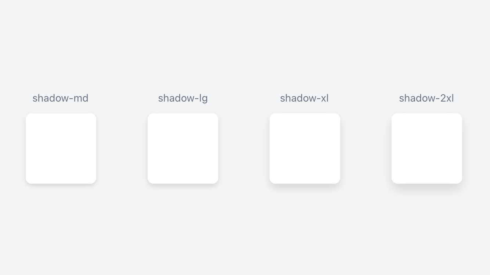

- [Minor Tweeks to Shadow Classes](#minor-tweeks-to-shadow-classes)
- [Activity Indicator](#activity-indicator)
  - [Indicator Colors Property (ActivityIndicator)](#indicator-colors-property-activityindicator)
  - [Styling the activity indicator.](#styling-the-activity-indicator)

## Minor Tweeks to Shadow Classes
Did some minor adjustments to the shadow classes to better match the shadows from Tailwind.

Also added `drop-shadow-xx` classes for compatibility with Tailwind classes.

```xml
<Alloy>
  <Window class="grid bg-gray-100">
    <View class="grid-cols-4 grid-rows-1">
      <View class="vertical clip-disabled">
        <Label class="mb-3 text-sm text-gray-500" text="shadow-md" />
        <View class="w-24 h-24 bg-white rounded-lg shadow-md" />
      </View>
    </View>

    <View class="grid-cols-4 grid-rows-1">
      <View class="vertical clip-disabled">
        <Label class="mb-3 text-sm text-gray-500" text="shadow-lg" />
        <View class="w-24 h-24 bg-white rounded-lg shadow-lg"/>
      </View>
    </View>

    <View class="grid-cols-4 grid-rows-1">
      <View class="vertical clip-disabled">
        <Label class="mb-3 text-sm text-gray-500" text="shadow-xl" />
        <View class="w-24 h-24 bg-white rounded-lg shadow-xl"/>
      </View>
    </View>

    <View class="grid-cols-4 grid-rows-1">
      <View class="vertical clip-disabled">
        <Label class="mb-3 text-sm text-gray-500" text="shadow-2xl" />
        <View class="w-24 h-24 bg-white rounded-lg shadow-2xl"/>
      </View>
    </View>
  </Window>
</Alloy>
```

```css
// Main styles
'View': { width: Ti.UI.SIZE, height: Ti.UI.SIZE }
'Window': { backgroundColor: '#ffffff' }
'.bg-white': { backgroundColor: '#ffffff' }
'.bg-gray-100': { backgroundColor: '#f3f4f6' }
'.rounded-lg': { borderRadius: 8 }
'.clip-disabled[platform=ios]': { clipMode: Ti.UI.iOS.CLIP_MODE_DISABLED }
'.text-sm': { font: { fontSize: 14 } }
'.grid': { layout: 'horizontal' }
'.grid-cols-4': { width: '25%' }
'.grid-rows-1': { height: '100%' }
'.h-24': { height: 96 }
'.vertical': { layout: 'vertical' }
'.mb-3': { bottom: 12 }
'.shadow-md': { viewShadowOffset: { x: 0, y: 3 }, viewShadowRadius: 3, viewShadowColor: '#59000000' }
'.shadow-lg': { viewShadowOffset: { x: 0, y: 4 }, viewShadowRadius: 4, viewShadowColor: '#59000000' }
'.shadow-xl': { viewShadowOffset: { x: 0, y: 6 }, viewShadowRadius: 6, viewShadowColor: '#59000000' }
'.shadow-2xl': { viewShadowOffset: { x: 0, y: 8 }, viewShadowRadius: 8, viewShadowColor: '#59000000' }
'.text-gray-500': { color: '#6b7280' }
'.w-24': { width: 96 }
```



```css
// View Shadow ( Box Shadow in Tailwind ) - viewShadowOffset, viewShadowRadius and viewShadowColor Properties
'.shadow-xs': { viewShadowOffset: { x: 0, y: 0 }, viewShadowRadius: 1, viewShadowColor: '#59000000' }
'.shadow-sm': { viewShadowOffset: { x: 0, y: 1 }, viewShadowRadius: 1, viewShadowColor: '#59000000' }
'.shadow': { viewShadowOffset: { x: 0, y: 2 }, viewShadowRadius: 2, viewShadowColor: '#59000000' }
'.shadow-md': { viewShadowOffset: { x: 0, y: 3 }, viewShadowRadius: 3, viewShadowColor: '#59000000' }
'.shadow-lg': { viewShadowOffset: { x: 0, y: 4 }, viewShadowRadius: 4, viewShadowColor: '#59000000' }
'.shadow-xl': { viewShadowOffset: { x: 0, y: 6 }, viewShadowRadius: 6, viewShadowColor: '#59000000' }
'.shadow-2xl': { viewShadowOffset: { x: 0, y: 8 }, viewShadowRadius: 8, viewShadowColor: '#59000000' }
'.shadow-inner': { viewShadowOffset: { x: 0, y: 0 }, viewShadowRadius: null, viewShadowColor: null }
'.shadow-outline': { viewShadowOffset: { x: 0, y: 0 }, viewShadowRadius: 2, viewShadowColor: '#59000000' }
'.shadow-none': { viewShadowOffset: { x: 0, y: 0 }, viewShadowRadius: null, viewShadowColor: null }

// Shadow for Labels and Buttons ( Drop Shadow in Tailwind ) - shadowOffset, shadowRadius and shadowColor Properties
'.drop-shadow-xs': { shadowOffset: { x: 0, y: 0 }, shadowRadius: 1, shadowColor: '#59000000' }
'.drop-shadow-sm': { shadowOffset: { x: 0, y: 1 }, shadowRadius: 1, shadowColor: '#59000000' }
'.drop-shadow': { shadowOffset: { x: 0, y: 2 }, shadowRadius: 2, shadowColor: '#59000000' }
'.drop-shadow-md': { shadowOffset: { x: 0, y: 3 }, shadowRadius: 3, shadowColor: '#59000000' }
'.drop-shadow-lg': { shadowOffset: { x: 0, y: 4 }, shadowRadius: 4, shadowColor: '#59000000' }
'.drop-shadow-xl': { shadowOffset: { x: 0, y: 6 }, shadowRadius: 6, shadowColor: '#59000000' }
'.drop-shadow-2xl': { shadowOffset: { x: 0, y: 8 }, shadowRadius: 8, shadowColor: '#59000000' }
'.drop-shadow-none': { shadowOffset: { x: 0, y: 0 }, shadowRadius: null, shadowColor: null }
```

## Activity Indicator
New classes for the `ActivityIndicator` View.

```xml
<ActivityIndicator class="indicator-blue-500 activity-indicator-style-big" message="Greetings..." id="activityIndicator" />
```

```css
'.activity-indicator-style-big': { style: Ti.UI.ActivityIndicatorStyle.BIG }
'.indicator-blue-500': { indicatorColor: '#3b82f6' }
```

### Indicator Colors Property (ActivityIndicator)
New `indicatorColor` classes for the animated indicator.

```css
// indicatorColor Property
'.indicator-transparent': { indicatorColor: 'transparent' }
'.indicator-black': { indicatorColor: '#000000' }
'.indicator-white': { indicatorColor: '#ffffff' }
'.indicator-slate-50': { indicatorColor: '#f8fafc' }
'.indicator-slate-100': { indicatorColor: '#f1f5f9' }
// ...
```

And just like any other color property:
1. You can also set an arbitrary color value using `hex`, `rgb` or `rgba` color values.
2. You can set them directly in your `xml` files or in your `config.js` file.
3. You can add a **[color opacity modifier](https://github.com/macCesar/purgeTSS/blob/master/docs/whats-new/v3.0.4.md#color-opacity-modifiers)** to them.

### Styling the activity indicator.

```css
// ActivityIndicatorStyle Property
'.activity-indicator-style-big': { style: Ti.UI.ActivityIndicatorStyle.BIG }
'.activity-indicator-style-dark': { style: Ti.UI.ActivityIndicatorStyle.DARK }
'.activity-indicator-style-big-dark': { style: Ti.UI.ActivityIndicatorStyle.BIG_DARK }
'.activity-indicator-style-plain': { style: Ti.UI.ActivityIndicatorStyle.PLAIN }
```
