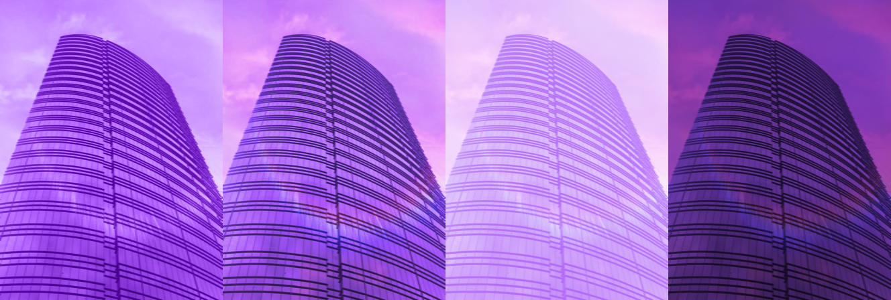

# What's new in v3.1.0
- [What's new in v3.1.0](#whats-new-in-v310)
  - [New Border Radius Classes](#new-border-radius-classes)
    - [Rounding sides](#rounding-sides)
    - [Rounding each corner separately](#rounding-each-corner-separately)
  - [Refactored Tint Color](#refactored-tint-color)
  - [Window](#window)
    - [Auto Adjust Scroll View Insets](#auto-adjust-scroll-view-insets)
    - [Extend Edges](#extend-edges)
    - [Status Bar Style](#status-bar-style)
    - [Hides Back Button](#hides-back-button)
    - [Hides Bars On Swipe](#hides-bars-on-swipe)
    - [Hides Bars On Tap](#hides-bars-on-tap)
    - [Include Opaque Bars](#include-opaque-bars)
    - [Large Title Enabled](#large-title-enabled)
    - [Large Title Display Mode](#large-title-display-mode)
    - [Nav Bar Hidden](#nav-bar-hidden)
    - [Orientation Modes](#orientation-modes)
    - [Tab Bar Hidden](#tab-bar-hidden)
  - [Ti.UI.Picker](#tiuipicker)
    - [The `type` of picker displayed](#the-type-of-picker-displayed)
    - [`useSpinner` multicolumn spinner or single column drop-down picker.](#usespinner-multicolumn-spinner-or-single-column-drop-down-picker)
  - [Auto Link](#auto-link)
  - [Border Style](#border-style)
  - [Bubble Parent](#bubble-parent)
  - [Fullscreen](#fullscreen)
  - [TabGroups](#tabgroups)
    - [Shift Mode](#shift-mode)
    - [Style](#style)
    - [Padding](#padding)
  - [Tab](#tab)
    - [Icon Is Mask](#icon-is-mask)
    - [Active Icon Is Mask](#active-icon-is-mask)
  - [Keep Sections In Search](#keep-sections-in-search)
  - [Keyboard](#keyboard)
    - [keyboardAppearance](#keyboardappearance)
    - [keyboardDismissMode](#keyboarddismissmode)
    - [keyboardType](#keyboardtype)
    - [loginKeyboardType](#loginkeyboardtype)
  - [Masked Image View Blend Modes](#masked-image-view-blend-modes)
    - [Blend Mode](#blend-mode)
  - [Ti.Media](#timedia)
    - [Video Player](#video-player)
      - [Video Repeat Mode](#video-repeat-mode)
    - [Music Player](#music-player)
      - [Repeat Mode](#repeat-mode)
      - [Shuffle Mode](#shuffle-mode)
  - [Show As Action](#show-as-action)
  - [Translucent](#translucent)

## New Border Radius Classes

### Rounding sides
Use `rounded-{t|r|b|l}-{size}` to only round one side of an element.

```css
// Component(s): Ti.UI.Android.CardView, Ti.UI.View
// Property(ies): borderRadius ( with Extra Styles )
// Top Corners
'.rounded-t-1': { borderRadius: [2, 2, 0, 0] }
'.rounded-t-2': { borderRadius: [4, 4, 0, 0] }
'.rounded-t-3': { borderRadius: [6, 6, 0, 0] }
// ...
'.rounded-t-72': { borderRadius: [144, 144, 0, 0] }
'.rounded-t-80': { borderRadius: [160, 160, 0, 0] }
'.rounded-t-96': { borderRadius: [192, 192, 0, 0] }

// Right Corners
'.rounded-r-1': { borderRadius: [0, 2, 2, 0] }
'.rounded-r-2': { borderRadius: [0, 4, 4, 0] }
'.rounded-r-3': { borderRadius: [0, 6, 6, 0] }
// ...
'.rounded-r-72': { borderRadius: [0, 144, 144, 0] }
'.rounded-r-80': { borderRadius: [0, 160, 160, 0] }
'.rounded-r-96': { borderRadius: [0, 192, 192, 0] }

// Bottom Corners
'.rounded-b-1': { borderRadius: [0, 0, 2, 2] }
'.rounded-b-2': { borderRadius: [0, 0, 4, 4] }
'.rounded-b-3': { borderRadius: [0, 0, 6, 6] }
// ...
'.rounded-b-72': { borderRadius: [0, 0, 144, 144] }
'.rounded-b-80': { borderRadius: [0, 0, 160, 160] }
'.rounded-b-96': { borderRadius: [0, 0, 192, 192] }

// Left Corners
'.rounded-l-1': { borderRadius: [2, 0, 0, 2] }
'.rounded-l-2': { borderRadius: [4, 0, 0, 4] }
'.rounded-l-3': { borderRadius: [6, 0, 0, 6] }
// ...
'.rounded-l-72': { borderRadius: [144, 0, 0, 144] }
'.rounded-l-80': { borderRadius: [160, 0, 0, 160] }
'.rounded-l-96': { borderRadius: [192, 0, 0, 192] }
```

### Rounding each corner separately
Use `rounded-{tl|tr|br|bl}-{size}` to only round one corner an element.

```css
// Component(s): Ti.UI.Android.CardView, Ti.UI.View
// Property(ies): borderRadius ( with Extra Styles )
// Top Left Corner
'.rounded-tl-1': { borderRadius: [2, 0, 0, 0] }
'.rounded-tl-2': { borderRadius: [4, 0, 0, 0] }
'.rounded-tl-3': { borderRadius: [6, 0, 0, 0] }
// ...
'.rounded-tl-72': { borderRadius: [144, 0, 0, 0] }
'.rounded-tl-80': { borderRadius: [160, 0, 0, 0] }
'.rounded-tl-96': { borderRadius: [192, 0, 0, 0] }

// Top Right Corner
'.rounded-tr-1': { borderRadius: [0, 2, 0, 0] }
'.rounded-tr-2': { borderRadius: [0, 4, 0, 0] }
'.rounded-tr-3': { borderRadius: [0, 6, 0, 0] }
// ...
'.rounded-tr-72': { borderRadius: [0, 144, 0, 0] }
'.rounded-tr-80': { borderRadius: [0, 160, 0, 0] }
'.rounded-tr-96': { borderRadius: [0, 192, 0, 0] }

// Bottom Right Corner
'.rounded-br-1': { borderRadius: [0, 0, 2, 0] }
'.rounded-br-2': { borderRadius: [0, 0, 4, 0] }
'.rounded-br-3': { borderRadius: [0, 0, 6, 0] }
// ...
'.rounded-br-72': { borderRadius: [0, 0, 144, 0] }
'.rounded-br-80': { borderRadius: [0, 0, 160, 0] }
'.rounded-br-96': { borderRadius: [0, 0, 192, 0] }

// Bottom Left Corner
'.rounded-bl-1': { borderRadius: [0, 0, 0, 2] }
'.rounded-bl-2': { borderRadius: [0, 0, 0, 4] }
'.rounded-bl-3': { borderRadius: [0, 0, 0, 6] }
// ...
'.rounded-bl-72': { borderRadius: [0, 0, 0, 144] }
'.rounded-bl-80': { borderRadius: [0, 0, 0, 160] }
'.rounded-bl-96': { borderRadius: [0, 0, 0, 192] }
```

## Refactored Tint Color
Refactored `tint-color` classes to include `tint` property for the `MaskedImage` view.

*Hopefully this won't break anything!!*

```css
// Component(s): Ti.UI, Ti.UI.AlertDialog, Ti.UI.Button, Ti.UI.ImageView, Ti.UI.iOS.Stepper, Ti.UI.ProgressBar, Ti.UI.RefreshControll, Ti.UI.Slider, Ti.UI.Switch, and `tint` for Ti.UI.MaskedImage
// Property(ies): tint and tintColor
'.tint-transparent': { tint: 'transparent', tintColor: 'transparent' }
'.tint-black': { tint: '#000000', tintColor: '#000000' }
'.tint-white': { tint: '#ffffff', tintColor: '#ffffff' }
'.tint-slate-50': { tint: '#f8fafc', tintColor: '#f8fafc' }
'.tint-slate-100': { tint: '#f1f5f9', tintColor: '#f1f5f9' }
// ...
```

## Window

### Auto Adjust Scroll View Insets
```css
// Component(s): Ti.UI.Window
// Property(ies): autoAdjustScrollViewInsets - iOS Only
'.auto-adjust-scroll-view-inset[platform=ios]': { autoAdjustScrollViewInsets: true }
```

### Extend Edges
```css
// Component(s): Ti.UI.Window
// Property(ies): extendEdges - iOS Only
'.extend-edges-all[platform=ios]': { extendEdges: [ Ti.UI.EXTEND_EDGE_ALL ] }
'.extend-edges-bottom[platform=ios]': { extendEdges: [ Ti.UI.EXTEND_EDGE_BOTTOM ] }
'.extend-edges-left[platform=ios]': { extendEdges: [ Ti.UI.EXTEND_EDGE_LEFT ] }
'.extend-edges-none[platform=ios]': { extendEdges: [ Ti.UI.EXTEND_EDGE_NONE ] }
'.extend-edges-right[platform=ios]': { extendEdges: [ Ti.UI.EXTEND_EDGE_RIGHT ] }
'.extend-edges-top[platform=ios]': { extendEdges: [ Ti.UI.EXTEND_EDGE_TOP ] }
```

### Status Bar Style
```css
// Component(s): Ti.UI.Window
// Property(ies): statusBarStyle - iOS Only
'.status-bar[platform=ios]': { statusBarStyle: Ti.UI.iOS.StatusBar.DEFAULT }
'.status-bar-dark[platform=ios]': { statusBarStyle: Ti.UI.iOS.StatusBar.DARK_CONTENT }
'.status-bar-light[platform=ios]': { statusBarStyle: Ti.UI.iOS.StatusBar.LIGHT_CONTENT }
```

### Hides Back Button
```css
// Component(s): Ti.UI.Window
// Property(ies): hidesBackButton
'.hides-back-button': { hidesBackButton: true }
```

### Hides Bars On Swipe
```css
// Component(s): Ti.UI.Window
// Property(ies): hidesBarsOnSwipe - iOS Only
'.hides-bars-on-swipe[platform=ios]': { hidesBarsOnSwipe: true }
```

### Hides Bars On Tap
```css
// Component(s): Ti.UI.Window
// Property(ies): hidesBarsOnTap - iOS Only
'.hides-bars-on-tap[platform=ios]': { hidesBarsOnTap: true }
```

### Include Opaque Bars
```css
// Component(s): Ti.UI.Window
// Property(ies): includeOpaqueBars - iOS Only
'.include-opaque-bars[platform=ios]': { includeOpaqueBars: true }
```

### Large Title Enabled
```css
// Component(s): Ti.UI.Window
// Property(ies): largeTitleEnabled - iOS Only
'.large-title-enabled[platform=ios]': { largeTitleEnabled: true }
```

### Large Title Display Mode
```css
// Component(s): Ti.UI.Window
// Property(ies): largeTitleDisplayMode - iOS Only
'.large-title-display-always[platform=ios]': { largeTitleDisplayMode: Ti.UI.iOS.LARGE_TITLE_DISPLAY_MODE_ALWAYS }
'.large-title-display-automatic[platform=ios]': { largeTitleDisplayMode: Ti.UI.iOS.LARGE_TITLE_DISPLAY_MODE_AUTOMATIC }
'.large-title-display-never[platform=ios]': { largeTitleDisplayMode: Ti.UI.iOS.LARGE_TITLE_DISPLAY_MODE_NEVER }
```

### Nav Bar Hidden
```css
// Component(s): Ti.UI.Window
// Property(ies): navBarHidden
'.nav-bar-hidden': { navBarHidden: true }
'.nav-bar-visible': { navBarHidden: false }
```

### Orientation Modes
```css
// Component(s): Ti.UI.Window
// Property(ies): orientationModes
'.orientation-left': { orientationModes: [ Ti.UI.LANDSCAPE_LEFT ] }
'.orientation-right': { orientationModes: [ Ti.UI.LANDSCAPE_RIGHT ] }
'.orientation-portrait': { orientationModes: [ Ti.UI.PORTRAIT ] }
'.orientation-upside-portrait': { orientationModes: [ Ti.UI.UPSIDE_PORTRAIT ] }
'.orientation-landscape': { orientationModes: [ Ti.UI.LANDSCAPE_LEFT, Ti.UI.LANDSCAPE_RIGHT ] }

// Component(s): Ti.UI.Window
// Property(ies): orientationModes (Alternative)
'.portrait': { orientationModes: [ Ti.UI.PORTRAIT ] }
'.upside-portrait': { orientationModes: [ Ti.UI.UPSIDE_PORTRAIT ] }
'.landscape-left': { orientationModes: [ Ti.UI.LANDSCAPE_LEFT ] }
'.landscape-right': { orientationModes: [ Ti.UI.LANDSCAPE_RIGHT ] }
'.landscape': { orientationModes: [ Ti.UI.LANDSCAPE_LEFT, Ti.UI.LANDSCAPE_RIGHT ] }
```

### Tab Bar Hidden
```css
// Component(s): Ti.UI.Window
// Property(ies): tabBarHidden - iOS Only
'.tab-bar-hidden[platform=ios]': { tabBarHidden: true }
```

## Ti.UI.Picker

### The `type` of picker displayed
```css
// Component(s): Ti.UI.Picker
// Property(ies): type (Picker Type)
'.picker-type-count-down-timer': { type: Ti.UI.PICKER_TYPE_COUNT_DOWN_TIMER }
'.picker-type-date': { type: Ti.UI.PICKER_TYPE_DATE }
'.picker-type-date-and-time': { type: Ti.UI.PICKER_TYPE_DATE_AND_TIME }
'.picker-type-plain': { type: Ti.UI.PICKER_TYPE_PLAIN }
'.picker-type-time': { type: Ti.UI.PICKER_TYPE_TIME }
```

### `useSpinner` multicolumn spinner or single column drop-down picker.
```css
// Component(s): Ti.UI.Picker
// Property(ies): useSpinner
'.use-spinner': { useSpinner: true }
'.dont-use-spinner': { useSpinner: false }
```

## Auto Link
```css
// Component(s): Ti.UI.Label, Ti.UI.TextArea, Ti.UI.TextField
// Property(ies): autoLink
'.auto-link-all': { autoLink: Ti.UI.AUTOLINK_ALL }
'.auto-link-email-addresses': { autoLink: Ti.UI.AUTOLINK_EMAIL_ADDRESSES }
'.auto-link-map-addresses': { autoLink: Ti.UI.AUTOLINK_MAP_ADDRESSES }
'.auto-link-none': { autoLink: Ti.UI.AUTOLINK_NONE }
'.auto-link-phone-numbers': { autoLink: Ti.UI.AUTOLINK_PHONE_NUMBERS }
'.auto-link-urls': { autoLink: Ti.UI.AUTOLINK_URLS }
'.auto-link-calendar[platform=ios]': { autoLink: Ti.UI.AUTOLINK_CALENDAR }
```

## Border Style
```css
// Component(s): Ti.UI.Picker[android], Ti.UI.TextArea, Ti.UI.TextField
// Property(ies): borderStyle
'.border-style-bezel': { borderStyle: Ti.UI.INPUT_BORDERSTYLE_BEZEL }
'.border-style-filled': { borderStyle: Ti.UI.INPUT_BORDERSTYLE_FILLED }
'.border-style-line': { borderStyle: Ti.UI.INPUT_BORDERSTYLE_LINE }
'.border-style-none': { borderStyle: Ti.UI.INPUT_BORDERSTYLE_NONE }
'.border-style-rounded': { borderStyle: Ti.UI.INPUT_BORDERSTYLE_ROUNDED }
'.border-style-underlined': { borderStyle: Ti.UI.INPUT_BORDERSTYLE_UNDERLINED }
```

## Bubble Parent
```css
// Component(s): Ti.Proxy
// Property(ies): bubbleParent
'.bubble-parent': { bubbleParent: true }
'.dont-bubble-parent': { bubbleParent: false }
```

## Fullscreen
```css
// Component(s): Ti.Media.VideoPlayer[android], Ti.UI.TextArea, Ti.UI.TextField, Ti.UI.Window
// Property(ies): fullscreen
'.fullscreen': { fullscreen: true }
'.fullscreen-disabled': { fullscreen: false }
```

## TabGroups
Added more utility classes for styling the `TabGroup` Object.

### Shift Mode
```css
// Component(s): Ti.UI.TabGroup
// Property(ies): shiftMode - Android Only
'.shift-mode[platform=android]': { shiftMode: true }
'.shift-mode-disabled[platform=android]': { shiftMode: false }
```

### Style
Property defining which style for the TabGroup to be used.

```css
// Component(s): Ti.UI.TabGroup
// Property(ies): style - Android Only
'.tabs-style[platform=android]': { style: Ti.UI.Android.TABS_STYLE_DEFAULT }
'.tabs-style-bottom[platform=android]': { style: Ti.UI.Android.TABS_STYLE_BOTTOM_NAVIGATION }
```

### Padding
For padding of bottom navigation in TabGroups and for CardViews container in Android.

When using TABS_STYLE_BOTTOM_NAVIGATION you can set the padding to have a floating bottom navigation

```css
// Component(s): Ti.UI.Android.CardView, Ti.UI.TabGroup
// Property(ies): padding, paddingTop, paddingLeft, paddingRight, paddingBottom
'.padding-0': { padding: 0 }
'.padding-1': { padding: 4 }
'.padding-2': { padding: 8 }
'.padding-3': { padding: 12 }
'.padding-4': { padding: 16 }
// ...
'.padding-x-0': { paddingLeft: 0, paddingRight: 0 }
'.padding-x-1': { paddingLeft: 4, paddingRight: 4 }
'.padding-x-2': { paddingLeft: 8, paddingRight: 8 }
'.padding-x-3': { paddingLeft: 12, paddingRight: 12 }
'.padding-x-4': { paddingLeft: 16, paddingRight: 16 }
// ...
'.padding-left-0': { paddingLeft: 0 }
'.padding-left-1': { paddingLeft: 4 }
'.padding-left-2': { paddingLeft: 8 }
'.padding-left-3': { paddingLeft: 12 }
'.padding-left-4': { paddingLeft: 16 }
// ...
'.padding-right-0': { paddingRight: 0 }
'.padding-right-1': { paddingRight: 4 }
'.padding-right-2': { paddingRight: 8 }
'.padding-right-3': { paddingRight: 12 }
'.padding-right-4': { paddingRight: 16 }
// ...
'.padding-bottom-0': { paddingBottom: 0 }
'.padding-bottom-1': { paddingBottom: 4 }
'.padding-bottom-2': { paddingBottom: 8 }
'.padding-bottom-3': { paddingBottom: 12 }
'.padding-bottom-4': { paddingBottom: 16 }
// ...
```

## Tab
`iconIsMask` and `activeIconsIsMask` properties.

### Icon Is Mask
```css
// Component(s): Ti.UI.Tab
// Property(ies): iconIsMask - iOS Only
'.icon-is-mask[platform=ios]': { iconIsMask: true }
'.icon-is-not-mask[platform=ios]': { iconIsMask: false }
```

### Active Icon Is Mask
```css
// Component(s): Ti.UI.Tab
// Property(ies): activeIconIsMask - iOS Only
'.active-icon-is-mask[platform=ios]': { activeIconIsMask: true }
'.active-icon-is-not-mask[platform=ios]': { activeIconIsMask: false }
```

## Keep Sections In Search
```css
// Component(s): Ti.UI.ListView
// Property(ies): keepSectionsInSearch - iOS Only
'.keep-sections-in-search[platform=ios]': { keepSectionsInSearch: true }
'.dont-keep-sections-in-search[platform=ios]': { keepSectionsInSearch: false }
```

## Keyboard
Several keyboard properties: `keyboardAppearance`, `keyboardDismissMode`, `keyboardType` and `loginKeyboardType`.

### keyboardAppearance
```css
// Component(s): Ti.UI.AlertDialog, Ti.UI.SearchBar, Ti.UI.TextArea, Ti.UI.TextField
// Property(ies): keyboardAppearance - iOS Only
'.keyboard-appearance[platform=ios]': { keyboardAppearance: Ti.UI.KEYBOARD_APPEARANCE_DEFAULT }
'.keyboard-appearance-dark[platform=ios]': { keyboardAppearance: Ti.UI.KEYBOARD_APPEARANCE_DARK }
'.keyboard-appearance-light[platform=ios]': { keyboardAppearance: Ti.UI.KEYBOARD_APPEARANCE_LIGHT }
```

### keyboardDismissMode
```css
// Component(s): Ti.UI.AlertDialog, Ti.UI.SearchBar, Ti.UI.TextArea, Ti.UI.TextField
// Property(ies): keyboardDismissMode - iOS Only
'.keyboard-dismiss-interactive[platform=ios]': { keyboardDismissMode: Ti.UI.iOS.KEYBOARD_DISMISS_MODE_INTERACTIVE }
'.keyboard-dismiss-none[platform=ios]': { keyboardDismissMode: Ti.UI.iOS.KEYBOARD_DISMISS_MODE_NONE }
'.keyboard-dismiss-on-drag[platform=ios]': { keyboardDismissMode: Ti.UI.iOS.KEYBOARD_DISMISS_MODE_ON_DRAG }
```

### keyboardType
```css
// Component(s): Ti.UI.AlertDialog, Ti.UI.SearchBar, Ti.UI.TextArea, Ti.UI.TextField
// Property(ies): keyboardType
'.keyboard-type': { keyboardType: Ti.UI.KEYBOARD_TYPE_DEFAULT }
'.keyboard-type-ascii': { keyboardType: Ti.UI.KEYBOARD_TYPE_ASCII }
'.keyboard-type-decimal-pad': { keyboardType: Ti.UI.KEYBOARD_TYPE_DECIMAL_PAD }
'.keyboard-type-email': { keyboardType: Ti.UI.KEYBOARD_TYPE_EMAIL }
'.keyboard-type-namephone-pad': { keyboardType: Ti.UI.KEYBOARD_TYPE_NAMEPHONE_PAD }
'.keyboard-type-number-pad': { keyboardType: Ti.UI.KEYBOARD_TYPE_NUMBER_PAD }
'.keyboard-type-numbers-punctuation': { keyboardType: Ti.UI.KEYBOARD_TYPE_NUMBERS_PUNCTUATION }
'.keyboard-type-phone-pad': { keyboardType: Ti.UI.KEYBOARD_TYPE_PHONE_PAD }
'.keyboard-type-url': { keyboardType: Ti.UI.KEYBOARD_TYPE_URL }
'.keyboard-type-appearance[platform=ios]': { keyboardType: Ti.UI.KEYBOARD_APPEARANCE_DEFAULT }
'.keyboard-type-appearance-dark[platform=ios]': { keyboardType: Ti.UI.KEYBOARD_APPEARANCE_DARK }
'.keyboard-type-appearance-light[platform=ios]': { keyboardType: Ti.UI.KEYBOARD_APPEARANCE_LIGHT }
'.keyboard-type-twitter[platform=ios]': { keyboardType: Ti.UI.KEYBOARD_TYPE_TWITTER }
'.keyboard-type-websearch[platform=ios]': { keyboardType: Ti.UI.KEYBOARD_TYPE_WEBSEARCH }
```

### loginKeyboardType
```css
// Component(s): Ti.UI.AlertDialog
// Property(ies): loginKeyboardType
'.login-keyboard': { loginKeyboardType: Ti.UI.KEYBOARD_TYPE_DEFAULT }
'.login-keyboard-appearance': { loginKeyboardType: Ti.UI.KEYBOARD_APPEARANCE_DEFAULT }
'.login-keyboard-appearance-dark': { loginKeyboardType: Ti.UI.KEYBOARD_APPEARANCE_DARK }
'.login-keyboard-appearance-light': { loginKeyboardType: Ti.UI.KEYBOARD_APPEARANCE_LIGHT }
'.login-keyboard-ascii': { loginKeyboardType: Ti.UI.KEYBOARD_TYPE_ASCII }
'.login-keyboard-decimal-pad': { loginKeyboardType: Ti.UI.KEYBOARD_TYPE_DECIMAL_PAD }
'.login-keyboard-email': { loginKeyboardType: Ti.UI.KEYBOARD_TYPE_EMAIL }
'.login-keyboard-namephone-pad': { loginKeyboardType: Ti.UI.KEYBOARD_TYPE_NAMEPHONE_PAD }
'.login-keyboard-number-pad': { loginKeyboardType: Ti.UI.KEYBOARD_TYPE_NUMBER_PAD }
'.login-keyboard-numbers-punctuation': { loginKeyboardType: Ti.UI.KEYBOARD_TYPE_NUMBERS_PUNCTUATION }
'.login-keyboard-phone-pad': { loginKeyboardType: Ti.UI.KEYBOARD_TYPE_PHONE_PAD }
'.login-keyboard-twitter': { loginKeyboardType: Ti.UI.KEYBOARD_TYPE_TWITTER }
'.login-keyboard-url': { loginKeyboardType: Ti.UI.KEYBOARD_TYPE_URL }
'.login-keyboard-websearch': { loginKeyboardType: Ti.UI.KEYBOARD_TYPE_WEBSEARCH }
```

## Masked Image View Blend Modes
A control that displays an image composited with a background image or color.

```xml
<Alloy>
  <Window class="landscape">
    <View class="horizontal">
      <MaskedImage class="w-1/4 bg-blend-lighten tint-purple-500" mask="images/building.jpeg" />

      <MaskedImage class="w-1/4 bg-blend-overlay tint-purple-500" mask="images/building.jpeg" />

      <MaskedImage class="w-1/4 bg-blend-screen tint-purple-500" mask="images/building.jpeg" />

      <MaskedImage class="w-1/4 bg-blend-multiply tint-purple-500" mask="images/building.jpeg" />
    </View>
  </Window>
</Alloy>
```

```css
// Main styles
'.bg-blend-lighten': { mode: Ti.UI.BLEND_MODE_LIGHTEN }
'.bg-blend-multiply': { mode: Ti.UI.BLEND_MODE_MULTIPLY }
'.bg-blend-overlay': { mode: Ti.UI.BLEND_MODE_OVERLAY }
'.bg-blend-screen': { mode: Ti.UI.BLEND_MODE_SCREEN }
'.horizontal': { layout: 'horizontal' }
'.landscape': { orientationModes: [ Ti.UI.LANDSCAPE_LEFT, Ti.UI.LANDSCAPE_RIGHT ] }
'.tint-purple-500': { tint: '#a855f7', tintColor: '#a855f7' }
'.w-1/4': { width: '25%' }
'View': { width: Ti.UI.SIZE, height: Ti.UI.SIZE }
'Window': { backgroundColor: '#ffffff' }
```



### Blend Mode
```css
// Component(s): Ti.UI.MaskedImage
// Property(ies): mode ( Background Blend Mode )
'.bg-blend-clear': { mode: Ti.UI.BLEND_MODE_CLEAR }
'.bg-blend-copy': { mode: Ti.UI.BLEND_MODE_COPY }
'.bg-blend-darken': { mode: Ti.UI.BLEND_MODE_DARKEN }
'.bg-blend-destination-atop': { mode: Ti.UI.BLEND_MODE_DESTINATION_ATOP }
'.bg-blend-destination-in': { mode: Ti.UI.BLEND_MODE_DESTINATION_IN }
'.bg-blend-destination-out': { mode: Ti.UI.BLEND_MODE_DESTINATION_OUT }
'.bg-blend-destination-over': { mode: Ti.UI.BLEND_MODE_DESTINATION_OVER }
'.bg-blend-lighten': { mode: Ti.UI.BLEND_MODE_LIGHTEN }
'.bg-blend-multiply': { mode: Ti.UI.BLEND_MODE_MULTIPLY }
'.bg-blend-normal': { mode: Ti.UI.BLEND_MODE_NORMAL }
'.bg-blend-overlay': { mode: Ti.UI.BLEND_MODE_OVERLAY }
'.bg-blend-plus-lighter': { mode: Ti.UI.BLEND_MODE_PLUS_LIGHTER }
'.bg-blend-screen': { mode: Ti.UI.BLEND_MODE_SCREEN }
'.bg-blend-source-atop': { mode: Ti.UI.BLEND_MODE_SOURCE_ATOP }
'.bg-blend-source-in': { mode: Ti.UI.BLEND_MODE_SOURCE_IN }
'.bg-blend-source-out': { mode: Ti.UI.BLEND_MODE_SOURCE_OUT }
'.bg-blend-xor': { mode: Ti.UI.BLEND_MODE_XOR }
'.bg-blend-color[platform=ios]': { mode: Ti.UI.BLEND_MODE_COLOR }
'.bg-blend-color-burn[platform=ios]': { mode: Ti.UI.BLEND_MODE_COLOR_BURN }
'.bg-blend-color-dodge[platform=ios]': { mode: Ti.UI.BLEND_MODE_COLOR_DODGE }
'.bg-blend-diference[platform=ios]': { mode: Ti.UI.BLEND_MODE_DIFFERENCE }
'.bg-blend-exclusion[platform=ios]': { mode: Ti.UI.BLEND_MODE_EXCLUSION }
'.bg-blend-hard-light[platform=ios]': { mode: Ti.UI.BLEND_MODE_HARD_LIGHT }
'.bg-blend-hue[platform=ios]': { mode: Ti.UI.BLEND_MODE_HUE }
'.bg-blend-luminosity[platform=ios]': { mode: Ti.UI.BLEND_MODE_LUMINOSITY }
'.bg-blend-plus-darker[platform=ios]': { mode: Ti.UI.BLEND_MODE_PLUS_DARKER }
'.bg-blend-saturation[platform=ios]': { mode: Ti.UI.BLEND_MODE_SATURATION }
'.bg-blend-soft-light[platform=ios]': { mode: Ti.UI.BLEND_MODE_SOFT_LIGHT }
```

## Ti.Media

### Video Player

#### Video Repeat Mode
```css
// Component(s): Ti.Media.VideoPlayer
// Property(ies): repeatMode
// Description: Determines how the movie player repeats when reaching the end of playback.
'.video-repeat-one': { repeatMode: Ti.Media.VIDEO_REPEAT_MODE_ONE }
'.video-repeat-none': { repeatMode: Ti.Media.VIDEO_REPEAT_MODE_NONE }
```

### Music Player

#### Repeat Mode
```css
// Component(s): Ti.Media.MusicPlayer
// Property(ies): repeatMode - iOS Only
'.music-repeat-all[platform=ios]': { repeatMode: Ti.Media.MUSIC_PLAYER_REPEAT_ALL }
'.music-repeat[platform=ios]': { repeatMode: Ti.Media.MUSIC_PLAYER_REPEAT_DEFAULT }
'.music-repeat-none[platform=ios]': { repeatMode: Ti.Media.MUSIC_PLAYER_REPEAT_NONE }
'.music-repeat-one[platform=ios]': { repeatMode: Ti.Media.MUSIC_PLAYER_REPEAT_ONE }
```

#### Shuffle Mode
```css
// Component(s): Ti.Media.MusicPlayer
// Property(ies): shuffleMode - iOS Only
'.music-shuffle-albums[platform=ios]': { shuffleMode: Ti.Media.MUSIC_PLAYER_SHUFFLE_ALBUMS }
'.music-shuffle[platform=ios]': { shuffleMode: Ti.Media.MUSIC_PLAYER_SHUFFLE_DEFAULT }
'.music-shuffle-none[platform=ios]': { shuffleMode: Ti.Media.MUSIC_PLAYER_SHUFFLE_NONE }
'.music-shuffle-songs[platform=ios]': { shuffleMode: Ti.Media.MUSIC_PLAYER_SHUFFLE_SONGS }
```

## Show As Action
```css
// Component(s): Ti.Android.MenuItem
// Property(ies): showAsAction - Android Only
'.show-as-action-always[platform=android]': { showAsAction: Ti.Android.SHOW_AS_ACTION_ALWAYS }
'.show-as-action-collapse[platform=android]': { showAsAction: Ti.Android.SHOW_AS_ACTION_COLLAPSE_ACTION_VIEW }
'.show-as-action-if-room[platform=android]': { showAsAction: Ti.Android.SHOW_AS_ACTION_IF_ROOM }
'.show-as-action-never[platform=android]': { showAsAction: Ti.Android.SHOW_AS_ACTION_NEVER }
'.show-as-action-with-text[platform=android]': { showAsAction: Ti.Android.SHOW_AS_ACTION_WITH_TEXT }
```

## Translucent
```css
// Component(s): Ti.UI.iOS.Toolbar, Ti.UI.TabGroup, Ti.UI.Toolbar, Ti.UI.Window
// Property(ies): translucent - iOS Only
'.translucent[platform=ios]': { translucent: true }
'.translucent-disabled[platform=ios]': { translucent: false }
```
