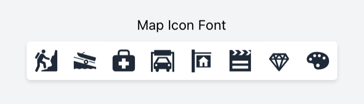
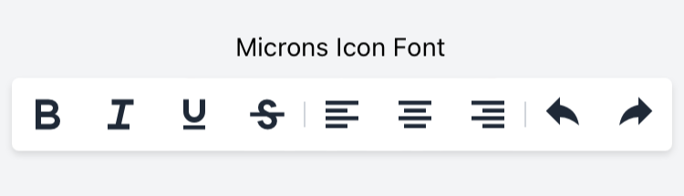

# What's new in v.3.1.5

- [What's new in v.3.1.5](#whats-new-in-v315)
  - [`build-fonts` command](#build-fonts-command)
    - [Organizing the fonts folder](#organizing-the-fonts-folder)
    - [Icon Font Libraries](#icon-font-libraries)
    - [CommonJS module](#commonjs-module)
  - [Font Awesome v.6.0.0](#font-awesome-v600)
  - [Fixed `package.json` when using the `--tailwind` option in `purgetss create`.](#fixed-packagejson-when-using-the---tailwind-option-in-purgetss-create)
  - [Animation Module](#animation-module)
    - [Animate the `complete` attributes.](#animate-the-complete-attributes)
    - [Extra `delay` and `duration` values](#extra-delay-and-duration-values)

## `build-fonts` command
With the new `build-fonts` command in **PurgeTSS**, you can create a `fonts.tss` file with all the class definitions and `fontFamily` selectors from any Serif, Sans-Serif, Cursive, Fantasy or Monospace font families.

**Just put all the `.ttf` or `.otf` files that you want to use in `./purgetss/fonts/`, and run the command**

```bash
> purgetss build-fonts

# alias:
> purgetss bf
```

1. It will create the `./purgetss/fonts.tss` file with all class definitions and `fontFamily` selectors
2. It will copy the font files into `./app/assets/fonts` folder
3. If necessary, **PurgeTSS will rename the font files to their corresponding PostScript Name**

In this example we are using the [Bevan and Dancing Script](https://fonts.google.com/share?selection.family=Bevan:ital@0;1%7CDancing%20Script:wght@400;500;600;700) fonts from Google Fonts.

```bash
# Root of the project
purgetss
└─ fonts
   ├─ Bevan-Italic.ttf
   ├─ Bevan-Regular.ttf
   ├─ DancingScript-Bold.ttf
   ├─ DancingScript-Medium.ttf
   ├─ DancingScript-Regular.ttf
   └─ DancingScript-SemiBold.ttf
```

```css
// Fonts TSS file generated with PurgeTSS
// https://github.com/macCesar/purgeTSS

'.bevan-italic': { font: { fontFamily: 'Bevan-Italic' } }
'.bevan-regular': { font: { fontFamily: 'Bevan-Regular' } }
'.dancingscript-bold': { font: { fontFamily: 'DancingScript-Bold' } }
'.dancingscript-medium': { font: { fontFamily: 'DancingScript-Medium' } }
'.dancingscript-regular': { font: { fontFamily: 'DancingScript-Regular' } }
'.dancingscript-semibold': { font: { fontFamily: 'DancingScript-SemiBold' } }
```

**Now you can use any of those fonts in your project.**

### Organizing the fonts folder
For better organization, you can group each font family in sub-folders, for example:

```bash
# Root of the project
purgetss
└─ fonts
   └─ bevan
      ├─ Bevan-Italic.ttf
      ├─ Bevan-Regular.ttf
   └─ dancing-script
      ├─ DancingScript-Bold.ttf
      ├─ DancingScript-Medium.ttf
      ├─ DancingScript-Regular.ttf
      └─ DancingScript-SemiBold.ttf
```

You will get the same `fonts.tss` file as the previous example, but with a much better organized fonts folder.

### Icon Font Libraries
You can add **any icon font library** that has either a `.ttf` or `.otf` font file and a `.css` file with unicode characters.

In this example we are using the [map-icons](http://map-icons.com) and the [microns](https://www.s-ings.com/projects/microns-icon-font/) icon font libraries.

```bash
# Root of the project
purgetss
└─ fonts
   └─ bevan
   └─ dancing-script
   └─ mapicons
      ├─ map-icons.css
      └─ map-icons.ttf
   └─ microns
      ├─ microns.css
      └─ microns.ttf
```

After running `purgetss build-fonts` you will have all the unicode characters in `fonts.tss`.

```css
// Fonts TSS file generated with PurgeTSS
// https://github.com/macCesar/purgeTSS

'.map-icons': { font: { fontFamily: 'map-icons' } }
'.microns': { font: { fontFamily: 'microns' } }

// Unicode characters
// To use your Icon Fonts in Buttons AND Labels each class sets 'text' and 'title' properties
// map-icons.css
'.map-icon-abseiling': { text: '\ue800', title: '\ue800' }
'.map-icon-accounting': { text: '\ue801', title: '\ue801' }
'.map-icon-airport': { text: '\ue802', title: '\ue802' }
'.map-icon-amusement-park': { text: '\ue803', title: '\ue803' }
'.map-icon-aquarium': { text: '\ue804', title: '\ue804' }
// ...

// microns.css
'.mu-arrow-left': { text: '\ue700', title: '\ue700' }
'.mu-arrow-right': { text: '\ue701', title: '\ue701' }
'.mu-arrow-up': { text: '\ue702', title: '\ue702' }
'.mu-arrow-down': { text: '\ue703', title: '\ue703' }
'.mu-left': { text: '\ue704', title: '\ue704' }
// ...
```





### CommonJS module
You can use the `--modules` flag to generate a CommonJS module called `purgetss-fonts.js` in `./app/lib/`.

To avoid any conflicts with other icon libraries that you may use, **PurgeTSS will keep each icon prefix**.

```bash
> purgetss build-fonts --modules

# alias:
> purgetss bf -m
```

```javascript
const icons = {
  // foundation-icons.css
  '.fiAddressBook': '\uf100',
  '.fiAlert': '\uf101',
  '.fiAlignCenter': '\uf102',
  '.fiAlignJustify': '\uf103',
  '.fiAlignLeft': '\uf104',
  // ...

  // map-icons.css
  '.mapIconAbseiling': '\ue800',
  '.mapIconAccounting': '\ue801',
  '.mapIconAirport': '\ue802',
  '.mapIconAmusementPark': '\ue803',
  '.mapIconAquarium': '\ue804',
  // ...
};
exports.icons = icons;
```

## Font Awesome v.6.0.0
The `fontawesome.tss` file has been updated to include [Font Awesome v.6.0.0](https://fontawesome.com/docs/changelog/).

We've also updated the scripts to generate your Pro or Beta version of `fontawesome.tss` file.

## Fixed `package.json` when using the `--tailwind` option in `purgetss create`.
When creating a new project with `purgetss create 'name of the project' --tailwind`, the `package.json` file was throwing an error if the name of the project contain spaces.

## Animation Module

### Animate the `complete` attributes.
The animation module will execute the properties defined with the `complete` attribute.

In this example the `open` animation will reduced the children of the `letters` view to a size of 1%, after completion, the `complete` attributes will be executed: Setting the background color to green and the scaling back to 100%.

```xml
<Alloy>
  <Window title="App Wordle" class="bg-(#181e2d)">
    <View class="vertical">
      <View id="letters" class="horizontal">
        <Label class="w-8 h-8 mx-1 text-center text-white bg-transparent border-white rounded" text="T" />
        <Label class="w-8 h-8 mx-1 text-center text-white bg-transparent border-white rounded" text="I" />
        <Label class="w-8 h-8 mx-1 text-center text-white bg-transparent border-white rounded" text="T" />
        <Label class="w-8 h-8 mx-1 text-center text-white bg-transparent border-white rounded" text="A" />
        <Label class="w-8 h-8 mx-1 text-center text-white bg-transparent border-white rounded" text="N" />
        <Label class="w-8 h-8 mx-1 text-center text-white bg-transparent border-white rounded" text="I" />
        <Label class="w-8 h-8 mx-1 text-center text-white bg-transparent border-white rounded" text="U" />
        <Label class="w-8 h-8 mx-1 text-center text-white bg-transparent border-white rounded" text="M" />
      </View>

      <Button class="mt-4" android:onClick="doAnimate" ios:onSingletap="doAnimate">Animate</Button>
      <Button android:onClick="doReset" ios:onSingletap="doReset">Reset</Button>
    </View>

    <Animation module="purgetss.ui" id="myAnimationReset" class="bg-transparent" />
    <Animation module="purgetss.ui" id="myAnimationOpen" class="open:scale-1 complete:bg-(#008800) complete:scale-100" />
  </Window>
</Alloy>
```

```javascript
$.index.open();

function doAnimate() {
  $.myAnimationOpen.play($.letters.children);
}

function doReset() {
  $.myAnimationReset.apply($.letters.children);
}
```

### Extra `delay` and `duration` values
Added extra `delay` and `duration` values.
```css
// Component(s): Ti.UI.Animation
// Property(ies): delay
'.delay-0': { delay: 0 }
'.delay-25': { delay: 25 }
'.delay-50': { delay: 50 }
'.delay-75': { delay: 75 }
'.delay-100': { delay: 100 }
'.delay-150': { delay: 150 }
'.delay-200': { delay: 200 }
'.delay-250': { delay: 250 }
'.delay-300': { delay: 300 }
'.delay-350': { delay: 350 }
'.delay-400': { delay: 400 }
'.delay-450': { delay: 450 }
'.delay-500': { delay: 500 }
'.delay-600': { delay: 600 }
'.delay-700': { delay: 700 }
'.delay-800': { delay: 800 }
'.delay-900': { delay: 900 }
'.delay-1000': { delay: 1000 }
'.delay-2000': { delay: 2000 }
'.delay-3000': { delay: 3000 }
'.delay-4000': { delay: 4000 }
'.delay-5000': { delay: 5000 }

// Component(s): Ti.UI.Animation
// Property(ies): duration
'.duration-0': { duration: 0 }
'.duration-25': { duration: 25 }
'.duration-50': { duration: 50 }
'.duration-75': { duration: 75 }
'.duration-100': { duration: 100 }
'.duration-150': { duration: 150 }
'.duration-200': { duration: 200 }
'.duration-250': { duration: 250 }
'.duration-300': { duration: 300 }
'.duration-350': { duration: 350 }
'.duration-400': { duration: 400 }
'.duration-450': { duration: 450 }
'.duration-500': { duration: 500 }
'.duration-600': { duration: 600 }
'.duration-700': { duration: 700 }
'.duration-800': { duration: 800 }
'.duration-900': { duration: 900 }
'.duration-1000': { duration: 1000 }
'.duration-2000': { duration: 2000 }
'.duration-3000': { duration: 3000 }
'.duration-4000': { duration: 4000 }
'.duration-5000': { duration: 5000 }
'.duration': { duration: 150 }
```
